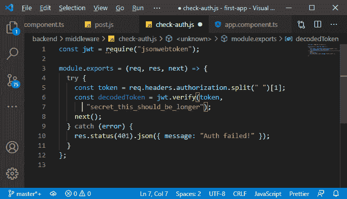
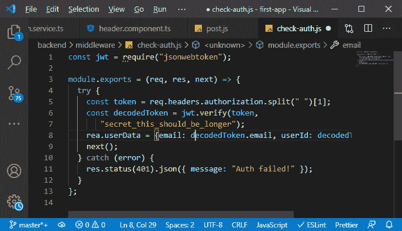
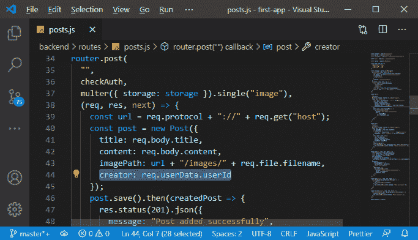
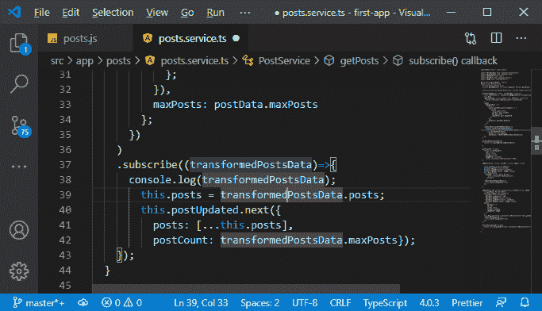
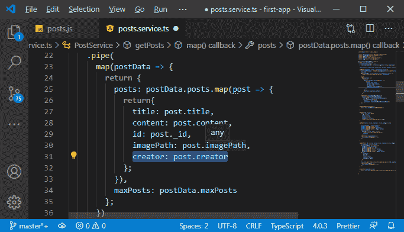
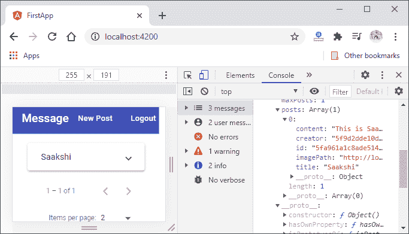

# 将用户标识添加到 MEAN 栈中的帖子

> 原文：<https://www.javatpoint.com/adding-user-id-to-posts-in-mean-stack>

在前面的部分中，我们成功地将 creator 键添加到了我们的数据模式中。现在，我们需要将用户 id 添加到帖子中，因此在本节中，我们将学习如何将帖子与用户 id 联系起来。为此，我们将对一些邮政路线进行更改。我们将使用以下步骤来做到这一点:

1)我们将转到我们的帖子路由，即 routes 文件夹中的 posts.js 文件。我们将延伸到我们正在创建新职位的路线。在这条路径中，我们存储了标题、内容和 imagepath，现在我们也需要填充 creator 字段。我们将添加 creator 属性，对于它的值，我们有一个问题，即我们从哪里获得用户 Id。我们将通过解码令牌从令牌中获取 id。我们将解码令牌以获取信息。

现在，如果我们回到我们的中间件，我们已经验证了令牌，并且验证方法为我们检索令牌。它给了我们一个解码的令牌。因此，我们首先将结果存储在一个常量中，然后我们可以访问令牌中的数据。

```

const decodedToken = jwt.verify(token, "secret_this_should_be_longer");

```



2.现在，我们不需要 checkAuth 方法中的数据。我们在创建新帖子的帖子路径中需要它。现在，最酷的是我们正在使用的**[NodeJS](https://www.javatpoint.com/nodejs-tutorial)**框架，它让我们能够轻松地向请求对象添加新的数据和字段。如果我们的中间件接着调用下一个，请求将转移到下一个中间件，它将保留我们添加到它的任何字段。因此，我们将简单地访问请求，然后添加一个新字段；只是确保不要覆盖已经存在的。我们将添加用户数据字段，并分配一个 [JavaScript](https://www.javatpoint.com/javascript-tutorial) 对象作为值， [JavaScript 对象](https://www.javatpoint.com/javascript-objects)包含电子邮件和用户标识。

```

rea.userData = {email: decodedToken.email, userId: decodedToken.userId};

```



现在，运行在这个 check-auth 中间件之后的每个中间件都将获得额外的信息。

3)如果我们查看我们的 post.js 文件，我们会看到我们尝试创建新帖子的中间件在 check-auth 中间件之后运行。这意味着我们将拥有额外的信息，即用户数据字段。因此，现在，我们将以以下方式将值传递给之前创建的 creator 字段:

```

creator: req.userData.userId

```



现在，我们应该能够存储用户标识作为我们帖子的一部分。

4)现在，我们将返回到我们获取所有帖子的 post . service . t 文件。我们将简单地转到我们的订阅方法，控制台记录我们的 transformedPostData，以确保它们是否包含用户标识。

```

console.log(transformedPostsData);

```



5)需要记住的一件重要的事情是，我们映射了 subscribe 方法上面的 post 数据。现在，我们将它映射到一个新的对象中，不再使用该创建者标识。因此，我们也将在这里添加创建者标识字段。

```

creator: post.creator

```



现在，我们将保存所有文件并返回到我们的 angular 应用程序。如果我们添加一个新的帖子，我们会看到该帖子附带的创建者信息。



现在，我们将用户 id 与帖子联系起来，我们的代码也运行良好。在下一部分中，我们将使用后端的创建者 id 来拒绝其他用户对给定帖子的任何删除或更新请求。

* * *