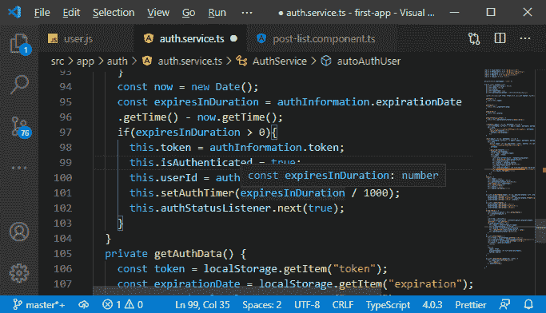

# 将用户标识传递给 MEAN 栈中的前端

> 原文：<https://www.javatpoint.com/passing-the-user-id-to-the-frontend-in-mean-stack>

在前一节中，我们成功地添加了服务器端授权。在本节中，我们将把用户 id 传递给前端。现在，每个用户都可以点击删除按钮，即使是已经过验证但没有创建帖子的用户。我们将调整我们的前端代码。

我们将转到后列表组件，在那里我们向任何通过身份验证的用户显示编辑和删除按钮。但是现在已经不正确了。我们想更多地限制它。我们只想把这些按钮展示给那些被认证的人和那个帖子的创建者。这意味着我们需要先将用户 id 发送到前端。

1)我们将回到我们的 **js** 文件，在这里我们创建登录路线。我们会找到我们归还令牌和解释的地方。现在，我们不只是想归还令牌和过期时间。我们还希望通过以下方式返回用户标识:

```

userId: fetchedUser._id

```


2)在将用户 id 传递给前端之后，我们也需要将该信息存储在前端。我们将返回到我们发送登录请求的服务文件。在这里，我们将创建一个新的属性，即**用户标识，**类型为字符串。在登录函数中，我们将在返回响应时将该值设置为 userId 属性。为此，我们也需要更新我们的[TypeScript](https://www.javatpoint.com/typescript-tutorial)代码，因为现在我们也有带有令牌和 expiresIn 的用户标识字段。

```

login(email: string, password: string) {
    ...
    …
      .post(
        "http://localhost:3000/api/user/login",
        authData
      )…
       …
       …
          this.userId = response.userId;
          …
          …
  }

```


3)现在，我们可以在应用程序中使用这个用户标识。为此，我们将添加一个新方法，即 **getUserId()** 。在这个方法中，我们将简单地返回用户标识，如下所示:

```

getUserId(){
    return this.userId;
  }

```


4)现在，我们将从我们的帖子列表组件中获取该用户 Id，因为我们需要将其与我们正在查看的帖子的 Id 进行比较。因此，我们将返回到我们的 post-list.component.ts 文件，在那里我们将添加一个新的属性，即 userId，最初，它将是未定义的。之后，我们将在 ngOnInit()方法中获取用户标识，并将其分配给用户标识属性。

```

userId: string;
this.userId = this.authService.getUserId();

```


5)我们还希望获取更新的用户标识，以防身份验证发生变化。因此，这意味着我们还将侦听器中的用户标识设置为我们的 AuthStatusChange。

```

this.userId = this.authService.getUserId();

```


6)如果用户从经过身份验证切换到未经身份验证，我们希望从侦听器中的 getUserId()方法获取 null 或 undefined。因此，每当我们注销时，我们都必须重置身份验证服务中的用户标识字段。因此，我们将在 logout()方法中将 userId 设置为 null。

```

this.userId = null;

```


7)此外，我们还获得了我们的 autoAuthUser()方法，在该方法中，我们根据存储在本地存储中的数据登录用户。我们还没有将用户标识存储在本地存储中，但是我们需要这样做，因为我们将来也需要这些信息。因此，在 saveAuthData()方法中，我们期望得到一个额外的字段，即 userId，它的类型是 string。我们是这样储存的:

```

private saveAuthData(token: string, expirationDate: Date, userId: string) {
    localStorage.setItem('userId', userId);
  }

```


8)我们还需要删除 clearAuthData()方法中的数据。

```

private clearAuthData() {
    localStorage.removeItem("userId");
  }

```


9)在 getAuthData()方法中，我们也需要得到它。我们将通过以下方式获得:

```

const userId = localStorage.getItem("userId");
…
…
…
      token: token,
      expirationDate: new Date(expirationDate),
      userId: userId
    }
  }

```


10)现在，在 autoAuthUser()方法中，我们也用我们的 auth Information 初始化用户标识。

```

.getTime() - now.getTime();
    …
    …
      this.userId = authInformation.userId
      this.setAuthTimer(expiresInDuration / 1000);
      this.authStatusListener.next(true);
    }

```



11)我们必须做的最后一件事是，我们期望 userId 作为 saveAuthData()上的参数。因此，我们将用户标识传递给调用它的函数。

```

this.saveAuthData(token, expirationDate, this.userId);

```


现在，用户标识得到了正确的管理，在下一节中，我们将与贴在帖子上的创建者标识一起使用。

* * *