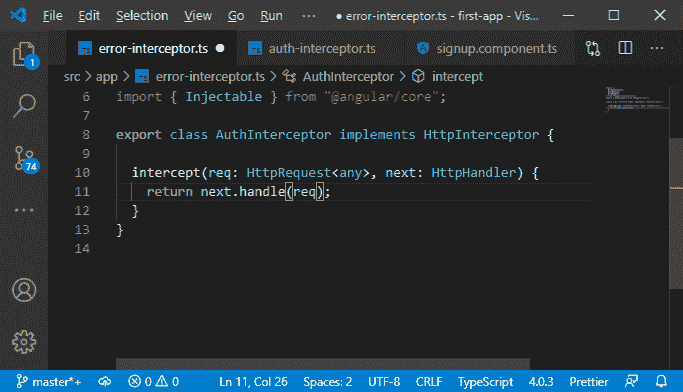
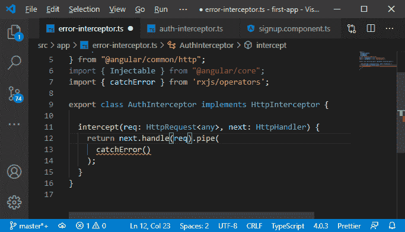
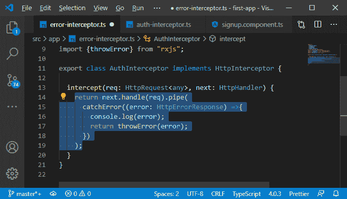
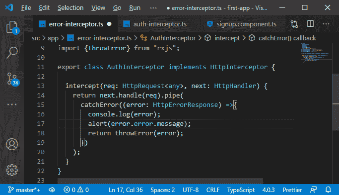
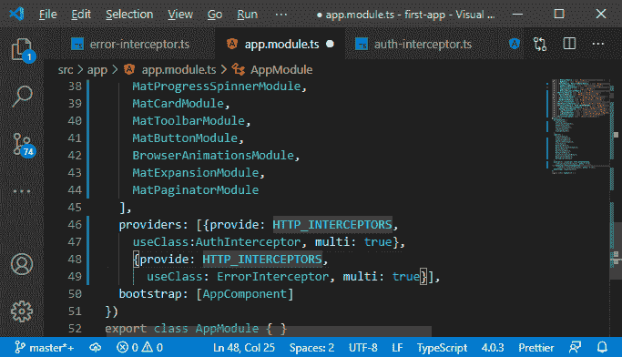
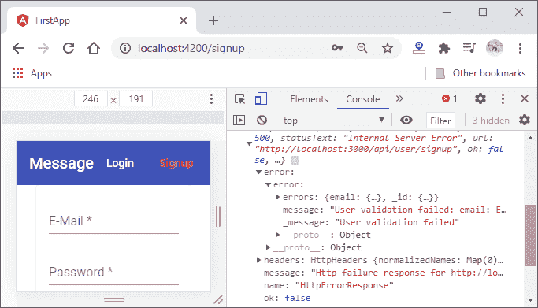

# MEAN 栈中的错误拦截器

> 原文：<https://www.javatpoint.com/error-interceptor-in-mean-stack>

在前面的部分中，我们成功地去掉了登录和注册组件中的无限加载微调器。在我们上一节的最后，我们仍然得到了一个错误，我们提到当我们得到一个错误时，有一些错误消息会很好。为此，我们将使用一个有角度的材料组件。这里我们有一个组件，即对话组件。

我们将使用对话框组件来显示错误消息。为了使用它，我们必须通过使用对话框服务提供者来打开一个对话框，并且我们传入组件引用，该引用将在打开的对话框中呈现。简单的解决方法是在模板中添加一些 div，然后使用 ngIf 结合一些错误条件来显示或隐藏它。我们将使用该对话框，为了使用它，我们将遵循以下步骤:

1)首先，我们需要注册一个全局错误处理程序，由于我们的错误与 [HTTP](https://www.javatpoint.com/computer-network-http) 错误相关，我们想再次使用我们的拦截器。我们使用我们的身份验证拦截器来拦截所有传出的请求并添加身份验证头。我们可以添加另一个拦截器，我们将把它添加到我们的根文件夹中，因为它会影响整个应用程序。我们将添加一个新的拦截器文件，即 **error-interceptor.ts** 。


2)在这个文件中，我们将创建一个拦截器，就像我们为 auth 所做的那样。因此，我们将复制 auth-interceptor 的整个代码，并将其粘贴到我们的 error-interceptor.ts 文件中。我们不需要授权服务，所以我们将从这里删除授权服务代码。我们只想在拦截器方法中返回请求，但是现在我们也可以在那里听取响应。我们不想编辑请求。我们想倾听响应，handle 方法返回响应可观察流。

```

export class AuthInterceptor implements HttpInterceptor {

  intercept(req: HttpRequest, next: HttpHandler) {
    return next.handle(req);
  }
} 
```



3)我们可以直接进入那个流，听事件。我们可以使用 **rxjs** 提供的 pipe()方法向该流添加一个操作符。我们想添加一个特殊的操作符，即 catchError 操作符。顾名思义，这个操作符允许我们处理流中发出的错误。我们将为我们的 [HTTP](https://www.javatpoint.com/http) 请求添加这个，所以我们将讨论 [HTTP](https://www.javatpoint.com/http-tutorial) 错误。

```

return next.handle(req).pipe(
      catchError()
    );

```



4)在 catchError 函数中，我们必须传递函数，在那里我们将得到我们的错误，它将是类型 HttpErrorResponse。我们将对它进行控制台日志记录，我们必须做的一件事是我们必须记住，我们只是在向那个可观察的流添加一些东西。我们在应用程序的不同地方处理它。因此，即使我们有错误，我们也必须返回一个可观察到的 catchError 内部。我们可以只使用 throwError()，它将生成一个新的可观测值。我们只需将错误传递给函数，并将其作为可观察的结果返回。

```

return next.handle(req).pipe(
      catchError((error: HttpErrorResponse) =>{
        console.log(error);
        return throwError(error);
      })
    );

```



5)所以，现在我们只是返回那个可观察到的错误，但是我们可以做一些错误处理来代替控制台日志错误。例如，我们可以使用一个警报来抛出一个普通的 [JavaScript 警报](https://www.javatpoint.com/javascript-alert)。错误对象有一个错误属性，它将是错误响应的响应主体，在那里，我们可以输出消息。

```

alert(error.error.message);

```



6)现在，我们将在我们的应用程序模块中注册拦截器，我们还通过添加以下提供程序来注册身份验证拦截器:

```

{provide: HTTP_INTERCEPTORS, useClass: ErrorInterceptor, multi: true}

```



#### 注意:我们需要用 ErrorInterceptor 来重命名我们的类名。

现在，这个拦截器将监视每个传出的 http 请求，如果我们得到一个错误响应，拦截器应该会介入。




我们得到一个未定义的警报，因为我们没有消息，但是我们看到拦截器正在做一些事情，并且我们从拦截器内部看到日志。在那里，我们可以看到我们得到的错误响应。

我们成功地添加了拦截器，在下一节中，我们将使用它并添加一些比这个警报更好的错误消息。

* * *