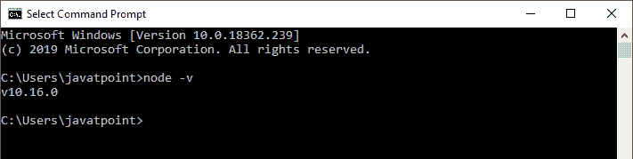
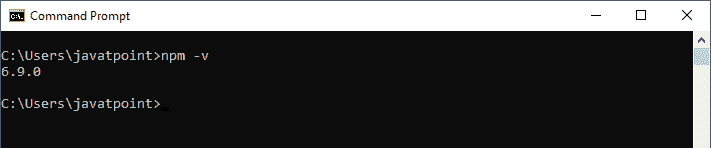
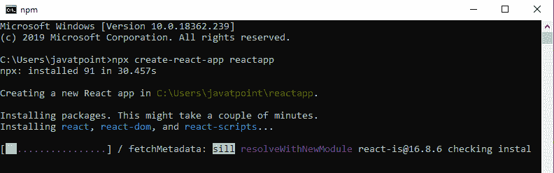
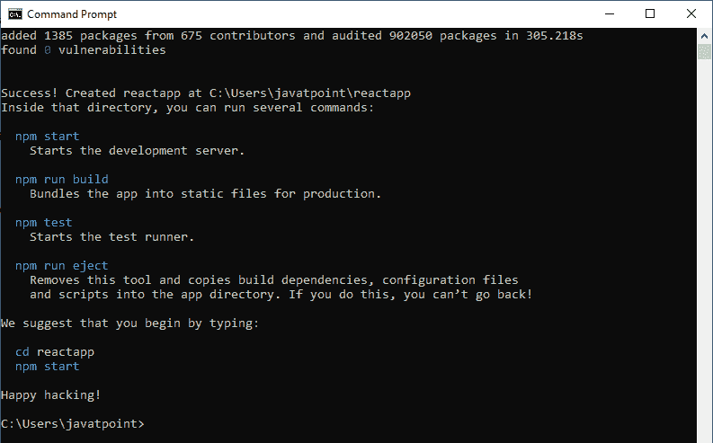
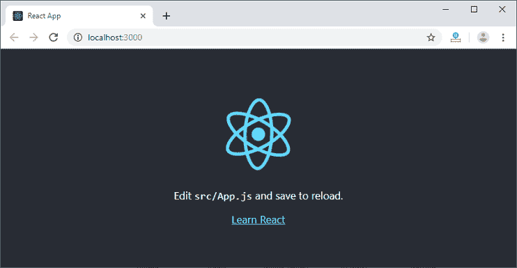
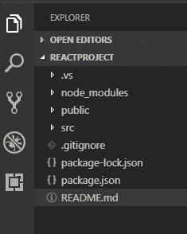

# React 创建-React-应用

> 原文：<https://www.javatpoint.com/react-create-react-app>

启动一个新的 React 项目非常复杂，有这么多构建工具。在编写一行 React 代码之前，它使用了许多依赖项、配置文件和其他需求，如 Babel、Webpack、ESLint。创建 React 应用命令行界面工具消除了所有复杂性，使 React 应用变得简单。为此，您需要使用 NPM 安装软件包，然后运行一些简单的命令来获得一个新的 React 项目。

**create-react-app** 是初学者的绝佳工具，可以让你非常快速的创建和运行 react 项目。它不需要手动进行任何配置。这个工具包装了所有必需的依赖项，比如 React 项目本身的**网络包**、**巴贝尔**，然后你只需要专注于编写 React 代码。该工具设置了开发环境，提供了出色的开发人员体验，并针对生产优化了应用程序。

## 要求

Create React App 由**脸书**维护，可以在任何**平台**上运行，比如 macOS、Windows、Linux 等。要使用创建-React-应用程序创建 React 项目，您需要在系统中安装以下内容。

1.  节点版本> = 8.10
2.  NPM 版本> = 5.6

让我们检查一下系统中**节点**和 **NPM** 的当前版本。

运行以下命令，在命令提示符下检查节点版本。

```

$ node -v

```



运行以下命令，在命令提示符下检查 NPM 版本。

```

$ npm -v

```



## 装置

在这里，我们将学习如何使用***【CRA】***工具安装 React。为此，我们需要遵循下面给出的步骤。

### 安装 React

我们可以使用下面的命令，使用 npm 包管理器安装 React。无需担心 React 安装的复杂性。create-react-app npm 包管理器将管理 react 项目所需的一切。

```

C:\Users\javatpoint> npm install -g create-react-app

```

### 创建新的 React 项目

一旦 React 安装成功，我们可以使用 create-react-app 命令创建一个新的 React 项目。在这里，我为我的项目选择“reactproject”名称。

```

C:\Users\javatpoint> create-react-app reactproject

```

#### 注意:我们可以使用 npx 将以上两个步骤合并到一个命令中。npx 是一个包运行工具，附带 npm 5.2 及以上版本。

```

C:\Users\javatpoint> npx create-react-app reactproject

```



上面的命令需要一些时间来安装 React 并创建一个名为“reactproject”的新项目现在，我们可以看到终端如下。



上面的屏幕告诉我们 React 项目已经在我们的系统上成功创建了。现在，我们需要启动服务器，以便可以在浏览器上访问应用程序。在终端窗口中键入以下命令。

```

$ cd Desktop
$ npm start

```

NPM 是一个包管理器，它启动服务器并在默认服务器 [http://localhost:3000](http://localhost:3000) 上访问应用程序。现在，我们将看到下面的屏幕。



接下来，在代码编辑器中打开项目。这里，我使用的是 Visual Studio 代码。我们项目的默认结构如下图所示。



在 React 应用程序中，根目录下有几个文件和文件夹。其中一些如下:

1.  **node_modules:** 它包含 React 库和任何其他需要的第三方库。
2.  **公有:**持有应用的公有资产。它包含 index.html，在那里 React 将默认在< div id="root" > < /div >元素上挂载应用程序。
3.  **src:** 包含 App.css、App.js、App.test.js、index.css、index.js、serviceWorker.js 文件。这里，App.js 文件总是负责在 React 中显示输出屏幕。
4.  **package-lock . JSON:**NPM 包修改 node_modules 树或 package.json 的任何操作都会自动生成，不能发布。如果它找到除顶级包之外的任何其他位置，它将被忽略。
5.  **package.json:** 保存项目所需的各种元数据。它向 npm 提供信息，NPM 允许识别项目和处理项目？的依赖关系。
6.  **README.md:** 它提供了阅读关于 React 主题的文档。

### React 环境设置

现在，打开 **src > > App.js** 文件，进行你想在屏幕上显示的修改。进行所需更改后，**保存**文件。我们一保存文件，Webpack 就重新编译代码，页面会自动刷新，更改会反映在浏览器屏幕上。现在，我们可以创建任意数量的组件，将新创建的组件导入 **App.js** 文件中，该文件在通过 Webpack 编译后将包含在我们的主**index.html**文件中。

接下来，如果我们想要将项目设为生产模式，请键入以下命令。该命令将生成最佳优化的生产版本。

```

$ npm build

```

* * *