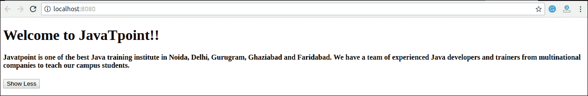

# React 状态

> 原文：<https://www.javatpoint.com/react-state>

状态是一个可更新的结构，用于包含有关组件的数据或信息。组件中的状态会随着时间的推移而改变。状态随时间的变化可能是对用户操作或系统事件的响应。具有状态的组件称为有状态组件。它是 react 组件的核心，决定了组件的行为及其呈现方式。他们还负责使组件具有动态性和交互性。

状态必须尽可能保持简单。可以通过 **setState()** 方法设置，调用 setState()方法触发 UI 更新。状态表示组件的本地状态或信息。它只能在组件内部或由组件直接访问或修改。要在任何交互发生之前设置初始状态，我们需要使用 **getInitialState()** 方法。

**例如**，如果我们有五个组件需要来自状态的数据或信息，那么我们需要创建一个容器组件，它将为所有组件保持状态。

## 定义状态

要定义状态，必须首先声明一组默认值来定义组件的初始状态。为此，添加一个使用 this.state 分配初始状态的类构造函数。可以在 **render()** 方法中呈现“ **this.state** ”属性。

### 例子

下面的示例代码展示了我们如何使用 ES6 语法创建有状态组件。

```

import React, { Component } from 'react';
class App extends React.Component {
 constructor() {
      super();		
      this.state = { displayBio: true };
      }
      render() {
          const bio = this.state.displayBio ? (

### Javatpoint 是诺伊达、德里、古鲁格拉姆、加济阿巴德和法里达巴德最好的 Java 培训机构之一。我们有一个由跨国公司经验丰富的 Java 开发人员和培训师组成的团队来教我们的校园学生。

              ) : null;
              return (

# 欢迎来到 JavaTpoint！！

                      { bio } 

              );
     }
}
export default App;

```

若要设置状态，需要调用构造函数中的 super()方法。这是因为在调用 super()方法之前，this.state 未初始化。

**输出**


## 改变国家

我们可以通过使用 setState()方法并传递一个新的 state 对象作为参数来更改组件状态。现在，在上面的例子中创建一个新的方法 togglesplaybio()，并将这个关键字绑定到 togglesplaybio()方法，否则我们无法在 togglesplaybio()方法中访问这个关键字。

```

this.toggleDisplayBio = this.toggleDisplayBio.bind(this);

```

### 例子

在这个例子中，我们将添加一个**按钮**到**渲染**()方法中。点击此按钮会触发 toggleDisplayBio()方法，显示所需的输出。

```

import React, { Component } from 'react';
class App extends React.Component {
 constructor() {
      super();		
      this.state = { displayBio: false };
      console.log('Component this', this);
      this.toggleDisplayBio = this.toggleDisplayBio.bind(this);
      }
      toggleDisplayBio(){
          this.setState({displayBio: !this.state.displayBio});
          }
      render() {
          return (

# 欢迎来到 JavaTpoint！！

                  {
                      this.state.displayBio ? ( 

#### Javatpoint 是诺伊达、德里、古鲁格拉姆、加济阿巴德和法里达巴德最好的 Java 培训机构之一。我们有一个由跨国公司经验丰富的 Java 开发人员和培训师组成的团队来教我们的校园学生。

                              <button onclick="{this.toggleDisplayBio}">Show Less</button> 

                          ) : (

                                  <button onclick="{this.toggleDisplayBio}">Read More</button> 

	                      )
                  }

	    )
    }
}
export default App;

```

**输出:**


点击**多读**按钮，会得到如下输出，点击**少显示**按钮，会得到如上图所示的输出。



* * *