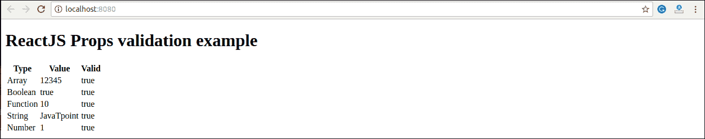

# React 道具验证

> 原文：<https://www.javatpoint.com/react-props-validation>

道具是将**只读**属性传递给 React 组件的重要机制。道具通常需要在组件中正确使用。如果没有正确使用，组件可能不会按预期运行。因此，需要使用**道具验证**来改进 React 组件。

道具验证是一个工具，将帮助开发人员避免未来的错误和问题。这是强制正确使用组件的有用方法。它使你的代码更易读。React 组件使用特殊属性 **propTypes** ，通过验证通过 PropTypes 传递的值的数据类型来帮助您捕获 bug，尽管没有必要用 PropTypes 定义组件。但是，如果您在组件中使用 propTypes，它可以帮助您避免意外的错误。

## 验证道具

**App.propTypes** 用于 react 组件中的道具验证。当一些道具以无效类型传递时，您将在 JavaScript 控制台上收到警告。指定验证模式后，您将设置 App.defaultProps

### 语法:

```

class App extends React.Component {
          render() {}
}
Component.propTypes = { /*Definition */};

```

## ReactJS 道具验证器

ReactJS 道具验证器包含以下验证器列表。

| 塞内加尔 | 属性类型 | 描述 |
| **1。** | 属性类型. any | 道具可以是任何数据类型。 |
| **2。** | proptypes . array(属性类型.数组) | 道具应该是一个数组。 |
| **3。** | 类型，bool | 道具应该是布尔型的。 |
| **4。** | 类型. func | 道具应该是一种功能。 |
| **5。** | property types . number-属性类型 | 道具应该是一个数字。 |
| **6。** | property types . object-属性类型 | 道具应该是一个物体。 |
| **7。** | props types . string-属性类型 | 道具应该是一根绳子。 |
| **8。** | 属性类型。符号 | 道具应该是一种象征。 |
| **9。** | PropTypes.instanceOf | 道具应该是一个特定的 JavaScript 类的实例。 |
| **10。** | PropTypes.isRequired(必需的类型) | 必须提供道具。 |
| **11 时。** | proptypes . element-属性类型 | 道具必须是一个元素。 |
| **12 时。** | PropTypes.node | 道具可以呈现任何东西:数字、字符串、元素或包含这些类型的数组(或片段)。 |
| **13。** | PropTypes.oneOf() | 道具应该是几种特定值中的一种。 |
| **14。** | proptypes . one type([proptypes . string，PropTypes.number]) | 道具应该是多种类型中的一种。 |

### 例子

在这里，我们正在创建一个包含我们需要的所有道具的应用程序组件。在本例中， **App.propTypes** 用于道具验证。对于道具验证，您必须添加这一行:**从 **App.js 文件**中的【道具类型】**导入道具类型。

**App.js**

```

import React, { Component } from 'react';
import PropTypes from 'prop-types';
class App extends React.Component {
   render() {
      return (

# ReactJS 道具验证示例

| 类型 | 价值 | 有效的 |
| 排列 | {this.props.propArray} | {this.props.propArray？“真”:“假” |
| 布尔代数学体系的 | { this . props . ProBool？“真”:“假” | { this . props . ProBool？“真”:“假” |
| 功能 | { this . props . ProFunc(5)} | { this . props . ProFunc(5)？“真”:“假” |
| 线 | {this.props.propString} | {this.props.propString？“真”:“假” |
| 数字 | {this.props.propNumber} | {this.props.propNumber？“真”:“假” |

        );
   }
}
App.propTypes = {
    propArray: PropTypes.array.isRequired,
    propBool: PropTypes.bool.isRequired,
    propFunc: PropTypes.func,
    propNumber: PropTypes.number,
    propString: PropTypes.string, 
}
App.defaultProps = {
    propArray: [1,2,3,4,5],
    propBool: true,
    propFunc: function(x){return x+5},
    propNumber: 1,
    propString: "JavaTpoint",
}
export default App;

```

**Main.js**

```

import React from 'react';
import ReactDOM from 'react-dom';
import App from './App.js';

ReactDOM.render(, document.getElementById('app'));

```

**输出:**



## ReactJS 自定义验证器

ReactJS 允许创建自定义验证函数来执行自定义验证。以下参数用于创建自定义验证函数。

*   **道具:**应该是组件中的第一个参数。
*   **propName:** 要验证的是 propName。
*   **组件名:**是要再次验证的组件名。

### 例子

```

var Component = React.createClass({
App.propTypes = {
   customProp: function(props, propName, componentName) {
        if (!item.isValid(props[propName])) {
          return new Error('Validation failed!');
        }
      }
   }
})

```

* * *