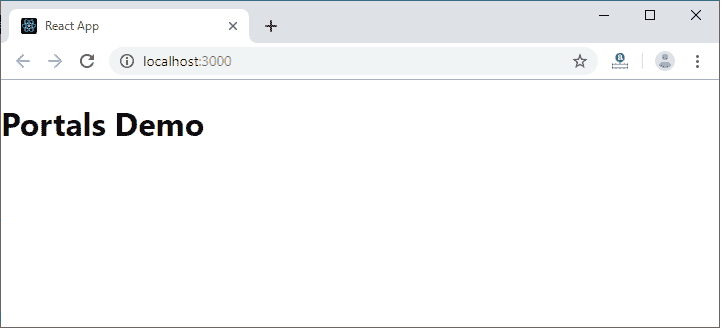

# React 门户

> 原文：<https://www.javatpoint.com/react-portals>

**React 16.0** 版本于【2017 年 9 月推出 React 门户。React 门户提供了一种在其组件层次结构之外，即在单独的组件中呈现元素的方法。

在 React 16.0 版本之前，在父组件层次结构之外呈现子组件是非常棘手的。如果我们这样做，它打破了组件需要作为新元素呈现并遵循**父子**层次结构的惯例。在 React 中，父组件总是想去它的子组件去的地方。这就是 React 门户概念出现的原因。

### 句法

```

ReactDOM.createPortal(child, container)

```

这里，第一个参数(子)是组件，可以是元素、字符串或片段，第二个参数(容器)是 DOM 元素。

### React 前示例 v16

通常，当您想要从组件的呈现方法中返回一个元素时，它会作为一个新的 div 装载到 DOM 中，并呈现最接近的父组件的子组件。

```

render() {
// React mounts a new div into the DOM and renders the children into it
  return (
   <div>
     {this.props.children}
   </div>
  );
}

```

### 使用门户的示例

但是，有时我们想在 DOM 中的不同位置插入一个子组件。这意味着 React 不想创建新的 div。我们可以通过创建 React 门户来做到这一点。

```

render() {
 return ReactDOM.createPortal(
   this.props.children,
   myNode,
 );
}

```

## 特征

*   它使用 React 版本 16 及其官方 API 来创建门户。
*   它有一个针对 React 版本 15 的后备版本。
*   它将其子组件传输到一个新的 React 门户中，默认情况下，该门户会附加到 document.body 中。
*   它还可以针对用户指定的 DOM 元素。
*   它支持服务器端呈现
*   它支持返回数组(不需要包装器)
*   它使用<portal>和<portalwithstate>，所以在灵活性和便利性之间没有妥协。</portalwithstate></portal>
*   它不会产生任何 DOM 混乱。
*   它没有依赖性，简约。

## 什么时候用？

React 门户的常见用例包括:

*   模型
*   工具提示
*   浮动菜单
*   小工具

## 装置

我们可以使用以下命令安装 React 门户。

```

$ npm install react-portal --save

```

## React 门户解释

使用以下命令创建新的“React”项目。

```

$ npx create-react-app reactapp

```

打开 App.js 文件并插入以下代码片段。

**App.js**

```

import React, {Component} from 'react';  
import './App.css'
import PortalDemo from './PortalDemo.js';

class App extends Component {  
    render () {  
        return (  
            <div className='App'>
	     <PortalDemo />
	</div>  
        );  
    }  
}  
export default App;

```

下一步是创建一个**门户**组件，并将其导入到 App.js 文件中。

**门户演示. js**

```

import React from 'react'
import ReactDOM from 'react-dom'

function PortalDemo(){
	return ReactDOM.createPortal(
	  <h1>Portals Demo</h1>,
	  document.getElementById('portal-root')
	)
}
export default PortalDemo

```

现在，打开 Index.html 文件，添加一个

元素来访问根节点之外的子组件。

**Index.html**

```

<!DOCTYPE html>
<html lang="en">
  <head>
    <meta charset="utf-8" />
    <link rel="shortcut icon" href="%PUBLIC_URL%/favicon.ico" />
    <meta name="viewport" content="width=device-width, initial-scale=1" />
    <meta name="theme-color" content="#000000" />
    <link rel="manifest" href="%PUBLIC_URL%/manifest.json" />
    <title>React App</title>
  </head>
  <body>
    <noscript>It is required to enable JavaScript to run this app.</noscript>
    <div id="root"></div>
    <div id="portal-root"></div>
  </body>
</html>

```

**输出:**

当我们执行 React 应用程序时，我们将获得以下屏幕。



现在，打开**检查** (ctrl + shift + I)。在该窗口中，选择**元素**部分，然后单击< div id= "门户-根"> < /div >组件。在这里，我们可以看到每个标签都在“portal-root”DOM 节点下，而不是“root”DOM 节点下。因此，我们可以看到 React 门户如何提供脱离根 DOM 树的能力。


* * *