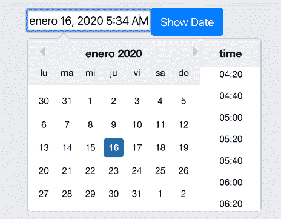

# React 日期选择器

> 原文：<https://www.javatpoint.com/react-date-picker>


## 介绍

我们经常会遇到各种论坛和网站，在那里我们需要输入出生日期或为任何原因的约会选择日期，一个日历状的图标就出现在我们眼前。这是如何以及从哪里冒出来的？它必须是一些特定的和动态的日历，智能地识别并呈现给我们，以选择我们想要的日期。这就是 React 日期选择器的作用。在本教程中，我们将学习从零到高级的所有这些方法，了解如何在 React 中实现以及如何进行定制。让我们继续讨论。

[React](https://www.javatpoint.com/reactjs-tutorial)日期选择器是一个有用且丰富的组件，用于使用日历对话框格式显示日期。现在通常有很多日期选择器选项可用。它们都可以有不同的技术方面和应用。在本教程中，我们将专门讨论 React 日期选择器。为此，我们需要一个显示时间和日期的软件包。为了更好地理解，我们将制作一个应用程序来帮助我们更好地理解 React Date Picker。但是，在此之前，让我们按照下面的步骤安装它。

## 装置

要为我们的 React 应用程序安装日期选择器，我们需要在系统上预装 [Node.js](https://www.javatpoint.com/nodejs-tutorial) 。尽管始终拥有节点模块并不重要，但强烈建议下载它们，以便有效地服务所有依赖项。因此，下面给出了安装 React 日期选择器的命令。

可以通过 **npm:** 安装软件包

```

npm install react-datepicker --save

```

或通过**纱线:**

```

yarn add react-datepicker

```

可能需要单独安装 React 及其 Proptypes，因为没有这些依赖项，就不可能构建 React 日期选择器。此外，我们可能需要从外部包中使用 [CSS](https://www.javatpoint.com/css-tutorial) ，以便日期选择器在视觉上看起来很棒。为了开始我们的应用程序，我们需要在我们的主文件中导入 React 日期选择器，并且我们需要通过 React 视图不断检查它。

```

import React, { useState } from "react";
import DatePicker from "react-datepicker";

import "react-datepicker/dist/react-datepicker.css";

// CSS Modules, react-datepicker-cssmodules.css
// import 'react-datepicker/dist/react-datepicker-cssmodules.css';

const Example = () => {
  const [startDate, setStartDate] = useState(new Date());
  return (
    setStartDate(date)} />
  );
}; 
```

## React Datepicker 示例

假设我们的系统配置了所有的安装需求和依赖项，我们将学习如何从头开始创建一个 React 应用程序。这个实现完全基于 React datepicker 的应用程序。

在上面的讨论中，我们假设我们已经独立安装了 React 和 PropTypes，因为这些依赖项没有包含在包本身中。为了继续构建我们的应用程序，我们需要遵循下面给出的步骤。

```

npx create-react-app react-datepicker-app

```

使用命令在项目文件夹中移动。

```

cd react-datepicker-app

```

启动 React 应用程序。

```

npm start

```

节点引擎启动后，我们可以通过本地主机的端口号 3000 来检查我们的应用程序。此外，我们需要在 app.js 文件中包含下面给出的代码片段，以便将 React Date Picker 的重要组件导入到我们的文件中。

```

// app.js

  import React, { Component } from 'react';
import DatePicker from 'react-datepicker';

import "react-datepicker/dist/react-datepicker.css";
import 'bootstrap/dist/css/bootstrap.min.css';

class App extends Component {

  constructor (props) {
    super(props)
    this.state = {
      startDate: new Date()
    };
    this.handleChange = this.handleChange.bind(this);
    this.onFormSubmit = this.onFormSubmit.bind(this);
  }

  handleChange(date) {
    this.setState({
      startDate: date
    })
  }

  onFormSubmit(e) {
    e.preventDefault();
    console.log(this.state.startDate)
  }

  render() {
    return (
      <form onSubmit={ this.onFormSubmit }>
        <div className="form-group">
          <DatePicker
              selected={ this.state.startDate }
              onChange={ this.handleChange }
              name="startDate"
              dateFormat="MM/dd/yyyy"
          />
          <button className="btn btn-primary">Show Date</button>
        </div>
      </form>
    );
  }

}

export default App;

```

我们的应用程序现在看起来像这样。


在上面编码的示例中，我们首先在 React 模板中导入了**日期选择器**和[T3【BootstrapT5】的包。然后，我们将其定义为绑定**句柄变更**，并在事件日历中提交组件。当用户提交或更改日期选择器的输入值时，这些事件将自动触发。后来，我们在构造函数中用一个新的 **Date()** 对象初始化了 Datepicker 表单状态。最后，我们用下面的指令启动了日期选择器，向它添加了一些属性。](https://www.javatpoint.com/bootstrap-tutorial)

```

  <DatePicker
   selected={ this.state.startDate }
   onChange={ this.handleChange }
   name="startDate"
   dateFormat="MM/dd/yyyy"
   />

```

我们可以将输出可视化为以日历为中心的日期选择器格式。上面给出的日期选择器向上面显示的 React 应用程序组件添加了定制属性。它允许我们以**月、日、**和**年**的形式选择日期。

此外，为了定制日期选择器，我们有各种其他方法，无论是给组件着色还是巧妙地应用函数来提取日期。如果我们有与 app.js 文件相关的 HTML 和 CSS 组件，我们也可以轻松地定制它们。

## 本地化日期选择器

我们将要学习的另一个实例是本地化日期选择器。我们将要制作的日期选择器高度依赖于日期 fns 国际化。这是因为它用于本地化将要显示的元素。如果我们需要使用默认 en-US 以外的区域设置，我们可能需要从 date-fns 将其导入到项目中。

此外，英语是默认的语言环境，它由三种设置语言环境的方法组成。

**注册本地**(字符串，对象):从 date-fns 加载导入的区域设置对象。

**设置默认区域设置**(字符串):将注册的区域设置设置为所有日期选择器实例的默认值。

**getDefaultLocale:** 返回一个字符串，显示当前设置的默认区域设置。

我们可以使用下面的代码片段将这些服务导入日历视图的区域设置。

```

import { registerLocale, setDefaultLocale } from  "react-datepicker";
import es from 'date-fns/locale/es';
registerLocale('es', es)

```

```

<DatePicker
  locale="es"
/>

```

在将这些区域服务导入并保存到我们的 app.js 文件中时，我们的应用程序将如下所示。



在另一个例子中，要更改语言环境，我们需要首先更改语言环境代码，或者使用 date-fns 的国际化，以便支持代码审查。

```

setDefaultLocale('es')

```

## 在日期选择器中设置日历日期范围。

在这一步中，我们将学习如何使用 minDate 和 **maxDate 属性**实现范围功能。为此，我们将**日期-fns** 库中的 **addDays AP** I 导入到我们的 React 组件的顶部。它会将特定的天数添加到指定的日期，以设置范围。

```

import addDays from 'date-fns/addDays'

```

**addDays()** 方法通常采用两个参数:

**日期:**需要更新的日期。

**数量:**需要计入的显著天数。

我们可以在 React 日历中轻松设置当前到未来七天的日期范围。当我们在下面显示的示例代码中实现 **minDate** 和 **maxDate** 方法时，就可以理解这一点。

```

render() {
    return (
      <form onSubmit={ this.onFormSubmit }>
        <div className="form-group">
          <DatePicker
              selected={ this.state.startDate }
              onChange={ this.handleChange }
              showTimeSelect
              timeFormat="HH:mm"
              timeIntervals={20}
              timeCaption="time"
              dateFormat="MMMM d, yyyy h:mm aa"
              minDate={new Date()}
              maxDate={addDays(new Date(), 7)}
          />
          <button className="btn btn-primary">Show Date</button>
        </div>
      </form>
    );
  }

```

在实现了上面给出的所有步骤之后，我们的应用程序的完整代码片段如下所示。

```

import React, { Component } from 'react';
import DatePicker from 'react-datepicker';
import addDays from 'date-fns/addDays'
import "react-datepicker/dist/react-datepicker.css";
import 'bootstrap/dist/css/bootstrap.min.css';

class App extends Component {

  constructor (props) {
    super(props)
    this.state = {
      startDate: new Date()
    };
    this.handleChange = this.handleChange.bind(this);
    this.onFormSubmit = this.onFormSubmit.bind(this);
  }

  handleChange(date) {
    this.setState({
      startDate: date
    })
  }

  onFormSubmit(e) {
    e.preventDefault();
    console.log(this.state.startDate)
  }

  render() {
    return (
      <form onSubmit={ this.onFormSubmit }>
        <div className="form-group">
          <DatePicker
              selected={ this.state.startDate }
              onChange={ this.handleChange }
              showTimeSelect
              timeFormat="HH:mm"
              timeIntervals={20}
              timeCaption="time"
              dateFormat="MMMM d, yyyy h:mm aa"
              minDate={new Date()}
              maxDate={addDays(new Date(), 7)}
          />
          <button className="btn btn-primary">Show Date</button>
        </div>
      </form>
    );
  }

}
export default App;  

```

在上面的示例片段中，我们已经将**作为签入组件进行了 minDate** ，用户只能选择今天之前的日期。我们使用了签出组件的日期值，这意味着用户不能选择签入日期之前的日期。

在下一步中，我们将保存状态的值，并定义每个句柄的工作方式。主要思想是通过简单地为每个**入住**和**退房**日期创建一个具有定义值的状态并将数据保存在那里来实现它。唯一的区别在于签出组件的 **minDate** 方法，因为它只依赖于签入组件。因此，确保一切都是根据值而不是之前和之后设置的，我们现在可以轻松地选择日期和定义退房。

## 结论

在本教程中，我们已经能够按照一个简单的分步指南来构建一个自定义的 React Datepicker 组件，该组件可以很容易地用作本机 **[HTML5](https://www.javatpoint.com/html5-tutorial) datepicker** 输入元素的替代。我们已经学习了如何按优先级设置 React 应用程序，因为呈现 React 组件对于初学者来说可能看起来很复杂，所以设置依赖项总是初学者的首选。我们还遇到了各种各样的例子来建立在我们的应用程序中使用 Datepicker 组件的清晰概念。我们还了解了本地化日期选择器的过程，这样，如果在日历上选择了指定的持续时间，日期选择过程就不会产生问题。

尽管在本教程中创建的自定义日期选择器工作正常，但它并不符合日期选择器元素的所有高级要求。可以进行进一步的改进，例如通过道具实现 max 和 min，将输入类型从文本切换到日期，以及建立更好的可访问性改进。我们还可以为我们在本教程中实现的日期选择器开发设计方法，方法是导入 Bootstrap 包，并添加自定义样式和悬停属性，使其看起来更好。

* * *