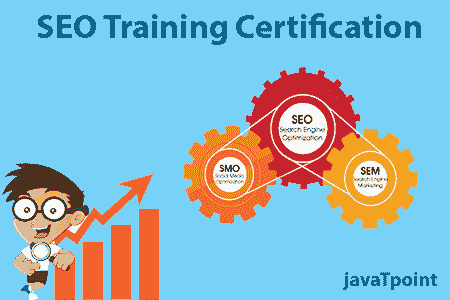
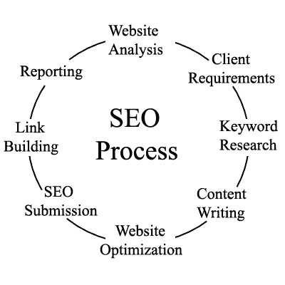

# 搜索引擎优化教程

> 原文：<https://www.javatpoint.com/seo-tutorial>

SEO 教程提供了 SEO 的基本和高级概念。我们的搜索引擎优化教程是为初学者和专业人士设计的。

搜索引擎优化代表搜索引擎优化。它提供了优化网站的技术，以便在搜索引擎上排名良好。

我们的搜索引擎优化教程包括搜索引擎优化的所有主题，如黑白搜索引擎优化技术、搜索引擎如何工作、搜索引擎优化市场研究、内容研究、页面优化技术、页面外优化技术、社交媒体优化、搜索引擎优化工具等。

## 什么是搜索引擎优化

SEO 代表搜索引擎优化。这是一个为搜索引擎优化网站的过程。当人们搜索与他们的产品和服务相关的关键词时，它帮助网站在搜索引擎结果中获得更高的排名。因此，通过有机的搜索引擎结果来增加网站流量的数量和质量是一种做法。见下图了解搜索引擎优化中涉及的基本活动。

搜索结果以有序列表的形式呈现，列表中排名较高的网站往往会获得更多的流量。例如，对于搜索查询，排名第一的结果将接收该查询生成的总流量的 40%到 60%。只有 2%到 3%的访问者会超出搜索结果的第一页。

## 搜索引擎优化如何工作:

谷歌等搜索引擎有自己的算法或规则来决定搜索查询的页面显示顺序。这些算法基于各种排名因素来确定 SERPs 的排名。然而，它更强调某些指标来评估页面的质量，并相应地决定其排名。

## 搜索引擎使用的关键指标:

**链接:**其他网站的链接称为反向链接。这些链接有助于确定网站在 SERPs 中的排名。链接被认为是其他网站的质量投票，因为网站所有者不会链接到质量差的网站。

**内容:**内容质量也是决定网站排名的一个至关重要的参数。内容应该是唯一的，与给定的搜索查询相关。

**页面结构:**网页采用 HTML 编写；搜索引擎也使用页面的 html 编码来评估页面。因此，在标题、网址和其他元标签中包含重要的关键词，并确保网站是可抓取的。

* * *

## 搜索引擎优化指数

* * *

**SEO 教程**

*   [SEO 教程](seo-tutorial)
*   [搜索引擎优化类型](types-of-seo)
*   [白色有 SEO](white-hat-seo-techniques)
*   [黑色有 SEO](black-hat-seo-techniques)
*   [搜索引擎如何工作](how-search-engine-works)
*   [什么是域](what-is-domain)
*   [什么是 WWW](what-is-world-wide-web)
*   [搜索引擎 vs 门户](difference-between-search-engine-and-portal)
*   [谷歌算法更新](seo-google-algorithm-updates)

**研究分析**

*   [SEO 关键词研究](seo-keyword-research-and-analysis)
*   [竞争对手分析](seo-competitors-website-analysis)
*   [SWOT 分析](swot-analysis-of-a-website)
*   [选择最佳关键词](how-to-choose-best-keywords)
*   [关键词研究工具](keyword-research-tools)

**搜索引擎优化指南**

*   [网站设计指南](seo-website-design-guidelines)
*   [内容优化](seo-content-optimization)
*   [搜索引擎优化设计和布局](seo-design-and-layout-of-a-website)

**页面搜索引擎优化**

*   [页面优化](seo-on-page-optimization)
*   [搜索引擎优化页面标题](seo-page-title)
*   SEO 元描述
*   [SEO 元关键词](seo-meta-keywords)
*   [搜索引擎优化标题](seo-headings)
*   [SEO 优化领域](seo-optimized-domain-name)
*   [搜索引擎优化规范标签](seo-canonical-tag)
*   SEO 元标记
*   [其他元标签](seo-miscellaneous-meta-tags)
*   [打开图形元标签](seo-open-graph-metatags)
*   [搜索引擎优化图片](seo-images-and-alt-text)
*   [SEO 内部链接](seo-internal-link-building)
*   [搜索引擎优化站点地图](seo-site-map)
*   [SEO 隐藏文字](seo-hidden-text)
*   [SEO 网络托管](seo-web-hosting)
*   [SEO 机器人元标记](seo-robots-meta-tag)
*   [SEO 301 重定向](seo-301-redirect)
*   [SEO 404 错误](seo-404-error)

**页面外搜索引擎优化**

*   [离页优化](seo-off-page-optimization)
*   [搜索引擎优化页面排名](seo-page-rank)
*   [SEO 链接人气](seo-link-popularity)
*   [SEO 目录提交](seo-directory-submission)
*   [SEO 社交书签](seo-social-bookmark-submission)
*   [SEO 博客投稿](seo-blog-submission)
*   [SEO 文章提交](seo-article-submission)
*   [SEO Reciprocial](seo-reciprocal-linking)
*   [SEO 论坛发帖](seo-forum-posting)
*   [搜索引擎提交](seo-search-engine-submission)
*   [RSS 源提交](seo-rss-feed-submission)
*   [新闻稿提交](seo-press-release-submission)

**面试问题**

*   [SEO 面试问题](seo-interview-questions)

* * *

## 先决条件

在学习 SEO 之前，你必须具备计算机基础和 HTML 的基础知识。

## 观众

我们的搜索引擎优化教程旨在帮助初学者和专业人士。

## 问题

我们保证你不会在这个搜索引擎优化教程中发现任何问题。但是如果有任何错误，请在联系表格中发布问题。