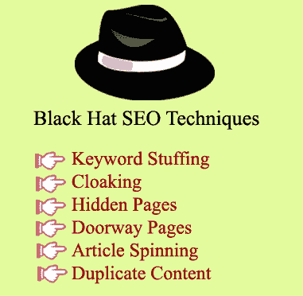

# 黑帽SEO技术

> 原文：<https://www.javatpoint.com/black-hat-seo-techniques>

下面列出了十大黑帽SEO技术:

1.  关键词填充
2.  大衣料
3.  隐藏文本
4.  门口页面
5.  物品旋转
6.  复制内容
7.  页面交换
8.  链接农场
9.  网址劫持
10.  片段的不当使用

### 1)关键词填充

搜索引擎分析网页上的关键词和关键短语来索引网站。为了利用搜索引擎的这一特性，一些SEO从业者增加关键词密度以获得更高的排名，这被认为是一种黑帽SEO技术。百分之二到百分之四之间的关键词密度被认为是最佳的，增加关键词密度会激怒你的读者并影响你的排名。

### 2)隐形

它指的是对网页进行编码，使得搜索引擎看到一组内容，访问者看到另一组内容，即搜索“黄金价格”的用户点击搜索结果“当前黄金价格”，并受到旅游和旅游网站的欢迎。这种做法不符合搜索引擎的指导方针，即为用户而不是搜索引擎创建内容。

### 3)隐藏文本

搜索引擎可以查看但读者不能查看的文本被称为隐藏文本。这种技术用于合并不相关的关键词并隐藏文本或链接，以增加关键词密度或改善内部链接结构。隐藏文本的一些方法是将字体大小设置为零，使用 CSS 将文本设置为离屏，在白色背景上创建白色文本等。

### 4)门口页面

那些写得很差的页面，虽然关键词丰富，但不包含相关信息，并且只关注将用户重定向到不相关页面的链接，这些页面被称为门口页面。这些页面被黑帽 SEO 专业人士用来将用户流量传递给不相关的网站。

### 5)物品旋转

它包括重写一篇文章，以产生不同的副本，使每一个副本看起来都像一篇新文章。这类文章内容重复，文笔差，对访问者价值低。在这项技术中，这样的文章会定期上传，以创造新鲜文章的假象。

### 6)重复内容

从一个网站复制的内容发布到另一个网站，因为原始内容被称为重复内容。这种黑帽技术被称为抄袭。

### 7)页面交换(诱饵和开关)

在这种技术中，首先，你得到的网页索引和搜索引擎列表排名，然后你改变整个页面的内容。在这种情况下，当用户点击 SERP 中的结果时，他们被转移到不同的页面。

### 8)链接农场

链接场是一个网站或网站集合，旨在通过增加传入链接的数量来提高网站的链接流行度。它被认为是黑帽SEO，因为链接农场的网站质量低，内容无关紧要。

### 9)网址劫持(打字)

在这里，注册了一个拼错的热门网站或竞争对手网站的域名，试图误导访问者。例如，whitehouse.com 可能会误导想要访问 whitehouse.gov 的用户。

### 10)片段使用不当

在这种黑帽SEO技术中，与你的网站或页面无关的片段被用来驱动网站的流量。例如，即使您的页面只有一个评论，也要使用评论片段。

* * *