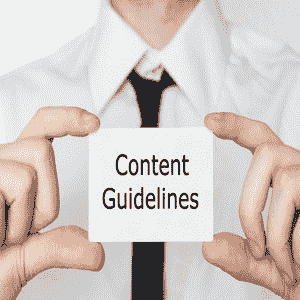

# 网站设计搜索引擎优化指南

> 原文：<https://www.javatpoint.com/seo-website-design-guidelines>

* * *

## 内容指南

一个网站的成功主要取决于它向访问者提供的内容的质量。在搜索引擎优化中，优质内容是指不仅吸引读者，而且吸引搜索引擎的内容。

## 创建优质内容的一些重要准则

### 1)选择最佳关键词

你的页面必须有与你的产品、服务或概念相关的关键词，因为从关键词搜索引擎可以了解你网站的性质和类型。相应地，搜索引擎会在相关查询的结果页面中对您的网站进行排名。所以，在开始写内容之前，进行彻底的关键词研究。可以借助**谷歌关键词规划师、谷歌趋势、SEMRUSH 等各种关键词研究工具。**

### 2)原创/独特内容

纳入相关关键词是不够的；你的内容必须新颖独特。它不应该从任何其他网站复制，否则你的网站将被搜索引擎处罚。

### 3)有足够的词汇

您的网页必须有足够的单词。它们不应该充满大量的图像、符号和负面空间。内容少、图片多的页面不被认为是针对 SEO 优化的，很少出现在搜索引擎的首页。

### 4)最佳关键词密度

避免关键词填充；过度使用关键词不会取悦读者或搜索引擎。他们会理解你的意图，你只关心排名，不关心内容质量。因此，保持最佳的关键词密度，以获得更好的结果。

### 5)短段落

大段落不会吸引用户，所以即使你提供了相关信息，用户也可能不会阅读你的页面。段落大小限制在四至五行被认为是搜索引擎优化的理想选择。

### 6)项目符号和编号

大部分读者一般注意力跨度短，不愿意阅读整页。他们寻找要点，以便在更短的时间内获得有意义的信息，因此尽可能使用简洁明了的项目符号或编号，使您的页面更具吸引力和可读性。

### 7)相关链接

您的内容应该超链接到相关页面。如果你的内容被链接到一个提供不同信息的页面，那么它会惹恼读者，你可能会失去你的可信度。

### 8)校对内容

即使你有良好的打字技巧或写作经验，你也可能在写作时出错。所以，在发布之前，仔细校对你的内容至少两次。它将帮助您消除内容中的所有错误。