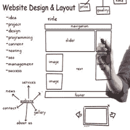

# 网站的设计和布局

> 原文：<https://www.javatpoint.com/seo-design-and-layout-of-a-website>

网站的设计和布局可能很吸引人，但如果它不适合 SEO，它就无法在搜索引擎结果页面中获得更高的排名。搜索引擎不能像我们和访问者一样解释内容；在搜索引擎看来，网页可能不像在你看来的那样。因此，在开始考虑网站的设计和布局之前，请记住以下指导原则。

### 1)关键词放置

你应该在整个网站的正确位置使用目标关键词和短语，即正文、标题、标题、元描述、链接等。正确的关键词放置对每个页面都很重要，但在主页上更重要，因为它是通往网站其他页面的门户和介绍。此外，使用适当的链接词；不要使用“查看更多”、“阅读更多”或“单击此处”来描述链接本身。

### 2)导航

导航必须对用户友好，以便用户可以在更短的时间内轻松找到所需的信息，即从一个步骤移动到另一个步骤应该简单快捷。

优化您的站点的一些有用的实践有:

1.  主导航应该在页面顶部或顶部附近。
2.  在网页页脚添加导航选项。
3.  在每个页面上添加面包屑，让用户知道他们的导航路径。
4.  在页面顶部附近添加一个搜索框，使用户能够按关键词进行搜索。
5.  在页面上提供有限的导航选项，并在导航中提供有限的步骤。
6.  不要修改每个类别的网站模板，因为这会给用户的导航带来困难。

### 3)网址和文件名

网址应该优化 SEO，以便搜索引擎可以很容易地识别它。有许多方法可以优化网址，例如；

1.  在网址中加入关键词，这样就可以清楚地知道页面上的内容
2.  最小化其长度，使用户更容易复制和粘贴
3.  不要使用包含随机字母或数字的网址

为了优化文件名，您可以在上传项目的文件名中添加相关关键字，例如媒体、html、文档等。此外，您应该使用连字符(-)而不是下划线、空格或加号来分隔网址中的单词。

### 4)图像

网站图片是 SEO 的一个重要方面，应该针对更快的加载和搜索引擎可见性进行优化。优化图像的一些实践有:

1.  图像的大小应该小，即 30？100 kb 大小和 72 dpi 分辨率被认为是网站图像的最佳选择。
2.  图像应该放在页面信息的上下文中，即图像周围应该有相关的内容。
3.  对图像使用适当的 alt 标签，因为搜索引擎只能看到单词，而不能看到图像。因此，不要使用像“图像”或“截图”这样的 alt 标签，而是使用包含关键词或描述图像的短语。

### 5)简单性

访问者来到你的网站是为了完成某项任务或寻找特定信息，所以要避免不必要的设计元素，因为这些元素会让访问者更难完成任务或找到信息。一些增强网站简洁性的说明如下:

1.  不要添加太多颜色，即根据 SEO 专家的说法，在您的网站中最多使用五种颜色。
2.  选择易读的字体，每种字体最多使用三种不同的字体和三种不同的大小。
3.  仅当图形有助于用户执行特定操作时，才添加图形。
4.  添加建议插件，帮助用户找到包含特定信息的页面。
5.  避免水平滚动和弹出窗口，因为它们可能会惹恼用户。