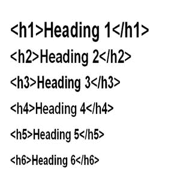

# 标题/标题标签

> 原文：<https://www.javatpoint.com/seo-headings>

标题标签是指页面不同段落或部分的标题。标题将特定的部分或段落与页面的其他部分区分开来，使其更具可读性和组织性。最多可以有六个标题标签，范围从 H1 到 H6，形成自上而下的层次结构，即 HI 在顶部或更重要，H6 在底部或最不重要。

标题应该按照从上到下的顺序使用。您不能跳过序列之间的任何标题标签；否则会打破标题结构，这是页面 SEO 不建议的，即 H1 标签后面应该是 H2 标签，而不是 H3 或任何其他标题标签。

## 搜索引擎优化中标题的好处/为什么 H1 标签很重要？

H1 标签是网站每个页面最重要的标签。它的目的是介绍一个页面的内容，告诉用户对一个页面的期望，或者简单地说出页面的名称。

页面顶部的相关关键词或者想要的信息对 SEO 是有好处的。它允许用户和搜索引擎阅读和理解你的文本。它们让用户更容易理解文章或页面的内容。标题告诉你内容的哪些部分是重要的，它们是如何连接的。因此，我们可以说标题就像路标一样引导读者浏览一页。

标题应该是相关的，这样读者就可以知道一个页面或部分是关于什么的，或者对一个页面或部分有什么期望。此外，它还可以帮助用户在迷路时回到正轨。

例如，销售两轮车零件的人可以创建一个带有“在哪里购买自行车零件”H1 标签的页面。所以，这个标题告诉谷歌，这个页面是关于在哪里购买两轮车零件，所以它增加了这个页面为那个查询排名的机会。因此，谷歌将向正确的用户显示该页面，从而有助于降低跳出率，进而有助于提高搜索引擎优化。

## 优化标题的一些重要说明

*   **每页上的 H1 标签:**永远不要错过页面上的 H1 标签，因为搜索蜘蛛倾向于寻找 h1 标签来获得页面内容的想法。如果您错过了 H1 标签或您的网页没有介绍，访问者可能不确定他们是否在正确的页面上。
*   **唯一:**不要过度使用 H1 标签，即每页应该只有一个。一个页面的多个标题可能会混淆读者，稀释你的关键词。重复的内容永远不会好，不管它有多小。
*   **相关、描述性关键词:**在标题中使用有针对性的关键词或短语；避免与页面无关的词语。例如，您可以使用“关于我们的汽车修理厂”，而不是“关于”或“关于我们”你也可以在标题中加入长尾关键词，让标题更具体，让读者更感兴趣。因此，它允许你向读者展示他们已经找到了正确的页面。例如，一个玩具供应商在为他或她的网站写一个关于玩具供应的页面时，可以使用 H1 标签，如“玩具供应”、“在哪里购买玩具供应”或“所有关于玩具供应”等。因此，它允许您在正确的位置使用关键词，从而帮助您的网站超越竞争对手。此外，标题后应附有相关内容。
*   **顺序:**保持标题标签的顺序；H1 应该排在第一位，其次是 H2、H3 等等。
*   **关键词密度:**不要在 H1 标签或标题中填入关键词，例如，汽车配件供应优于“汽车配件汽车维修供应汽车”
*   **使用副标题:**你可以在每 200 个或更多单词后使用 H2 标签来创建一个分页符，使每个部分更加可见和吸引人。记住不要把关键词放在每个小标题中，因为这可能会导致关键词填充。

* * *