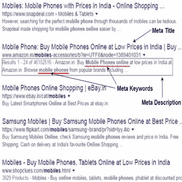

# 当标记

> 原文：<https://www.javatpoint.com/seo-meta-tags>

元标签代表元数据，并提供关于 HTML 文档的信息。元标签中包含的内容不会显示在网页上；浏览器和搜索引擎使用它来获取关于页面的信息。

所以，元标签就是 HTML 标签，它提供了关于网页内容的信息。它们告诉你页面是关于什么的，谁创建了页面，什么时候更新，用来表示页面的关键词等等。这些信息有助于搜索引擎对网页进行索引，以便寻找该信息或类似信息的用户可以找到它。

元标签放在 HTML 的头部内部，即元标签。浏览你的网站的用户看不到它们，但是搜索引擎可以看到它们，从而对你的关键词有一个简单的了解，并知道你的网站是关于什么的。

有三种类型的元标签:

**标题标签:**是出现在浏览器窗口标题栏的搜索引擎列表中的标题文本。

**元描述标签:**是你页面内容的总结。它会出现在搜索引擎列表中您的页面的网址下方。

**Meta 关键词标签:**它是你放置所有描述页面内容的重要关键词和短语的地方。

* * *