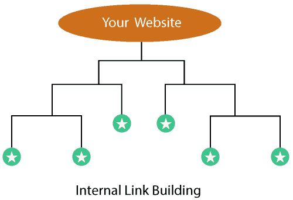

# 内部链接建筑

> 原文：<https://www.javatpoint.com/seo-internal-link-building>

同一个域中从一个页面到另一个页面的文本链接被称为内部链接，创建这样的链接被称为**内部链接构建**。这是一种重要的搜索引擎优化技术，使您能够将新帖子链接到另一个旧的或受欢迎的帖子，以增加新帖子的流量，并为用户提供更多相关内容。网站所有者对内部链接拥有完全控制权，因此有效使用它非常重要。链接结构应该是自然的和用户友好的，以便用户可以轻松地在您的网站上导航。

## 内部链接构建的一些主要好处是:

1.  **用户友好导航:**有助于提升导航；当你阅读一个页面时，你也可以通过文本链接访问其他类似的页面。因此，它也有助于提高页面浏览量，并提高您的网站转化率。
2.  **帮助提供相关数据:**它使你能够告诉用户和搜索引擎，网站的其他页面上有更多或额外的关于他们正在阅读的文本的信息。因此，您可以确保您的用户不会错过任何相关信息。
3.  **降低跳出率:**通过使用文本链接，你可以/让用户在你的网站上持续更长时间；用户希望使用链接阅读其他页面上的其他相关帖子或内容。
4.  **帮助利用其他页面的链接汁:**它帮助你将页面排名或权限较高的页面连接到排名较低或不太受欢迎的另一个页面上的相关内容。因此，您可以将链接果汁从一个页面传递到其他页面，以便它们可以表现得更好。此外，每当你上传新的内容或页面时，你可以将其链接到你现有的受欢迎的内容，并在 SERPs 中排名更高。
5.  **帮助页面增值:**通过内部链接谷歌可以了解不同页面、帖子等之间的关系。因此，它可以找出你网站上的哪些页面包含相关信息。因此，它增加了页面的相关性和价值。
6.  **站点架构:**内部链接帮助建立站点架构，传播链接汁液。
7.  **页面排名:**Page Rank 高的页面可以通过内部链接进一步提升自己的 Page Rank，并将其链接汁扩散到其他连接的页面。
8.  **更好的抓取和索引:**内部架构帮助爬虫找到通常不被访问的更深的页面。因此，通过内部链接，它可以识别索引中没有的内容。因此，具有良好内部链接的网站可以期待其新内容被爬虫快速发现和索引。
9.  **提升有机流量:**通过将链接汁传递给新页面，有助于提高新页面的排名，从而提升有机流量。
10.  **提高点击率:**内部链接可以让用户在你的网站上找到更多提高点击率的页面。

* * *