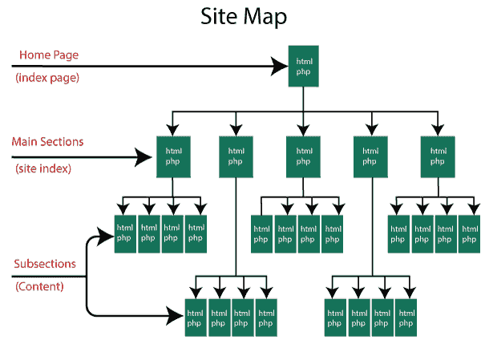

# 网站地图

> 原文：<https://www.javatpoint.com/seo-site-map>

站点地图指的是站点的地图，它显示了站点的详细结构，比如不同的部分以及连接它们的链接。站点地图的作用是帮助用户和搜索引擎在你的站点上找到信息，从而发现更多你的站点。

## 站点地图的类型:

站点地图可以是静态的 HTML 文件或 XML 文件。基于 HTML 文件的站点地图是传统的站点地图。它们被设计成勾勒出网站的第一和第二层结构，以便用户可以很容易地在网站上找到信息。这些主要与用户有关。

## HTML 网站地图的优势:

*   它包括网站的每一页，就像一个组织良好的日常事务。
*   它是你的网站的架构蓝图，监督你的页面和子页面之间的结构和连接。
*   它允许用户导航到你网站的关键区域。它告诉用户你的网站是关于什么的。
*   它确保你的内容离你的主页只有一两次点击，也就是说，它很容易访问。
*   它促进了搜索引擎爬虫的工作，因为 HTML 链接提供了搜索引擎更喜欢探索网络的方式。
*   优化的 HTML 站点地图在您的网站上充当权威页面，包含指向您网站其他页面的链接。

另一方面，XML 站点地图主要是为搜索引擎设计的。它包括一个网站的所有活动，就像主网址一样，它也包含所有其他带有元数据的网址。它还会告诉你一个网址在最后一次更新时有多重要，它与网站的关系等等。

## 为什么需要 XML 站点地图？

在下列情况下，XML 站点地图非常有用:

*   一个网站有复杂的结构或大量的内部链接
*   一个网站是新的，或者它有较少的外部链接
*   一个网站是一致的，并有存档的内容

## 创建 XML 站点地图时需要记住的要点:

*   以开始标记开始，以结束标记结束
*   在标记中指定名称空间(协议标准)
*   为每个网址合并一个条目，作为父 XML 标记
*   每个父标签的子条目
*   UTF-8 编码

## XML 站点地图的优势:

*   它允许你列出你网站上的所有网址，包括那些在索引你的网页时不会被搜索引擎注意到的网页。
*   它允许您通过在 XML 站点地图上添加标签来指示最重要的页面，从而为页面分配优先级。因此，你可以要求搜索引擎爬虫给你的优先页面更多的优先权。
*   它允许您向搜索引擎提供时间信息，因为您可以添加两个可选的标签来与搜索引擎共享额外的数据，以帮助它们抓取您的网站。第一个这样的标签是“lastmod”，它告诉页面最后一次改变或更新的时间；第二个是“changefreq ”,它告诉你一个页面多久可能会改变一次。

* * *