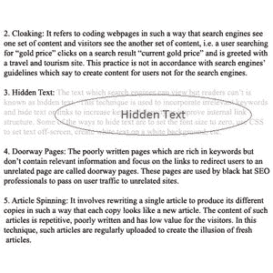

# 隐藏文本

> 原文：<https://www.javatpoint.com/seo-hidden-text>

隐藏文本是搜索引擎可以阅读的文本内容，但您的访问者无法阅读或看到。也叫**隐形或假文字**。

使用这样的文本可以提高页面的排名，但是这种技术违背了搜索引擎的准则，被认为是黑帽 SEO 技术。

所有主要的搜索引擎都将隐藏文本视为搜索垃圾邮件。他们可以很容易地检测到他们的存在，并可能暂时或永久禁止你的网站。

## 创建隐藏文本的一些方法:

*   内容和背景的颜色保持不变，以使它们无法区分。例如，白色背景上的白色文本是创建隐藏文本的常用方法。
*   CSS 还用于隐藏内容，例如，使用显示:无、可见性:隐藏、高度:0、宽度:0 等属性。

## 隐藏内容的有效理由:

虽然它是黑帽 seo，有一些有效的理由隐藏文本。

**付费内容订阅:**提供付费订阅的网站被谷歌允许隐藏内容。它还支持第一次点击免费的隐形方法，这意味着在从谷歌首次访问期间，您将看到内容，但在第二次访问页面时，内容不再可用，您需要登录并付费才能查看内容。它旨在提供出版商付费订阅内容的预览示例。

**专为移动和桌面设计的页面元素:**响应性网站可以根据页面大小进行更改和调整。当达到特定的宽度限制时，一些页面元素可能会消失，一些可能会出现。但是，它们同时出现在源代码中，并被暂时隐藏。这是为了可用性的目的，谷歌知道这些视口格式。如果你用它来获得适当的移动和桌面用户体验，谷歌不会处罚你的网站。

**优雅降级:**有时，开发人员希望确保高级和旧网络浏览器的最佳用户体验。例如，如果浏览器不支持图像、JavaScript 或 CSS，内容仍将被正确呈现。但是，要启用此功能，旧网络浏览器的内容可能需要隐藏在新网络浏览器中。

* * *