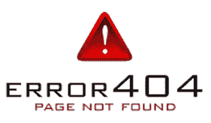

# SEO 404 错误

> 原文：<https://www.javatpoint.com/seo-404-error>

404 错误是用户在浏览网页时经常遇到的最常见的 HTTP 错误。这是一个 HTTP 标准响应代码，表示客户端能够联系服务器，但服务器无法找到客户端请求的页面。因此，这仅仅意味着您试图访问的网页在服务器上找不到。

404 错误通常是由于您的网站上的错误链接或您删除了请求的页面而引起的。它通常发生在重定向到新的网址还没有实现的时候。如果你不创建 404 错误页面，会影响你的SEO。要求有 404 错误页，因为是常见问题。要创建 404 页面，您需要将所有不相关的请求重定向到一个 404 错误页面。

**你可以做一些事情来改善 404 的用户体验，比如:**

*   不要让它显示为 404 错误，因为这是一个大多数人可能不理解的技术术语。取而代之的是使用一个简单的消息，比如“对不起，你要找的页面不可用”，或者如果可能的话，让这个消息变得有趣。
*   404 消息的模板布局或站点导航应该与您的网站相同。
*   确保您的联系信息清晰显示，您可以包含一个快速联系表单。
*   添加热门页面的内部链接，例如主页和产品/服务页面，或者像站点地图这样的列表。
*   您还可以添加到最新或特色文章的链接。
*   如果有 404 错误的页面有从外部来源指向它的重要链接，或者它以前接收过大量流量，请使用 301 重定向。
*   您可以重定向到新的网址或相关网页。从用户角度考虑，主页并不是唯一的显示选项。

* * *