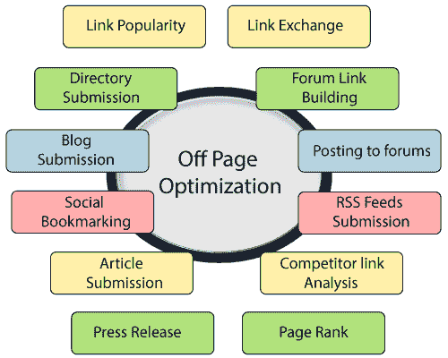

# 页面外优化

> 原文：<https://www.javatpoint.com/seo-off-page-optimization>

离页优化是指在网站之外可以采取的所有措施，以提高其在搜索引擎结果页面上的排名。与页面SEO不同，它不处理网站或内容本身的优化。所以，页外优化因素不在网站所有者的直接控制范围内。

页面外优化和页面内优化一样重要。如果不应用离页因素，你的网站排名可能不会像它应该的那样高。页面外SEO因素，如链接建设，社交媒体，视频，博客等。，对你网站的SEO非常重要。它帮助你在社交媒体上获得更多的点击量、访问量和曝光率。这是一系列接连发生的事件。因此，这是一个长期的过程，主要集中在从社交媒体、权威网站和社交书签获取网页的反向链接。

## 页面外SEO的链接类型:

建立链接是页面外SEO的一个重要部分。在你开始建立反向链接之前，你必须知道链接的类型和影响你网站链接质量的因素。链接有三种类型，如下所示:

*   **自然链接:**这类链接自然来到你的网站。你不必付出努力或制定策略来获得这样的链接。比如一个博主写了一个关于技术的博客，他在博客里提到了你的网站链接。
*   **已建链接:**这些链接是通过外展生成的。你必须通过联系网站管理员、出版商或记者，或者通过广告宣传来获得这样的链接。
*   **已创建链接:**这些链接是通过目录、论坛或新闻稿上的自我提交为您的网站生成的。

## 页面外优化技术:

1.  **打造可分享内容:**优质内容永远是 SEO 中的王者。创建有意义的、相关的、可以共享的内容是一种生成到您的网站的自然链接的聪明方法。所以，继续研究和更新你的内容。
2.  **影响者外展:**如果您认为您的内容有价值，值得分享，请不要犹豫，主动联系您所在行业的影响者。如果他们喜欢你的内容，你可以从他们那里获得链接。但是，请确保链接来自相关网站。
3.  **客座作者:**您可以将您的内容作为客座文章发布在其他博客上，这些博客对来自不同作者的客座文章开放。你需要写与他们的博客相关的高质量内容。如果你的内容没有给他们的博客增加价值，他们可能不允许在他们的博客上发帖。
4.  **社交媒体参与度:**这也是一种重要的页面外 SEO 技术，通过与脸书、推特等多个社交媒体平台上的人互动，让你的网站或业务变得受欢迎。它将帮助你获得更多的反向链接。
5.  **社交书签网站:**这些网站为你提供了一个推广网站的平台。您可以在这些网站上上传您的网页或博客文章，并附上指向您的网站的链接。因此，你可以获得高流量到你的网站。
6.  **论坛提交:**你可以参与与你的网站和业务相关的论坛，并与这些社区建立联系。它允许你回复帖子，回答人们的问题，并给出建议。使用“做-跟随”论坛获得更好的结果。
7.  **博客目录提交:**它允许你在目录中提交你的页面来建立反向链接。你需要选择一个受欢迎的目录，然后选择一个合适的类别。
8.  **文章提交:**你也可以在高 PR 文章提交目录下提交你的文章。你的内容应该是独特的和高质量的。选择一个相关的类别，给你的内容一个好的标题。
9.  **问答:**你也可以从问答网站获取你网站的流量。加入热门问答网站，回答与您的业务、博客或网站相关的问题，并正确回答这些问题。在答案中包含一个指向您的网站的链接，这将为您带来更多的可见性。
10.  **视频提交:**找到热门的视频提交网站。创建令人印象深刻的视频，适当的标题，描述，标签和参考链接，并在这些网站提交。这是获得反向链接的聪明方法，因为大多数视频网站都有很高的 PR。
11.  **图片提交:**有很多图片提交网站可以分享你的照片。提交之前，使用相关的网址、标题标签、描述和 alt 标签优化您的图像。
12.  **Infographics Submission:** 可以创建 Infographics，它是图表、图形等信息或数据的可视化表示。用户喜欢信息图。找到一些流行的信息图提交网站，提交带有指向您的网页或博客的参考链接的信息图。
13.  **文档共享:**还有各种文档共享网站，可以提交 pdf 或 ppt 格式的文档。创建有吸引力的相关文档，并在与您的业务、工作等相关的网站上提交。
14.  **Web2.0 提交:**它也是一种离页 seo 技术，可以让你在高域权威网站中创建子域。比如博主、wordpress、媒体等。
15.  **Google My Business:** 这是一款免费的 Google 产品，可以针对最佳本地 SEO 排名进行优化。

* * *