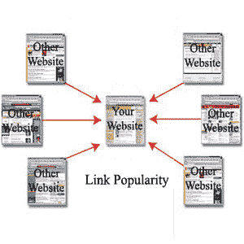

# 链接流行度

> 原文：<https://www.javatpoint.com/seo-link-popularity>

链接流行度是一个重要的页面外SEO策略。它指的是指向网站的链接总数。这些链接有两种类型；内部和外部。内部链接是来自您自己网页的链接，外部链接来自其他网页或网站。

高链接流行度表明更多的人连接到你的网站，它包含有用的内容和信息。因此，搜索引擎在搜索引擎结果页面中对网站进行排名是搜索引擎的重要因素之一，即如果有两个网站具有相同的SEO水平，链接人气较高的网站将被搜索引擎排名较高。

然而，链接到你的网站应该是高质量的反向链接。高质量的反向链接是一个链接，它包含与您的网站相关的内容，并且具有很高的人气。

锚文本也有助于确定反向链接的质量。它讲述了链接的全部内容。在寻找链接合作伙伴之前，您可能会遵循一些指导原则。

*   该网站应该与您的内容或信息相关。
*   保持你的网站及其链接的重点。
*   分享独特和相关的信息。

* * *