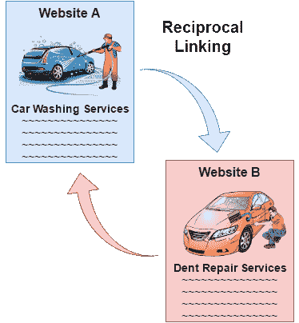

# 双向链接

> 原文：<https://www.javatpoint.com/seo-reciprocal-linking>

对等链接是指在两个网站之间创建对等链接，即当一个网站“A”链接到网站“B”时创建，网站“B”又链接到网站“A”。这是两个网站之间的协议，其中每个网站都超链接到另一个网站。

它通常在提供相关服务或信息的站点之间完成。相互喜欢的目的是为读者提供快速访问相关网站的机会，并提高网站的搜索引擎排名。

相关网站之间应该建立对等的链接，否则会激怒你的用户，损害你网站的SEO，例如，同一城市的一家洗车和凹痕修复公司可能会链接其他网站以吸引更多的客户。

## 互惠联系的好处:

*   它允许你从一个高权威网站到你的网站传递链接权益。
*   它可以帮助您建立多样化的链接配置文件。
*   它帮助你获得更多的推荐流量。

## 双向链接需要记住的要点:

*   链接应该来自一个与你的利基相关的网站。例如，如果你的网站与汽车利基相关，从减肥利基的高权威网站获得链接不会有太大好处。
*   你从网站获得的互惠链接应该是一个非竞争网站。
*   你应该入围那些网站的互惠链接，有良好的搜索引擎结果页面排名。

* * *