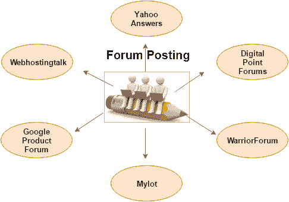

# 论坛发帖

> 原文：<https://www.javatpoint.com/seo-forum-posting>

**论坛发帖**是指通过参与在线论坛，生成优质的入站链接。它允许你发布新的帖子和回复旧的帖子来增加你网站的流量。

有许多论坛网站为在线讨论提供了一个平台，即留言板、讨论组、论坛和公告板是一些受欢迎的论坛网站类型。您需要在这些网站上注册，然后才能提交讨论主题。

**部分热门论坛讨论网站有:**

*   雅虎回答
*   数字点论坛
*   战争论坛
*   米洛特
*   Webhostingtalk
*   栈溢出
*   谷歌产品论坛

## 论坛发布说明:

*   **选择相关论坛:**你应该在相关论坛发帖，即如果你的帖子是关于计算机技术的，那么你应该更喜欢计算机技术相关的论坛。
*   **选择合适的标题:**你的标题要清晰地反映你的帖子内容。一个不相关的标题可能会让你的读者远离你的网站。
*   **并入主要关键词:**在文章标题和正文中插入你的主要关键词。它有助于您的帖子出现在搜索结果中，以查找具有相同关键字的查询。
*   **论坛指南:**每个论坛都有自己的注册流程和指南，你应该遵守。它有助于你获得尊重，并吸引认真和专注的读者。
*   **放置你的链接:**你可以在帖子末尾的签名中添加你的链接。这将有助于产生你的网站反向链接。
*   **不要使用抄袭的内容:**不要在论坛上分享或发布别人的内容。论坛不允许复制内容，可能会对你采取严厉措施。
*   **避免直销:**论坛不允许直销。您应该向访问者提供相关信息，并为他们的问题提供快速解决方案。

* * *