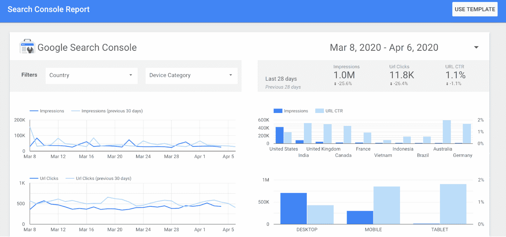

# 最佳 SEO 工具 51 强

> 原文：<https://www.javatpoint.com/top-10-best-seo-tools>

**SEO(SEO)** 是优化在线内容的过程，以便搜索引擎显示为任何关键词搜索的顶级结果。它提高了搜索引擎网站**流量**的质量。根据搜索引擎土地(一个提供**SEO**和**SEO**新闻的门户网站)**SEO**行业估值为**650 亿美元**。

如果你经营的是**博客、网站**或**频道**，我们必须优化在线内容以获得更好的效果。对于优化，有很多**SEO 工具**可用。在这一部分，我们列出了**十大最佳 SEO 工具**，它们有助于**关键词研究、竞争对手研究、排名跟踪、**和**链接构建**。

### 1:永远

**用于:**关键词+竞争研究

**定价:**免费增值

SEMrush 是 SEO 的最佳工具。它成名多年。该工具将竞争研究提升到了一个不同的水平。它提供了比 **20** 更多的方式来研究比赛。罗比·理查兹称之为隐形战术。你会发现他们的反向链接、关键词和内容是最好的。对于付费流量和 PPC 非常好。

**关键特性**

*   运行技术 SEO 审核。
*   跟踪我们的每日排名。
*   分析任何竞争对手的 SEO 策略。
*   分析任何域的反向链接配置文件。
*   研究数百万个关键词创意。
*   收集 SEO 的想法来获得有机的流量。

### 2:应收帐款

**用于:**研究和分析

**定价:**溢价

许多博主、在线营销人员和小企业主使用 Ahrefs 来提高他们的网站搜索排名。它有一个内容浏览器，可以搜索任何关键词中最受欢迎的内容。

它给了我们关键词的搜索量(**全球或国家**)、SERP 概况和状态历史、相关关键词查看和难度等级。Ahrefs 的价格从每月 99 美元**开始，有年度选项，但这里也有一个有限制的免费账户。30 天免费。**

 ****关键特性**

*   **搜索引擎**关键词研究。
*   获得总搜索流量估计。
*   查看反向链接随时间的增长或下降。
*   查看“点击”数据。
*   根据流量查看顶部子文件夹。
*   检查关键词点击分布。

### 3: Serpstat

**用于:**内容营销、SEO、PPC

**定价:**付费

它是一个一体化的数字开发工具，可以优化任何网站的 SEO、项目组合和内容营销活动。塞尔普斯特有四个计划列出 **A** 到 **D** ，价格从**19 美元/月**到**299 美元/月。**

**关键特性**

*   它收集**SEO**和**项目组合**的关键词
*   设置关键字的值
*   找到关键词和搜索建议，扩展语义核心。
*   获取长尾关键词
*   国际数据搜索
*   检查网页的相关性。
*   分析关键词趋势
*   知道哪些页面出现在关键字的搜索结果中。

### 4:高级网页排名

**用于:**竞争研究&排名追踪

**定价:**付费，免费试用

高级网页排名是市场上广泛的传统。自 2002 年以来，它适应了它的准确性和大量的关键词，被小企业、内容作者和自由职业者使用。它的价格从每月 49 美元开始，并且每年的订阅有 10%的折扣。

### 5:可靠性

**用于:** SEO 审核

**定价:**免费，也付费

搜索能力也是一个很好的 SEO 工具。它显示了网站整体 SEO 优化的好坏。它有 30 天的免费版本，但保费计划从每月 40 美元开始。扩展功能允许全面的**SEO 分析**，包括反向链接和关键词。注册一个免费的 SEO 基本计划，看看它的伟大功能。它提供以下工具:

1.  **SEO Checker:** 它测试你的网站，并给你更好的 SEO 的提示。
2.  **关键词检查器:**显示您的页面针对您的目标关键词进行了优化。
3.  **SEO 比较:**用来比较两个页面。
4.  **排名检查器:**它检查你的页面排名是否有任何关键词。

**关键特性**

*   所有**功能**都是针对高级会员的。
*   反向链接简介的每周更新。
*   它有一个所有反向链接的列表，新的和丢失的反向链接。
*   链接建设工具，以增加反向链接。

### 6:晨星核心

**用于:** SEO 审核、排名追踪、反向链接、关键词研究

**定价:**付费，免费试用

晨星核心也是一个不错的 SEO 工具。除了所有的标准功能，它比其他 SEO 工具带来了新的功能。该平台使用简化与智能 SEO 建议/指导相结合的方式，对客户的 SEO 最重要的任务进行优先排序。您将获得全新的工作流体验，结合用户友好的界面，节省您大量的时间。平台专注于 **SEO** 和连接。

**关键特性**

*   **针对企业的 SEO:**您可以快速估计企业/客户。
*   **完整反向链接简介:**与 Ahrefs 的合作为我们带来了最好的反向链接数据。
*   **SEO 审核:**它给你最重要的指标而不需要**额外的膨胀**。

### 7:长尾专业版

**用于:**关键词研究

**定价:**完全付费

**LTP** 也是热门的关键词研究工具。它使**10 倍**更快，**10 倍**更容易，目前正在进行所有权变更。新团队渴望成功。他们看到了**长尾 Pro** 的潜力，并将其做大。

它允许用户在几分钟内基于单个根关键词或同时基于多个根关键词生成数千个“**长尾**”关键词。

**关键特性**

*   每 24 小时产生 800 个关键词。
*   每 24 小时八百关键词**竞争力**计算。
*   800 **蛇** 查找 **24 小时** .
*   关键词结果还包括搜索量(来自**谷歌数据**)。
*   通过**长尾 Pro** 对搜索到的每个关键词计算关键词竞争力。

### 8:芒果/KWFinder

**用于:** SEO

**定价:**免费试用/支付

芒果工具可以看到我们竞争对手的关键词和反向链接。它分析 SERPs，跟踪 Rank，深入获取我们竞争对手的 **SEO** 信息。芒果醇用于排名跟踪、反向链接分析、网站分析和 SERP 分析。

**关键特性**

*   更精细的位置。
*   新指标。
*   更准确的关键词 SEO 难度。
*   几个月的搜索量。
*   改进的过滤选项。
*   新用户界面。

### 9:优博建议

**用于:** SEO

**定价:**免费试用/支付

Uber inspect 让我们能够深入了解对他人有效的策略，从而改进他人并获得优势。我们从我们的免费关键词工具中获得建议，从词头到长尾短语。我们可以看到每个关键词的数量、竞争和季节性趋势。

**关键特性**

*   更多关键词数据
*   更多反向链接数据
*   它有更好的流量估计。

### 10:地震

**用于:**竞争研究

**定价:**免费

SEOquake 是一个浏览器扩展。它用于关键词研究和 SEO 选项。这在我们研究竞争对手或寻找任何链接机会时非常有用。它是免费使用的。

**SEOquake** 提供搜索引擎结果页面上列表的相关参数。

**关键特性**

*   进行页面**SEO 审核**
*   它检查**内部**和**外部链接。**
*   实时对比**域**和 URL。
*   **将**所有数据导出到一个文件中

### 11:种子关键词

**用于:**关键词研究

**定价:**免费

种子关键词是搜索有价值关键词的引擎。在这个工具中，我们必须创建一个场景。

例如:**如果你在找鞋子，你会找什么？**

我们获取我们提供的唯一网址，并与尽可能多的人分享。我们有很多人来回答你的问题。它 100%免费使用。

**种子关键词**与修改器组合，创建长尾**关键词**。

### 12: SEOptimer

**用于:** SEO 审核

**定价:**免费

它显示了页面上的指标，如关键词使用和用户体验。(例如**速度**和**移动响应**)。它将显示**页面外的**指标，例如我们的反向链接简介和域名权威。 **SEOptimer** 将对网站进行评分，并给出适当的推荐。

**SEOptimer** 提供了很多免费的 SEO 工具，比如**反向链接检查器**和**元标签**。

### 13:权威实验室

**用于:**等级跟踪

**定价:**付费

这是一个等级追踪工具。它按照**国家、城市**和**个人识别码**跟踪结果。该工具给我们的关键词，排名位置，以及搜索量。它还可以让你追踪竞争对手的搜索排名。一些伟大的功能是移动排名跟踪，每周或每月报告。该计划以每月 99 美元**开始，30 天免费试用。**

 ****关键特性**

*   跟踪本地排名。
*   追踪手机排名。
*   特色片段跟踪。
*   竞争对手监控。

### 14.回答公众

回答公众从谷歌的自动完成结果中提取人们问的问题(以及一些其他类型的查询)。它对产生主题想法非常有帮助。

回答公众是一个免费的工具。你可以一天免费做两次搜索。

### 15.谷歌关键词规划器

谷歌关键词规划师是谷歌的关键词研究工具。使用它生成基于最多十个种子关键字或网站或网址的关键字想法。

虽然关键词计划器有局限性，例如缺乏完整的搜索量，但它有助于找到你可能难以使用传统关键词研究工具找到的关键词想法。

### 16.谷歌趋势

谷歌趋势显示了一个话题随时间的流行程度。使用它来捕获和利用趋势主题，避免创建关于不太感兴趣的人的内容。谷歌趋势是一个流行的 SEO 工具。

### 17.Keyworddit

Keyworddit 从 Reddit 中提取关键词。在这里，我们输入任何子关键词(例如，bigSEO)，它会拉一个关键词列表，并估计每月的搜索量。

这有助于找到你的听众感兴趣的话题。子列表中有许多关键词:

### 18.AlsoAsked.com

**AlsoAsked.com**从**谷歌的“人们也问”(PAA)** 框中抓取问题。用它来寻找文章中可能值得回答的副主题和问题。

**比如**，如果你在写一篇关于“**如何用醋清洗咖啡机”的文章，你的问题就像:**

*   应该用多少醋？
*   你应该在咖啡机旁放多少次醋？
*   清洗醋比普通醋好吗？

### 19.关键词冲浪

关键字冲浪是一个免费的 Chrome 扩展，显示任何输入谷歌的查询的估计全球搜索量。你可以在侧边栏中看到类似的关键词和相关单词。

这让你不用离开 SERPs 就可以轻松进行关键词研究和竞争分析。

## 页面 SEO 工具

这些工具帮助你优化你的页面，使其在搜索引擎中排名更高。

### 20.数学排名

Rank Math 是一个 WordPress **SEO** 插件，帮助进行页面内和页面外的 SEO。

以下是排名数学中使用的一些东西:

*   它给帖子添加了标题、元描述和其他标签。
*   为丰富的代码片段添加结构化数据标记。
*   用于网址重定向。
*   搜索并修复网站上的死链接。

**类似网站** : Yoast SEO，全在一个 SEO 包里。

### 21.SERPSim

SERPSim 显示了网页在谷歌搜索结果中的外观。你必须输入你的标题，元描述和网址。

SERPSim 还会告诉你标题和描述是太长还是太短。

谷歌的丰富结果测试工具会检查你页面上的结构化标记，看看它是否符合搜索结果中的丰富片段。

### 23.默克的模式标记生成器

Merkle 的模式标记生成器以 JSON-LD 格式创建结构化数据标记。只需选择您想要生成的模式标记类型(例如，本地业务、常见问题、产品等)。)，填写表单，然后将生成的标记复制并粘贴到您的网站。

### 24.Ahrefs 的反向链接检查器

Ahrefs 的反向链接检查器显示任何网站的前 100 个反向链接。

它还显示了五个链接最多的页面，以及最常见的锚文本、反向链接和引用域的总数、域评级(DR)和 URL 评级(UR)分数。

同一个行业领先的数据库为我们的高级工具提供了动力。

### 25.亨特.伊奥

Hunter.io 查找与网站相关联的电子邮件地址。它每月最多可免费接受 50 次请求。

您也可以使用该工具查找任何特定人员的电子邮件地址。只需输入域名和人名。

### 26.“断开链接检查器”

Ahrefs 的断开链接检查器显示任何域、子域或 URL 的前十个断开的入站和出站链接。您可以使用此工具寻找断开的链接建立机会，并在您的站点上找到断开的出站链接，您可以修复这些链接以改善用户体验；

在你的网站上搜索断页检索“**链接授权**”。

### 27.刮刀

scratch 是一个 Chrome 扩展，允许你从任何网页上删除数据。它有多种用途。例如，从谷歌搜索结果中抓取链接可能性。

### 28.帮助记者(HARO)

HARO 是一项免费服务，将新闻来源与寻求专业知识的记者联系起来。

**工作原理**:这个需要专家解答。HARO 向客户发送带有这些问题的电子邮件。任何人都可以做出反应，并有可能成为这些出版物的来源。

如果你开始或创建一个既定的网站，这是一个伟大的方式来创建官方链接。

### 29.倾向

Streak 是一个免费的 Chrome 扩展，可以将你的 Gmail 变成客户关系管理软件。

你可以用 Streak 安排和发送大量个性化的电子邮件，看看是否有人打开了它们，等等。这是博主拓展的绝佳工具。

## 技术 SEO 工具

这些工具可以帮助你改进网站的技术方面。

### 30.谷歌搜索控制台

谷歌搜索控制台是谷歌的一项免费服务，帮助您监控和排除您的网站在其搜索结果中的存在。

使用它来检测和修复技术错误，查看结构化数据问题，以及许多其他工作。

Bing 和 Yandex 也有自己的版本。

### 31.网站管理员工具

Ahrefs 网站管理员工具是一个免费的工具，可以帮助你提高网站的 SEO 性能。它允许您:

*   监控你网站的 SEO 健康
*   查看 100 多个 SEO 问题
*   查看所有反向链接
*   查看您排名的所有关键词
*   找出你的页面有多少流量。
*   寻找内部链接机会

### 32.尖叫的青蛙

尖叫青蛙是一个基于桌面的网站。它也是最流行的工具之一，可用于分析和审计技术和页面 SEO 问题。

有了免费版本，你可以爬上 500 个网址。

### 33.云耀斑

Cloudflare 是一个免费的全球 CDN。它不仅可以加速你的网站，还可以保护它免受恶意攻击。

### 34.GTMetrix

GTMetrix 分析你网页的加载速度。除了性能得分，它还显示了可操作的建议，以加快加载速度。

**类似网站**:谷歌页面速度洞察、PSDI、网页测试。

### 35.谷歌的移动友好测试

谷歌的移动友好测试测试访问者在移动设备上访问你的页面有多容易。它还确定了特定的移动工具问题，如文本太小而无法阅读，使用不兼容的插件，等等。

随着谷歌转向移动优先索引，拥有一个响应迅速的网站比以往任何时候都更加重要。

### 36.机器人. txt 发电机

robots.txt 生成器会在几秒钟内创建一个格式正确的 robots.txt 文件。

更高级的用户可以使用自定义选项为不同的僵尸工具、子目录等创建不同的规则。

### 37.校长 SEO

HeadmasterSEO 是一个简单的工具，用于批量检查 URL 列表的状态代码。免费版允许你测试多达 500 个。

如果您更喜欢基于网络的应用程序，并且只想检查多达 100 个网址，请尝试 HTTPstatus.io。

### 38.保活验证 SEO 工具

使用此工具检查网页或网站上是否启用或禁用了持久连接。

### 39.Chrome DevTools(铬 DevTools)

Chrome DevTools 是一个内置的网页调试工具。我们可以用它来调试页面速度问题，提高网页渲染性能等等。

从[技术 SEO](https://ahrefs.com/blog/technical-seo/) 的角度来看，它有很多用途。

### 40.查看渲染源

视图渲染源是一个 Chrome 扩展，它显示了浏览器是如何将页面的原始 HTML 渲染到 DOM 中的，包括 JavaScript 所做的修改。

对于那些需要审核或解决 JavaScript 问题的人来说，这是一个很好的工具。

### 41.标记生成器

生成 hreflang 标记以指定网页的语言和地理目标。只需添加您想要的网址，选择您的目标国家和语言，然后点击生成。

## 本地搜索结果检查器

BrightLocal 的本地搜索结果检查器向您显示来自任何位置的搜索结果——下至城市、城镇，甚至 ZIP 级别。

根据国家，您甚至可以指定语言:

**类似替代品:**瓦伦汀。app。

### 42.移动 SERP 测试

MobileMoxie 的 SERPerator 工具允许您在任何地点、地址、城市、州或邮政编码检查您的手机排名。

你也可以比较设备，因为一些 SEO 认为谷歌显示 iOS 和安卓的结果不同。

## 分析工具

这些工具帮助您测量和分析网站上的数据。

### 43.谷歌分析

谷歌分析是最受欢迎的分析工具。它给了你一系列数据，你可以用这些数据来改善你营销的各个方面。

Bing 的版本是 Bing 站长工具，Yandex 有自己的 Metrica。

### 44.关键词英雄

关键字 Hero 用于在 Google Analytics 中用确切的搜索关键字替换“(未提供)”数据。

免费层允许您每月最多分析 10 个网址和 2000 个会话。

### 45.谷歌数据工作室

谷歌数据工作室帮助您创建交互式仪表板和惊人的报告。

它与谷歌的工具套件相集成，使得从谷歌搜索控制台和谷歌分析等位置合并数据变得容易。

### 46.AHRS WordPress SEO 外挂程式

Ahrefs 的 WordPress SEO 插件帮助你审核内容和监控你的反向链接。

该插件结合了我们的反向链接索引和谷歌分析数据，给出了如何改进您的内容的提示。

## 本地 SEO 工具

这些工具可以帮助你在本地 SERPs 中排名更高。

谷歌我的业务让我们可以管理我们的网站或任何网页在谷歌搜索和谷歌地图中的显示方式。

声称和优化你的 GMB 档案是最重要的事情，你可以做一个本地 SEO。无论是“零食包”还是有机食品，GMB 都是当地排名最高的因素之一。

### 47.Whitespark 的谷歌商业评论链接生成器

WhiteSpark 的谷歌商业评论链接生成器创建了一个可共享的链接，让客户只需点击一下就可以评论你的业务。

通过在谷歌上获得评论，我的业务档案对本地 SEO 很重要；您应该考虑在电子邮件、社交媒体和任何地方共享该链接，以使审查过程尽可能简单。

### 48.Whitespark 本地引用查找器

Whitespark 的本地引用查找器可帮助您为您的企业找到 NAP 引用机会。

根据 Moz 2018 年的研究，引用信号是地方排名的重要信号。

### 49.Algoroo

Algoru 是一个谷歌算法跟踪工具。它可以让你看到谷歌 **SERP** s 是否有波动，这可能表明谷歌算法更新。

类似的选项:刘梦洁脉冲，等级风险指数。

### 50.回程机

Archive.org 的 Wayback Machine 显示了过去看了多少页。

它对许多类型的工作都有帮助。比如它会加入断链建设，有助于看到死页上原本是什么让你可以重复。

### 51.谷歌提醒

谷歌提醒在线监控你的名字或业务。我们也可以用它来监控你的竞争对手的关键词。

* * *****