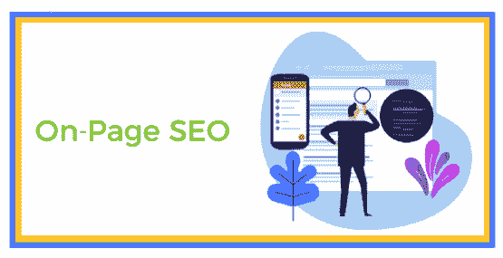
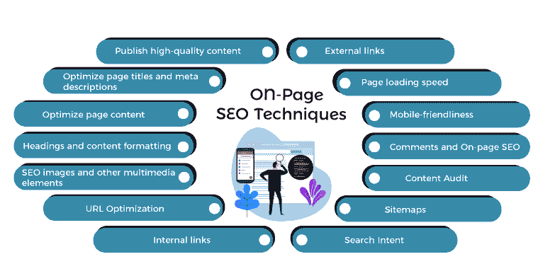
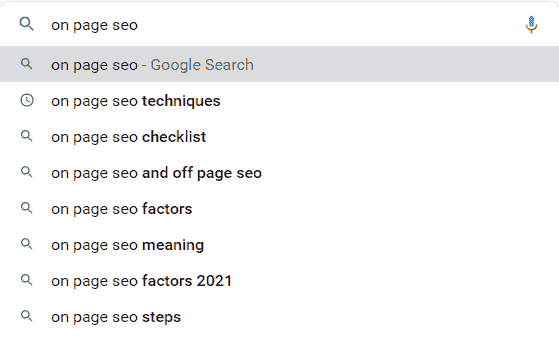
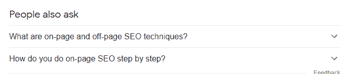
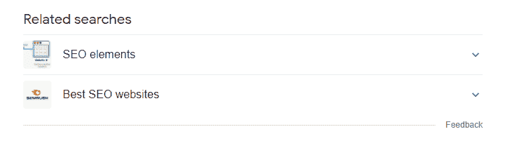
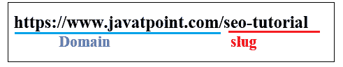
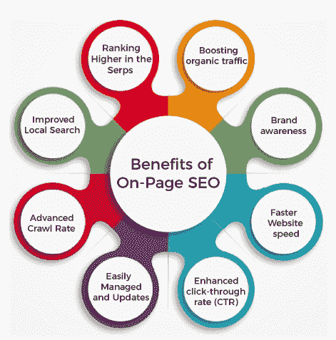

# 页面SEO技术

> 原文：<https://www.javatpoint.com/on-page-seo-techniques>

## 什么是页面SEO？

页面SEO又称 ***网站SEO。页面SEO是指优化单个网页以提高其搜索引擎排名的过程。*** 页面SEO是多方面的，并超越了内容，还包括其他功能，如模式和元标签。

页面内SEO拦截技术SEO和页面外SEO。虽然所有这三个过程一起工作，给你最好的可能结果，页面SEO负责优化网页的内容和布局。

页面SEO包含:

*   关键词研究:关键词研究是指在一页内容上找出最佳的关键词作为目标。
*   内容创作:内容创作是指发布以关键词为中心的高质量内容。
*   关键词优化:关键词优化就是在所有合适的地方使用目标关键词，使用强元标签 SEO。

## 页面SEO技术

以下是页面SEO技术:

### 1.发布高质量内容

说到SEO，请记住以下几点:

***一个内容优秀的网站，无论有没有 SEO，都可以很好的工作。一个内容差的网站，不管有没有 SEO 都无法生存。一个内容很棒的网站可以通过 SEO 变得更好！*T3】**

那么，是什么让一段内容高质量呢？优质内容具有以下特点:

*   **原创内容**
    文章、图片、视频、信息图、演示文稿、文字、评论等。不得复制或改写现有文章。
*   **不偏不倚的内容**
    如果我们写了一个特定的主题或回答了一个问题，确保你的话是有道理的，并且涵盖了故事的各个方面。
*   **你的网站专属内容**
    即使是你自己的内容，如果已经在其他网站发布过，对你的网站来说也不是很好(除非你适当指定规范标签)。
*   **包含文本元素的内容**
    写文本来配合你的非文本内容。例如，如果您在网站上发布视频，也可以尝试添加文本描述。如果添加图片，尽量用文字描述图片是什么。
*   **研究充分的内容**
    用户不需要快速阅读帖子，也不需要搜索引擎。长文章比短文章排名更好。
*   **满足搜索目的的内容**
    除了上述特点，您还必须确保您的内容符合搜索目的。在我们的网站上发布任何类型的内容之前，您必须首先确定用户期望看到什么类型的内容来响应特定的搜索意图。
    一般来说，有四种不同形式的搜索意图:
    想知道创建什么样的内容最简单的方法是使用谷歌，谷歌已经在弄清楚人们想要什么类型的搜索方面做得很好。
    所以，第一步就是在谷歌上查你的目标关键词。浏览前十个结果并彻底讨论它们。请注意以下几点:
    您的目标是使用这些数据来改进您的内容。在此上下文中，better 可能指多种项目，包括:

    *   信息:-一个鸡蛋含有多少卡路里？
    *   交易性:-'购买闲置制造商'
    *   商业 c: -'最佳SEO课程'
    *   导航:——“脸书”The easiest way to figure out what kind of content to create is by using Google, which has already done a great job of figuring out what types of searches people want.
    *   详细程度
    *   页面设计
    *   内容的类型
    *   他们如何使用图像和视频Your objective is to use this data to improve your content. In this context, better may refer to a variety of items, including:
    *   更容易阅读
    *   更全面、信息更丰富
    *   对现有内容中未涵盖的主题提出独特的观点。

### 2.优化页面标题和元描述

这是 SEO 101，但它对页面SEO至关重要。当搜索引擎“阅读”你的页面时，除了别的以外，它们还会查看页面的描述和标题。

他们这样做是因为他们需要知道页面是关于什么的，然后基于其他因素**(页面外 SEO、域名权威、竞争等)。).**他们可以制作你的页面(针对不同的关键词)。指数将根据他们的位置排名。

以下是一些相关的页面标题优化技巧:

*   **在你的页面标题的开头添加关键词**
    如果可能的话，用你的目标关键词开始你的页面标题。这使得搜索引擎更容易快速找出网站的目标关键词。
    这并不是说你可以走极端，开始关键词填充。如果一开始就找不到关键词，那就不是世界末日。只需确保标题中包含您的目标关键字。
*   **在标题中包含数字和权力词汇**
    数字，以及强大的术语，如**“清单、可操作、惊人、终极、**等。让标题更加引人入胜，增加点击率**(点击率)。**
*   **无需在标题中添加您的域名**
    不需要在标题中包含您的域名，因为谷歌会自动在标题中添加域名。您可以使用可用的 60 个字符来提供网站的详细概述。
    这个规则的一个例外是当你有一个人们可以很快发现的强势品牌时；在这种情况下，您可以考虑在标题中包含您的域名。
*   **写简短的描述性标题**
    一页的标题不一定要很长。因为这是谷歌在搜索原因中给出的平均字符数，一般建议保持在 60 个字符左右。
    ***元描述***
    这是你通过点击你的链接来推广你的页面并说服人们访问你的网站而不是其他网站的机会。
    值得注意的是，谷歌并不总是显示自定义元描述；相反，如果他们认为自动描述与搜索者更相关，他们会经常使用自动描述。
    以下是基本的元描述优化技巧:
*   **在描述中添加你的目标关键词**
    由于谷歌仍然在标题和描述中强调搜索词，因此在描述中使用目标关键词对搜索者来说更有意义和吸引力。
*   **避免使用自动生成的描述**
    即使谷歌没有使用你的描述，停止使用自动生成的解释仍然是一个好主意，这可能会令人困惑。

### 3.优化页面内容

优化页面内容是另一种页面SEO技术。页面SEO包括内容优化，即针对目标关键词优化实际内容。

在发布任何类型的内容如**图像、文本、视频、**或、**音频**之前，第一步是进行关键词研究。这对于确定用户在搜索框中输入哪些搜索词并生成满足其需求的内容非常重要。

选择目标关键词后，列出相似关键词(也称为 **LSI** 关键词)和龙邮件关键词，用于您的**标题、页面内容、描述**和**标题。**

这是什么原因呢？因为随着 Rank Brain 的引入，谷歌搜索算法变得更加复杂，现在他们正在搜索内容中的主题相关性和关键词相关性。

这意味着你可以在你的内容中使用大规模集成电路关键词，使其更适用于大型主题。

有很多方法可以确定谷歌认为哪些关键词对你的目标关键词很重要。

根据谷歌的说法，最简单快捷的方法是使用谷歌的三个功能之一:人们还可以查询相关搜索。

***谷歌建议***

当我们开始在谷歌搜索中键入一个查询时，我们会得到一个在搜索中使用的短语列表。这些都是优秀的关键词候选人在你的关键词中提及。

***人也问***

当你按下搜索时，谷歌会显示结果，其中包括一个名为**“人也问”**的部分。这些都是优秀的候选人，你可以在你的副标题中使用。

***相关搜索***

在搜索结果的底部，谷歌会显示相关搜索的列表。

你所需要做的就是在你的内容中使用上面提到的任何一个单词(不做关键词填充)。

### 4.标题和内容格式

页面的格式必须正确。将其视为一份带有主**标题(h1)** 和**子标题(h2，h3)的报告。**

***h1 标签***

每页只需要一个 **H1 标签**。如果你使用的是 WordPress，页面的标题会自动包装在 H1 标签中。

您可以使用相同的标题和 **< h1 >** 标签，或者给标题一个不同的标题。

别忘了搜索引擎会在结果中显示他们在标题标签中找到的内容，而不是 **h1** 标签。

以下是谈到另一个标题 **(h2，h3)时，你必须记住的一些要点；**

*   让标题变得有趣，方便喜欢浏览文章而不是使用单个单词的用户。
*   副标题是在我们的内容中使用相关关键词的最佳位置。
*   按照层次顺序使用标题，首先使用标题标签

    # ，然后使用

    ## 、

    ### 、

    #### 等等。

***内容格式化***

在将文本放在标签上之前，请确保文本可读:

*   要强调页面的重要部分，请使用**斜体、粗体、**和**下划线。**
*   将文字拆分成小段**(不超过 3-4 行)。**
*   在段落之间留出适当的空间，使文本更易于阅读。
*   使用好字号**(至少 14px)。**
*   使用 CSS 突出显示区域，并将内容分成更小、更容易理解的部分。

### 5.图像和其他多媒体元素

出于演示目的，图像至关重要。借助这个，你可以让你的页面更有趣，更容易阅读。图片的主要问题是搜索引擎不理解它们，并减慢页面加载时间。

**优化SEO图像的最佳实践**

*   文件名必须是描述性的，而不是简单地将你的图片命名为“image1.jpg”，考虑使用描述性的文件名，如“女性做运动. jpg”。
*   应该使用原始图像。如果你想使用网上现有的图片，你必须参考图片来源。
*   使用内容交付网络-如果您在单个页面上有许多图像，您可以使用 CDN 服务来加快页面加载速度。简单来说，你的图片会被很多服务器托管服务，这会增加加载过程。
*   使用 ALT 标签来标记图片，这样搜索引擎就可以知道它是关于什么的。
*   优化图像的大小-图像的大小(以字节为单位)越小越好。

### 6.网址优化

优化你的网址以获得最大的SEO是至关重要的。它分为两个部分。第一节是 URL 优化，第二节是 URL 结构。

永久链接也叫*鼻涕虫，是每个页面唯一的网址。*

*

好的网址长度必须少于 255 个字符；使用连字符来区分不同的部分。

一个SEO友好的网址是简短的，描述性的，包含你的目标关键字，像网页标题。

### 7.内部链接

由于以下原因，链接到您网站内的页面对于SEO非常重要:

*   **它；这就像建立你自己的网络**
    当搜索引擎蜘蛛发现一个网站时，它首先会跟踪该页面上的链接(内部和外部链接)。
*   **这是通知搜索引擎你的其他网站的一种方式**
    如上所述，当网络搜索引擎发现一个有链接的页面时，他们也会继续阅读这些页面，所以你可以利用这个策略来启发搜索引擎关于他们还没有找到的你网站的页面。
*   **这是增加用户在你网站上花费的一种方式**
    每个网站都有几个页面比其他网站优先级更高。内部链接是通过向主页发送更多内部链接来定位主页的方法之一。
*   **这是一种通知搜索引擎你的哪些页面最相关的方法。**
    网站上有些页面比其他页面更挑剔。内部链接是一种通过给页面附加内部链接来识别最相关页面的方法。
    所以，当他们到达你的页面时，如果你没有在内容里面加入一些其他的链接，他们就会看完你的页面就走。
    如果你的网站中有指向其他页面的链接，他们也会考虑这些。

***内部链接最佳实践:***

*   尽可能在网页主体中包含链接(不要在页脚或边栏中)。
*   不要只对你的内部链接使用关键词。
*   添加内部链接，如果它们对你的读者有用的话。
*   每个标签，应该有不超过 15 个内部链接。

### 8.外部链接

外部链接是指向不同于您自己的域的页面的链接。对于链接出去的网站，它是一个外部链接，对于收到链接的网站，它是一个反向链接。

我们都知道反向链接对于 SEO 有多重要，但是外部链接呢？

相关页面的外部链接有助于谷歌确定你页面的主题。它还告诉谷歌，你的页面是可靠的信息来源。

在你的内容中使用外部链接不会直接帮助你进行 SEO，因为这不是排名方面，但它可以间接支持你。

外部链接可以用来连接到其他网站，你可以通过电子邮件通知他们。

如果你链接到网站管理员，他们会很感激的，这是一个开始对话的完美方式。你可以慢慢建立这种关系，并最终获得你的网站反向链接，因为各种网站管理员将更有可能回报你的青睐。

让我们快速了解一下向内容添加外部链接的最佳实践。

*   只需链接到您了解和信任的网站。
*   仅链接到具有独特和原创内容的相关网站。
*   只要链接出来，如果读者会从中受益。
*   对于您不完全信任的网站的外部链接，请使用**‘no follow’**的标签。

### 9.页面加载速度

谷歌花了很多钱让网络变得更快。在每次谷歌输入/输出中，都会有人提到速度的重要性，以及他们希望索引中有最快网站的意愿。

他们还正式将速度作为公认的排名变量之一，以“迫使”网站所有者考虑它。所以，你肯定知道网站速度在SEO和排名方面很重要。

你作为一个网站管理员的角色是通过遵循谷歌的建议来确保你的网站尽可能快地加载。快速加载网站不仅有利于SEO，也有利于客户保持和对话。

### 10.移动友好性

现在，谷歌大约 60%的搜索来自移动设备。这意味着如果你的网站不适合移动，你已经失去了一半的潜在流量。

你该怎么办？

首先要确保你的网站是移动友好的。用谷歌的工具检查你的网站的移动友好性，并解决出现的任何问题。

然后更进一步，在手机上测试你的网站，就像一个真正的用户会做的那样，并确保所有内容都与你的 CTA 按钮一起正确显示。总的来说，移动友好性对于具有响应性设计的网站来说不是问题。

### 11.评论和页面SEO

许多人认为博客评论随着社交媒体的出现已经过时，但这是不正确的。

博客上的评论仍然相关。根据谷歌的 **Gary Illyes** 的说法，这是人们喜欢你的内容并参与页面的标志，这可以帮助你的 SEO。

用户很可能会在添加新评论之前阅读以前的评论，这是最大化他们在页面和您的网站上花费的时间的另一种方式。

您必须遵循这些简单的规则来充分利用注释:

*   一般不好的帖子不应该发表。
*   如果用户在评论中没有使用真实姓名，不要批准。
*   发布前一定要适度评论。
*   总是回复评论。这将激励其他人做得这么好。
*   只接受对页面内容有用和重要的评论。

### 12.内容审计

内容审核是指网站上所有内容属性的列表。当你审核你的内容时，既要考虑数量因素，也要考虑质量因素。

在审计的帮助下，您可以确定哪些内容资产必须从网站上重新调整用途、保留和删除。为了给每一页打分，你必须考虑定量和定性参数的混合。

*   这些量化指标评估内容对流量和排名的累积影响。它们提供的信息包括页面在过去 30 天内收到的流量以及 SERP 的平均位置。
*   使用定性参数来衡量内容的质量。有多少人看过内容？他们是否以某种方式与内容互动？

为了更快地审核，请保持评估标准简单。此练习应每 3-6 个月重复一次，以确保内容策略仍在完善中。

### 13.网站地图

网站管理员可以使用网站地图来让他们知道他们网站上的哪些页面是可抓取的。站点地图意味着一个包含网址列表和附加站点元数据的 XML 文件。网站地图帮助网络爬虫定位和抓取我们网站上的所有页面。他们经常给搜索引擎关于页面最后一次更新的时间和更新频率的详细信息。

### 14.搜索意图

随着时间的推移，谷歌提高了确定用户搜索内容的能力，而不仅仅依赖传统的SEO因素。

搜索意图已经成为一个更重要的因素，经常压倒传统的SEO元素，如**标题、链接、标题、**和其他**SEO基础。**

传统上，搜索意图分为以下几类:

*   ***信息性:-*** 目的是从特定网站或页面获取信息。
*   ***导航:-*** 目的是到达一个特定的地点或位置。
*   ***交易搜索意向:-*** 意向是购买或寻找未来要购买的产品/服务。

然而，随着时间的推移，搜索引擎发现这种分类过于模糊和重叠。例如，如果有人输入**“亚马逊笔记本电脑交易”**，你可以将“亚马逊笔记本电脑交易”分为交易性的**(试图购买笔记本电脑)**和导航性的**(试图联系亚马逊)**意图。

你必须知道的意图和搜索引擎，以确保你的网站排名良好的搜索词。搜索意图按内容和谐度分为以下几类。

*   ***回答意图:-*** 回答意图因研究查询而异，因为消费者正在寻找即时答案。例如，有人可能会简单地问:“今天天气怎么样？”
*   ***研究意图:-*** 研究意图短语和关键词产生结果，例如维基百科页面、旋转木马、知识图表和特色片段。
*   ***本地意图:-*** 本地意图是导致信息地图出现或基于您的 IP 地址提供本地化研究的关键字或短语。像“靠近我”这样的常用短语也在其中。
*   ***交易意向:-*** 交易意向包含希望购买或了解更多此类别商品的用户。这种结果经常在购物框和其他购买意图特征中产生。

## 页面SEO的好处

以下是页面SEO的好处:

### 1.在 Serps 中排名更高

制作独特和高质量的内容，然后使用页面SEO技术来增强它们，可以帮助您在搜索结果页面中列出更高的网页。

### 2.促进有机交通

利用SEO组织来利用进度排名、抓取率和点击率来执行熟练的页面SEO程序是很重要的。通过这种方式，你更有可能为你的网站和页面吸引有机流量，而不必在广告上花钱。

### 3.品牌知名度

更高的排名和你的网站在搜索引擎上的曝光度可以显著提升你的品牌价值。你的内容和页面在谷歌和其他搜索引擎中的排名越高，它建立的品牌价值就越大。建立你的网站的品牌价值将有助于你营销你的业务和增加销售。

### 4.更快的网站速度

凭借卓越的 **HTML** 编码和网站和页面上不同的页面SEO实现基础，您可以获得更高的排名，因为通过强调最佳的SEO策略，网站加载速度更快，网页内容质量更高。

### 5.增强的点击率

有条不紊的精简和理想的元描述元标题的制作对于在线网站的改进至关重要，以获得卓越的活跃点击因子。它有助于在网络索引中占据更高的位置，并让网站客户更多地点击你的帖子。

小心你的元描述的长度和内容。理想的元描述意味着你的基本口号的正确长度和使用。如果你需要显著提升你的页面，你应该检查这个元描述长度装置。

### 6.易于管理和更新

与页面外相比，通过使用页面上的SEO系统来监督、控制和跟踪最新的谷歌计算和更新更简单、更直接。

### 7.高级爬网率

网站的最终目标是被搜索引擎机器人观察和抓取。它们应该被编入索引，并在提供类似产品和服务的不同页面中排名。引人注目的页面SEO可以帮助网站分析工具和爬虫理解你的页面提供了什么，以及它应该反映什么样的上下文，并对搜索引擎结果页面进行排名。

### 8.改进的本地搜索

这是增加本地曝光率和范围的最有效策略。例如 **SEO 伊普斯维奇**对本地 SEO 采取了特殊的做法。因此，他们为没有在线业务的当地企业创造了许多销售机会。

* * **