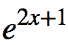

# 上标

> 原文：<https://www.javatpoint.com/mathml-superscripts>

MathML 上标是用<msup>标记创建的。你必须把底部放在<msup>标签里面，后面跟着上标。</msup></msup>

**例**

如果要写 x <sup>2</sup> ，使用以下 MathML 代码:

**等效 MathML 代码:**

```

<math xmlns='http://www.w3.org/1998/Math/MathML' display='block'>
  <msup>
    <mi>x</mi>
    <mn>2</mn>
  </msup>
</math>

```

MathML 元素<msup>的行为更像一个函数，而不是一个普通的 HTML 标记标签。在上面的 MathML 代码中，基数和上标可以看作是传递给<msup>函数的两个“参数”两个参数都需要是单个 MathML 元素(例如，<mi>或<mn>)。使用像 x 和 2 这样的原子值没问题，但是一旦我们开始使用复合表达式，事情就会变得更加复杂。</mn></mi></msup></msup>

* * *

## 分组子表达式

子表达式组用于包含多个元素。不能直接传入<msup>。相反，您必须使用<mrow>标签来对表达式进行分组，如下所示。</mrow></msup>

**例如:**如果要写 e <sup>2x+1</sup> ，使用以下 MathML 代码:

**等效 MathML 代码:**

```

 <msup><mi>e</mi>
    <mrow><mn>2</mn>
      <mi>x</mi>
      <mo>+</mo>
      <mn>1</mn></mrow></msup> 

```

它将显示如下表达式:



要创建复杂的基本表达式，必须将上标参数包装在<mrow>元素中。</mrow>

**例如:**如果要写一个表达式(5x？3y)2、使用以下 MathML 代码:

**等效 MathMl 代码:**

```
 <msup><mrow><mo>(</mo>
        <mrow><mrow><mn>5</mn><mi>x</mi></mrow>
          <mo>-</mo>
          <mrow><mn>3</mn><mi>y</mi></mrow></mrow> 
      <mo>)</mo></mrow> 
    <mn>2</mn></msup> 

```

## 支持浏览器:

| 元素 | 铬 |  IE |  Firefox(壁虎) | 歌剧 |  Safari |
|  | 不支持 | 不支持 | 支持 | 不支持 | 仅基本支持 |

* * *