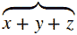

# MathML 超脚本

> 原文：<https://www.javatpoint.com/mathml-overscript>

MathML 超脚本是用<mover>元素创建的。它在表达式上附加了一个重音或一个限制。</mover>

**语法:**

```

<mover> base overscript </mover> 

```

**例**

要编写以下表达式:



**等效 MathML 代码:**

```
 <mover accent="true"><mrow>  
    <mi> x </mi>  
    <mo> + </mo>  
    <mi> y </mi>  
    <mo> + </mo>  
    <mi> z </mi>  
  </mrow>  
  <mo>	⏞ 
 </mo></mover>  

```

* * *

## 超脚本元素的属性

| 指数 | 属性 | 描述 |
| 1) | 口音 | 如果设置为 true，则过度脚本是一种重音，更接近基本表达式。如果为 false(默认值)，则超脚本是对基本表达式的限制。 |
| 2) | 排列 | 它用于指定过度脚本的对齐方式。它的可能值是:左、中、右。 |
| 3) | 类别、id、样式 | 这些与样式表一起使用。 |
| 4) | 超链接 | 它用于设置指向指定 URI 的超链接。 |
| 5) | 数学背景 | 它用于指定背景颜色。您可以使用#rgb、#rrggbb 和 html 颜色名称。 |
| 6) | matcolor | 它用于设置文本颜色。您可以使用#rgb、#rrggbb 和 html 颜色名称。 |

* * *

## 支持浏览器:

| 元素 | 铬 |  IE |  Firefox(壁虎) | 歌剧 |  Safari |
|  | 不支持 | 不支持 | 支持 | 不支持 | 仅基本支持 |

* * *