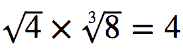

# 数学字根

> 原文：<https://www.javatpoint.com/mathml-radicals>

在 MathML 中，有两个元素用于指定部首。这两个要素是:

*   <msqrt>元素</msqrt>
*   <mroot>元素</mroot>

<msqrt>元素创建一个平方根，以基数为唯一参数，而<mroot>元素用于创建一个索引根。它以基和索引为参数。</mroot></msqrt>

**例如:**

要在网页上写下以下等式:



**等效 MathML 代码:**

```

<math xmlns='http://www.w3.org/1998/Math/MathML' display='block'>
  <msqrt>
    <mn>4</mn>
  </msqrt>
  <mo></mo>
  <mroot>
    <mn>8</mn>
    <mn>3</mn>
  </mroot>
  <mo>=</mo>
  <mn>4</mn>
</math>

```

## 支持浏览器:

| 元素 | 铬 |  IE |  Firefox(壁虎) | 歌剧 |  Safari |
|  | 不支持 | 不支持 | 支持 | 不支持 | 仅基本支持 |

* * *