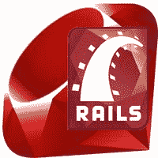

# Ruby on Rails 教程

> 原文：<https://www.javatpoint.com/ruby-on-rails-tutorial>

Ruby on Rails 教程提供了 Ruby on Rails 的基本和高级概念。我们的 Ruby on Rails 教程是为初学者和专业人士设计的。

Ruby on Rails 是一个服务器端 web 应用程序开发框架。这是大卫·海涅米尔·汉森写的

我们的 Ruby on Rails 教程包括 Ruby on Rails 的所有主题，如特性、MVC、路由器、脚手架、视图、Hello World 示例、捆绑器、迁移、布局、CRUD 示例、面试问题等。

* * *

## Ruby on Rails 索引

* * *

**Ruby 教程**

*   [Ruby 教程](ruby-tutorial)

**Ruby on Rails 教程**

*   [铁轨教程](ruby-on-rails-tutorial)
*   [钢轨介绍](ruby-on-rails-introduction)
*   [轨道特征](ruby-on-rails-features)
*   [轨道安装](ruby-on-rails-installation)
*   轨道 IDE
*   [Rails 脚本](ruby-on-rails-scripts)
*   [轨道示例](ruby-on-rails-hello-world-example)
*   [Rails 目录结构](ruby-on-rails-directory-structure)
*   [轨道活动记录](ruby-on-rails-active-record)
*   [钢轨 MVC](ruby-on-rails-mvc)
*   [rvm 轨道](ruby-on-rails-rvm)
*   [轨道捆扎机](ruby-on-rails-bundler)
*   [轨道迁移](ruby-on-rails-migrations)

*   [钢轨刳刨机](ruby-on-rails-router)
*   [轨道脚手架](ruby-on-rails-scaffolding)
*   [轨道会议](ruby-on-rails-session)
*   [轨道文件上传](ruby-on-rails-file-upload)
*   [轨道布局](ruby-on-rails-layout)
*   [轨道过滤器](ruby-on-rails-filters)
*   [钢轨测试](ruby-on-rails-testing)
*   [轨道缓存](ruby-on-rails-caching)
*   [轨道验证](ruby-on-rails-validation)
*   【ajax 轨道

**轨道数据库**

*   [轨道保存记录](ruby-on-rails-save-record)
*   [轨道视图记录](ruby-on-rails-view-record)
*   [钢轨积垢](ruby-on-rails-crud)

**铁轨采访**

*   [面试问题](ruby-on-rails-interview-questions)

* * *

## 先决条件

在学习 Ruby on Rails 之前，您必须具备 Ruby 的基础知识。

## 观众

我们的 Ruby on Rails 教程旨在帮助初学者和专业人士。

## 问题

我们保证您在这个 Ruby on Rails 编程教程中不会发现任何问题。但是如果有任何错误，请在联系表格中发布问题。