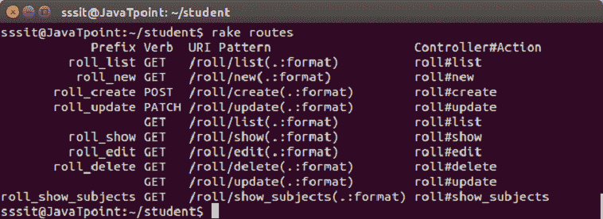

# Ruby on Rails路由器

> 原文：<https://www.javatpoint.com/ruby-on-rails-router>

Rails 路由器识别网址并将它们发送给控制器。它还生成路径和网址。Rails 路由器处理 URL 的方式与其他语言路由器不同。它为请求确定控制器、参数和动作。

基本上，路由器是将传入请求重定向到控制器和操作的一种方式。它取代了 mod _ 重写规则。最好的一点是，在 Rails 中，路由可以与任何网络服务器一起工作。

Rails 通过 config/routes.rb 文件处理路由，而不是依赖 web 服务器来控制 URL 路由。这个文件控制着你的网址的每一个方面，比如试图匹配一个请求的网址路径并决定将该请求指向哪里的规则。

Rails 路由器的主要用途解释如下:

*   将网址连接到代码
*   从代码生成路径和网址

* * *

## RESTful 路由

要理解路由，我们需要理解 REST。Rails 主要将 REST 用于 URL 路由。所以 REST 对于理解 Rails 路由很重要。它代表代表性国家转移。

有几种 HTTP 方法与 REST 一起使用来表示用户或应用程序执行的操作类型。

| HTTP 方法 | 目的 | 例子 |
| 得到 | 检索资源 | 要直接导航到页面或使用谷歌，请使用 get HTTP 方法。 |
| 邮政 | 创建资源 | POST HTTP 方法用于较旧的网络应用程序。 |
| 放 | 完全更新资源 | 更新网站上的用户配置文件使用带有支持它的网络框架的补丁。 |
| 修补 | 部分更新资源 | 它仅用于更新网站上用户配置文件的密码。 |

* * *

## 创建路线

要创建路由，您需要将一个 URL 映射到一个控制器和一个操作。当路由器看到一个请求时，它会将其分派给一个与 URL 匹配的控制器操作。

如果网址是这样的:

```

/roll/1

```

假设路线定义为:

```

get 'roll/:id' => 'roll#branch'

```

这是，

```

get 'roll/:id' to: 'roll/branch'

```

控制器为**滚动控制器**，方法为**分支**。方法前面的#是 Ruby 中的一种说法，表示它是一个实例方法。

**示例:**

让我们通过一个例子来看看。

创建一个**学生**申请。

```

rails new student

```

在其中，创建一个名为 **RollController** 的控制器。将为定义为**滚动控制器**类中定义的方法的动作定义路线。

```

rails generate controller RollController

```

打开 library/config/routes.rb 文件，并在其中编写以下代码。

```

Rails.application.routes.draw do 
   get 'roll/list' 
   get 'roll/new' 
   post 'roll/create' 
   patch 'roll/update' 
   get 'roll/list' 
   get 'roll/show' 
   get 'roll/edit' 
   get 'roll/delete' 
   get 'roll/update' 
   get 'roll/show_subjects' 
end 

```

它定义了应用程序中可用的操作和操作类型，如修补、获取和发布。

要列出应用程序中用于跟踪路由问题的已定义路由，请使用以下命令。

```

rake routes

```

输出:



* * *

### 资源路由

资源路由允许您声明控制器的所有公共路由。它在一行代码中为索引、创建、更新、读取、删除和新操作定义了单独的路径。

### 网上资源

浏览器通过某些 HTTP 方法从一个网址请求页面，如获取、发布、放置、删除和修补。每个方法对一个请求执行一个操作。

### CRUD、动词和动作

足智多谋的路由提供了 HTTP 动词和 URL 到控制器动作之间的映射。按照惯例，每个动作映射数据库中的一个特定 CRUD 操作。

### 路径和网址助手

通过创建一个资源丰富的路由，控制器的许多助手将在应用程序中公开。

### 同时定义多个资源

您可以通过对资源的一次调用来定义多个资源的路由。

### 单一资源

单一资源是用户请求的资源，没有任何引用标识。例如，您可以使用单一资源映射/配置文件(而不是/profile/:id)来显示操作。

### 控制器命名空间和路由

一组控制器被组织在一个命名空间下。大多数情况下，许多管理控制器在一个 Admin::命名空间下命名。这些控制器位于应用程序/控制器/管理目录下，可以在路由器中组合在一起。

### 嵌套资源

有些资源是其他资源的子资源。嵌套路由允许您捕获路由中的关系。

### 路由问题

路由问题允许您声明可以在其他资源和路由中重用的公共路由。

### 从对象创建路径和网址

Rails 还可以从一组参数中创建路径和 URL。

### 添加更多 RESTful 操作

您不限于默认的 RESTful 路由。您可以创建附加路由来应用于集合或集合的单个成员。

### 非资源路线

Rails 为您提供了将任意 URL 路由到操作的工具。在这里，您必须在应用程序中单独设置每条路由，因为您不会通过资源丰富的路由自动获得路由组。

* * *