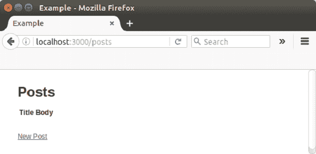
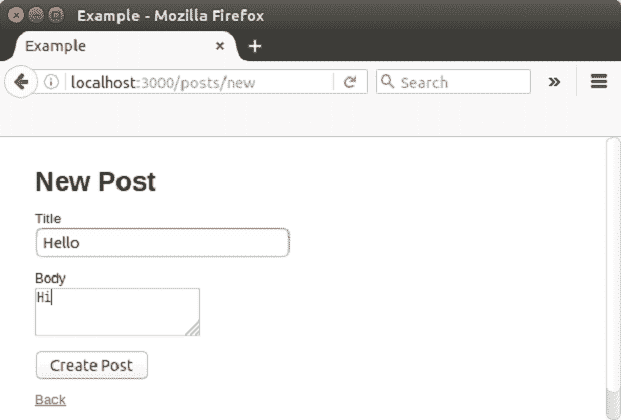
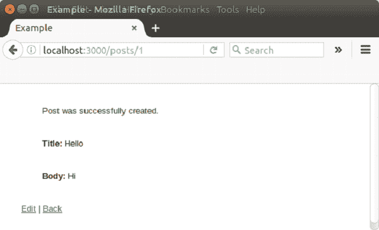
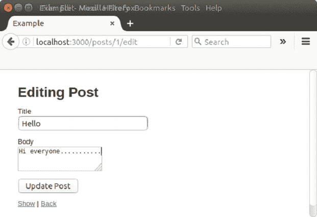
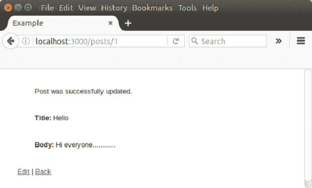

# Ruby on Rails 脚手架

> 原文：<https://www.javatpoint.com/ruby-on-rails-scaffolding>

## 脚手架

脚手架是产生应用程序的一些主要部分的快速方法。为了在单个操作中为新资源自动生成一组模型、视图和控制器，使用了支架。

支架是 MVC 框架支持的一种技术，程序员可以在其中指定如何使用应用程序数据库。框架或编译器将其与预定义的代码模板一起使用，生成应用程序可以用来在数据库条目中执行 CRUD 的最终代码，有效地将模板视为构建更强大应用程序的“脚手架”。

脚手架发生在程序生命周期的两个不同阶段，设计时和运行时。设计时支架会产生代码文件，程序员以后可以修改这些文件。运行时支架会动态生成代码。它允许对模板设计的更改立即反映在整个应用程序中。

## 铁轨上的脚手架

Rails 框架使脚手架变得流行起来。

当线脚手架:model_name 被添加到控制器时，Rails 将在运行时自动生成所有合适的数据接口。

一个外部命令也可以用来提前为脚手架生成 Ruby 代码，这就是 rails 生成脚手架 model_name。生成的脚本将生成 Ruby 代码文件，应用程序可以使用这些文件与数据库进行交互。

从 Rails 2.0 开始，不再支持动态脚手架。

## 嵌套脚手架

嵌套支架是为 Rails 4.2 和 5 生成一组完美工作的嵌套资源的命令。

**功能**

*   使用单个命令生成嵌套子资源
*   生成一堆运行良好的代码
*   自动为活动记录生成适当的模型关联
*   哈姆准备好了吗

**语法**

要安装嵌套脚手架，请使用以下命令。

```
gem 'nested_scaffold'

```

* * *

## 创建资源

要为帖子资源生成支架，请输入以下命令:

```
rails generate scaffold Post name:string title:string content:text

```

脚手架生成器将在您的应用程序中用一些文件夹构建几个文件。

以下文件将使用脚手架创建。

| 文件 | 目的 |
| db/migrate/20100207214725 _ create _ post . Rb | 在数据库中创建发布表 |
| app/models/post.rb | 邮政模式 |
| 测试/单元/后测试. rb | 立柱模型的单元测试线束 |
| 测试/固定装置/柱子 | 测试中使用的示例帖子 |
| config/routes.rb | 已编辑以包含帖子的路由信息 |
| app/controller/post _ controller . Rb | 邮政管理员 |
| app/view/post/index . html . erb | 显示所有帖子索引的视图 |
| app/view/post/edit . html . erb | 编辑现有帖子的视图 |
| app/view/post/show . html . erb | 显示单个帖子的视图 |
| app/view/post/new . html . erb | 创建新帖子的视图 |
| app/view/post/_ form . html . erb | 一个局部，用于控制编辑和新视图中使用的窗体的整体外观 |
| 测试/功能/post_controller_test.rb | 岗位控制器功能测试线束 |
| app/helper/post _ helper . Rb | 要在帖子视图中使用的助手函数 |
| test/unit/helper/post _ helper _ test . Rb | 支柱助手的单元测试线束 |
| app/assets/JavaScript/post . js . coffee | 后置控制器的咖啡脚本 |
| app/assets/样式表/post . CSS . scss | 后置控制器的级联样式表 |
| app/资产/样式表/支架. css.scss | 级联样式表使脚手架视图看起来更好 |

许多有经验的开发人员避免搭建脚手架，而是更喜欢从头开始编写全部或大部分源代码。因为它自动生成的代码可能不适合您的应用程序。

* * *

## 脚手架示例

让我们用脚手架生成以下示例。

**步骤 1** 创建应用程序

```
rails new example

```

**步骤 2** 在示例应用程序中，创建 MVC 组件。

```
cd example
rails generate scaffold post title:string body:text
rails generate scaffold comment post_id:integer body:text

```

从上面的代码，首先移动到应用程序目录。

**步骤 3** 创建数据库表注释和 post_id。

```
rake db:migrate

```

**步骤 4** 使用 rake 命令运行迁移。

```
rake routes

```

**步骤 5** 启动网络服务器

```
rails server

```

输出:

在浏览器中运行**http://localhost:3000/post**。



转到新帖子



点击创建。



点击编辑。



单击更新。



* * *

### [计] 下载

[Download this example](https://static.javatpoint.com/rubyonrails/src/scaffolding.zip)