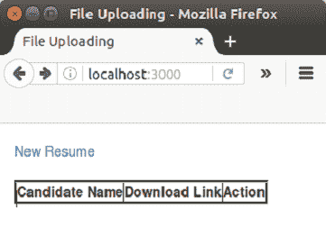
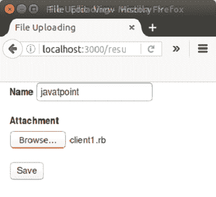
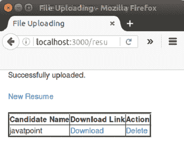
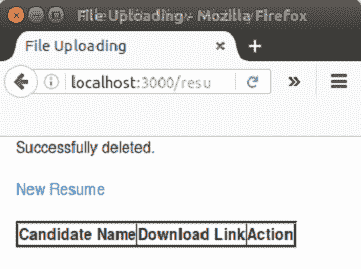

# 轨道文件上传

> 原文：<https://www.javatpoint.com/ruby-on-rails-file-upload>

我们可以通过文件上传在 Rails 中上传一个文件。在本教程中，我们将学习如何上传文件。

让我们看一个通过 Rails 上传文件的例子。

### 示例:

**步骤 1** 创建一个名为上传的 Rails 应用程序。

```
rails new upload

```

**第二步**更改你要上传的目录。

```
cd upload

```

**第三步**安装以下宝石。

```
gem install carrierwave
gem install bootstrap-sass

```

**第 4 步**转到你目录中的宝石文件，添加以下宝石。

```
gem 'carrierwave' 
gem 'bootstrap-sass'

```

**第 5 步**运行以下命令。

```
bundle install

```

**第 6 步**用两个字符串作为名称和附件创建模型。

```
rails g model Resume name:string attachment:string

```

**第 7 步**迁移数据库。

```
rake db:migrate

```

**第 8 步**在应用程序中生成控制器文件。

```
rails g controller Resumes index new create destroy

```

**第九步**在这一步中，我们将通过 carrierwave gem 创建一个上传器。

```
rails g uploader attachment

```

**第 10 步**现在打开 app/models/resume.rb 模型文件，编写如下代码。

```
class Resume < ApplicationRecord 
mount_uploader :attachment, AttachmentUploader # Tells rails to use this uploader for this model. 
   validates :name, presence: true # Make sure the owner's name is present. 
end

```

**第 11 步**转到 config/routes.rb 文件，编写以下代码。

```
resources :resumes, only: [:index, :new, :create, :destroy] 
   root "resumes#index"

```

**第 12 步**转到 app/controllers/resumes _ controller . Rb 文件，写下以下代码。

```
class ResumesController < ApplicationController 
   def index 
      @resumes = Resume.all 
   end 

   def new 
      @resume = Resume.new 
   end 

   def create 
      @resume = Resume.new(resume_params) 

      if @resume.save 
         redirect_to resumes_path, notice: "Successfully uploaded." 
      else 
         render "new" 
      end 

   end 

   def destroy 
      @resume = Resume.find(params[:id]) 
      @resume.destroy 
      redirect_to resumes_path, notice:  "Successfully deleted." 
   end 

   private 
      def resume_params 
      params.require(:resume).permit(:name, :attachment) 
   end 

end

```

**步骤 13** 在 app/assets/样式表/resumes.scss 文件中添加引导。

```
@import "bootstrap";

```

**第 14 步**转到 app/view/layouts/application . html . erb 文件，写下以下代码。

```
<!DOCTYPE html> 
<html> 
 <head> 
      <title>File Uploading</title> 
      <%= stylesheet_link_tag "application", media: "all", "data-turbolinks-track" => true %> 
      <%= javascript_include_tag "application", "data-turbolinks-track" => true %> 
      <%= csrf_meta_tags %> 
   </head> 

   <body> 
      <div> 
         <%= yield %> 
      </div> 
   </body> 
</html>

```

**第 15 步**转到 app/view/documents/index . html . erb 文件。

```
<div class="container"> 
<% if !flash[:notice].blank? %> 
   <div> 
      <%= flash[:notice] %> 
   </div> 
<% end %> 

<br> 

<%= link_to "New Resume", new_resume_path %> 
<br> 
<br> 

<table border="3"> 
   <thead> 
      <tr> 
         <th>Candidate Name</th> 
         <th>Download Link</th> 
         <th>Action</th> 
      </tr> 
   </thead> 

   <tbody> 
      <% @resumes.each do |resume| %> 

         <tr> 
            <td><%= resume.name %></td> 
            <td><%= link_to "Download", resume.attachment_url %></td> 
            <td><%= link_to "Delete",  resume, method: :delete, confirm: "Are you sure you want to delete #{resume.name}?" %></td> 
         </tr> 

      <% end %> 
   </tbody> 

</table> 
</div>

```

**第 16 步**转到 app/view/documents/new . html . erb 文件。

```
<div class="container"> 
<% if !@resume.errors.empty? %> 
   <div> 

      <ul> 
         <% @resume.errors.full_messages.each do |msg| %> 
            <li><%= msg %></li> 
         <% end %> 
<div class="container"> 
<% if !@resume.errors.empty? %> 
   <div> 

      <ul> 
         <% @resume.errors.full_messages.each do |msg| %> 
            <li><%= msg %></li> 
         <% end %>      </ul> 

   </div> 
<% end %> 

<div> 
   <%= form_for @resume, html: { multipart: true } do |f| %> 
      <%= f.label :name %> 
      <%= f.text_field :name %> 
      <br><br> 
      <%= f.label :attachment %> 
      <%= f.file_field :attachment %> 
      <br> 
      <%= f.submit "Save" %> 
   <% end %> 
</div> 
</div>

```

**步骤 17** 现在启动服务器。

```
rails s

```

**第 18 步**在浏览器**上运行此链接 http://localhost:3000/**

下一页将出现在你面前。



点击新简历。



点击保存按钮。您的文档将被上传。



要下载此文档，请单击下载链接。

要删除此文档，请单击删除链接。



* * *

### [计] 下载

[Download this example](https://static.javatpoint.com/rubyonrails/src/FILE-UPLOAD.zip)