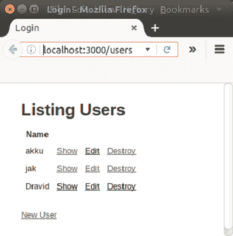
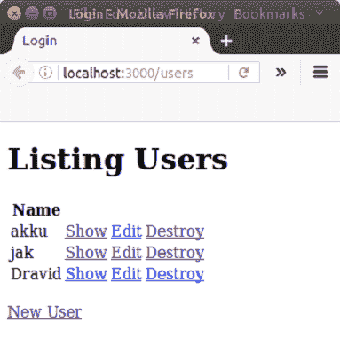
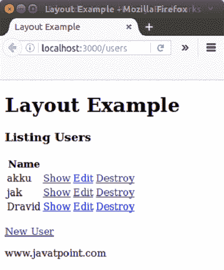

# 轨道布局

> 原文：<https://www.javatpoint.com/ruby-on-rails-layout>

在 Rails 中，布局是组合在一起(例如，页眉、页脚、菜单等)以形成完整视图的部分。一个应用程序可以有任意多的布局。Rails 使用常规而非配置来自动将布局与具有相同名称的相应控制器配对。

Rails 布局基本上是基于不要重复自己的原则(DRY)。

在 Rails 中，默认情况下启用布局。每当您生成新的 Rails 应用程序时，都会在应用程序/视图/布局中自动为您生成布局。

首先我们需要定义一个布局模板，然后定义控制器知道布局存在的路径。

* * *

## 创建响应

从控制器的角度来看，有三种方法可以创建 HTTP 响应:

*   调用 render 创建一个完整的响应发送回浏览器
*   调用重定向向浏览器发送 HTTP 重定向状态代码
*   调用 head 创建一个响应，以返回浏览器

### 收益率报表的重要性

Rails 中的 yield 语句决定了在布局中何处呈现动作的内容。如果布局中没有 yield 语句，将呈现布局文件本身，但是操作模板中的附加内容将不会正确地放置在布局中。

因此，必须在布局文件中添加 yield 语句。

```
<%= yield %>    

```

* * *

## 轨道布局和模板之间的关系

当在应用程序中提出请求时，会发生以下过程:

*   首先，Rails 为相应的动作找到一个模板，以便在您的控制器动作中呈现方法。
*   然后找到要使用的正确布局。
*   它使用动作模板来生成特定于该动作的内容。
*   最后，它在这里查找布局的 yield 语句和 insert 操作的模板。

### 寻找正确的布局

Rails 在 app/layouts 目录中搜索与控制器名称同名的布局。

例如，如果你有一个名为**的控制器，那么 rails 将搜索**布局/gio.html.erb** 布局。如果不存在同名布局，则使用默认布局**app/view/layouts/app application . html . erb****

### 示例:

前面我们做了一个例子，其输出如下:



现在在这个应用程序中，我们将插入一个布局文件。

**第一步**转到 app/layouts/application . html . erb 文件，去掉所有代码，写下以下代码。

```
<!DOCTYPE html> 
<html> 
  <head> 
    <title>Login</title> 

  </head> 

  <body> 

    <%= yield %>	 

  </body> 
</html> 

```



**第二步**转到 app/layouts 目录，创建 **lay.html.erb** 文件。

```
<!DOCTYPE html> 
<html> 
<head> 
	<title>Layout Example</title> 
</head> 
<body> 
		<h1>Layout Example</h1> 
	<%= yield %> 
		<p>www.javatpoint.com</p>                                           
</body> 
</html>

```

**第三步**通过编写以下代码将其插入 app/controller/users _ controller . Rb 文件。

```
class UsersController < ApplicationController 
  before_action :set_user, only: [:show, :edit, :update, :destroy] 

 layout "lay" 

  def index
code....

```

**第 4 步**在浏览器上运行。



* * *

### [计] 下载

[Download this example](https://static.javatpoint.com/rubyonrails/src/layout.zip)