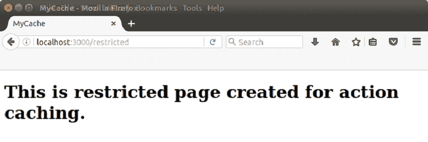

# Rails 缓存

> 原文：<https://www.javatpoint.com/ruby-on-rails-caching>

任何网络技术都使用缓存。它通过为后续请求存储以前的结果来提高性能。默认情况下，在 Rails 中禁用拼接。

Rails 缓存有三个粒度级别:

*   页
*   行动
*   碎片

* * *

## 页面缓存

Rails 页面缓存是一种将整个动作输出存储为一个 HTML 文件的技术。因此，web 服务器可以提供输出，而无需通过 Rails 再次调用操作。因此，它通过动态生成内容将性能提高了 100 倍。但是这种技术只对不区分应用程序用户的无状态页面有帮助。

通过使用**cache _ page**方法调用，可以为控制器类中的任何方法打开页面缓存。将需要缓存的操作作为参数传递给 cache_page。没有必要包含您的控制器的所有动作。

**示例:**

**步骤 1** 创建一个应用程序 MyCache -T

```
rails new MyCache -T

```

**步骤 2** 通过运行以下命令打开缓存。这个命令在 tmp 目录中创建一个空的缓存-dev.txt 文件。

```
rake dev:cache

```

**步骤 3** 转到 config/environments/development . Rb 文件并编写以下代码:

```
if Rails.root.join('tmp/caching-dev.txt').exist?
  config.action_controller.perform_caching = true
  config.action_mailer.perform_caching = false
  config.cache_store = :memory_store
  config.public_file_server.headers = {
    'Cache-Control' => 'public, max-age=172800'
  }
else
  config.action_controller.perform_caching = false
  config.action_mailer.perform_caching = false
  config.cache_store = :null_store
end

```

**第 4 步**转到 Gemfile，添加以下行。

```
gem 'actionpack-page_caching'

```

**步骤 5** 运行捆绑安装。

```
bundle install

```

**第 6 步**在 config/application.rb 文件中编写以下代码。它将指定您想要保存缓存页面的位置。

```
config.action_controller.page_cache_directory = "#{Rails.root.to_s}/public/deploy" 

```

**第七步**我们这里介绍一个控制器。运行以下命令:

```
rails generate controller page

```

**第 8 步**在 app/page_controller.rb 文件中，编写以下代码。

```
class PageController < ApplicationController 
  def index 
  end 
end 

```

**第九步**我们这里介绍一个控制器。运行以下命令:

```
root 'page#index'

```

转到视图/页面/索引. html.erb 文件。

```
<h1>Welcome to our Cached example tutorial.</h1> 

```

**步骤 11** 页面缓存通过 caches _ page 方法启用。转到控制器文件并编写以下代码:

```
class PageController < ApplicationController 
  caches_page index 
  end 

```

**步骤 12** 启动服务器。

```
rails s

```

**步骤 13** 在本地主机上运行。

```
localhost:3000

```


* * *

## 动作缓存

Rails 动作缓存像页面缓存一样保存动作响应的整个输出。只有一个区别，那就是动作缓存，动作调用仍然被路由到控制器，因此任何过滤器仍然可以被应用。通过使用**cache _ action**方法调用，可以为控制器类中的任何方法打开动作缓存。

**示例:**

我们将继续上面的例子。

**第 14 步**转到 Gemfile，编写以下代码。

```
gem 'actionpack-action_caching'

```

**第 15 步**运行捆绑安装。

```
bundle install

```

**第 16 步**要使用动作缓存，让我们创建一个新的受限页面。在控制器文件中编写以下代码。

```
class PageController < ApplicationController 
before_action :authenticate!, only: [:restricted]  

  caches_page :index 
  caches_action :restricted 

  def index 
  end 

  def restricted 
  end 

  private 

  def authenticate! 
    params[:admin] == 'true' 
  end 
end 

```

**第 17 步**创建 app/浏览量/页面/restricted.html.erb 文件。

```
<h1>This is restricted page created for action caching.</h1>

```

**第 18 步**转到 config/routes.rb 文件并编写以下代码。

```
get '/restricted', to: 'pages#restricted' 

```

**步骤 19** 启动服务器。

```
rails s

```

**第 20 步**在本地主机上运行。

```
Localhost:3000/restricted

```



* * *

## 片段缓存

Rails 片段缓存用于缓存模板中的块，而不是缓存动作方法的整个输出。当您需要频繁更改某个操作中无法缓存的某些部分，而其他部分需要缓存，因为它们保持静态时，这很有用。

这是在视图模板而不是控制器类中完成的。片段缓存用 cache_do 块指定。cache_do 语句中包含的块内的行将被缓存。

**示例:**

我们将继续上面的例子。

**第 21 步**创建一个名为 frag 的新模型。

```
rails g model Frag title:string

```

**第 22 步**运行迁移命令。

```
rake db:migrate

```

**第 23 步**转到 app/controller/frags _ controller . Rb 文件。

```
class FragsController < ApplicationController 
  def index 
    @frags = Frag.all 
  end 
end

```

**第 24 步**转到配置/routes.rb 文件。添加以下行。

```
resources :frags, only: [:index] 

```

**第 25 步**转到 app/view/frags/index . html . erb 文件。

```
<h1>Fragments</h1> 

<% @frags.each do |frag| %> 
  <%= frag.title %> 
<% end %>

```

**第 26 步**转到 db/seeds.rb 文件填充片段表。

```
20.times {|i| Frag.create!({title: "Frag #{i + 1}"})} 

```

**第 27 步**运行耙命令。

```
rake db:seed

```

**第 28 步**如果我们想要缓存一个页面上列出的每个片段，将使用缓存方法来完成。

转到 app/view/frags/index . html . erb 文件。

```
<% @frags.each do |frag| %> 
  <% cache frag do %> 
    <%= frag.title %> 

  <% end %> 
<% end %> 

```

**第 29 步**当一个对象被传递给 cache 方法时，它会自动取其 id 并生成一个合适的 cache key。如果片段被更新，缓存将自动过期。

在 app/view/frags/index . html . erb 文件中使用 ***渲染*** 方法，同时使用 ***缓存*** 选项。

```
<%= render @frags, cached: true %> 

```

* * *

### [计] 下载

[Download this example](https://static.javatpoint.com/rubyonrails/src/CACHING.zip)