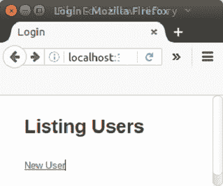
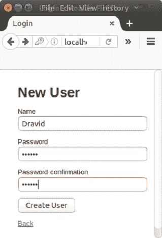
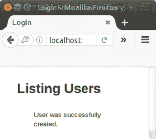

# Rails 将记录保存到数据库

> 原文：<https://www.javatpoint.com/ruby-on-rails-save-record>

我们可以使用 Ruby on Rails 将数据保存到数据库中。让我们看一个将表单数据保存到数据库的例子。

**步骤 1** 创建一个新的 Rails 应用程序。

```
rails new saverecord

```

**第二步**更改目录登录。

```
cd saverecord

```

**步骤 3** 从控制台创建脚手架。

```
rails generate scaffold User name:string password:digest

```

**第 4 步**迁移数据库。

```
rake db:migrate

```

**第 5 步**转到 Gemfile 并取消注释以下行。

```
gem 'bcrypt'

```

**第 6 步**运行以下命令:

```
bundle install

```

**第 7 步**转到 app/controller/users _ controller . Rb，在 create 方法中编写以下代码。

```
def create 
    @user = User.new(user_params) 

    respond_to do |format| 
      if @user.save 
        format.html { redirect_to users_url, notice: 'User was successfully created.' } 
        format.json { render :show, status: :created, location: @user } 
      else 
        format.html { render :new } 
        format.json { render json: @user.errors, status: :unprocessable_entity } 
      end 
    end 
  end

```

**第八步**转到 app/view/user/index . html . erb 文件。

```
<h1>Listing Users</h1> 

<% if notice %> 
<p id="notice"> <%= notice %> 
</p>
<%= link_to 'New User', new_user_path %>

```

**第九步**转到 app/浏览量/用户/new.html.erb 文件。

```
<h1>New User</h1> 

<%= render 'form', user: @user %> 

<%= link_to 'Back', users_path %> 

```

**第 10 步**转到 app/view/users/_ form . html . erb 文件。

```
<%= form_for(user) do |f| %> 
  <% if user.errors.any? %> 
    <div id="error_explanation"> 
      <h2><%= pluralize(user.errors.count, "error") %> prohibited this user from being saved:</h2> 

      <ul> 
      <% user.errors.full_messages.each do |message| %> 
        <li><%= message %></li> 
      <% end %> 
      </ul> 
    </div> 
  <% end %> 

  <div class="field"> 
    <%= f.label :name %> 
    <%= f.text_field :name %> 
  </div> 

  <div class="field"> 
    <%= f.label :password %> 
    <%= f.password_field :password %> 
  </div> 

  <div class="field"> 
    <%= f.label :password_confirmation %> 
    <%= f.password_field :password_confirmation %> 
  </div> 

  <div class="actions"> 
    <%= f.submit %> 
  </div> 
<% end %> 

```

**步骤 11** 启动 Rails 服务器。

```
rails s

```

**步骤 12** 在本地主机上运行。

```
http://localhost:3000/users

```



单击“新用途”添加新用户。



单击创建用途添加新用户。



* * *

### [计] 下载

[Download this example](https://static.javatpoint.com/rubyonrails/src/saverecord.zip)