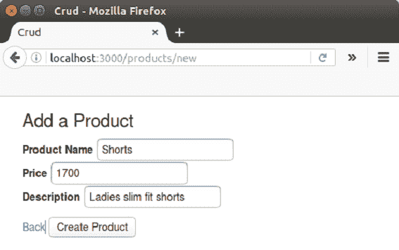

# Rails 上的 ruby CRUD

> 原文：<https://www.javatpoint.com/ruby-on-rails-crud>

CRUD 代表创建、读取、更新和删除数据库中的数据。活动记录自动允许应用程序读取和操作存储在表中的数据。

在本教程中，我们将使用 MySQL 数据库创建一个 Rails CRUD。

**步骤 1** 创建一个新的 Rails 应用程序。

```
rails new crud

```

**第 2 步**将你的目录改为 crud。

```
cd crud

```

**步骤 3** 转到应用程序中的 Gemfile 并添加以下内容。

```
gem 'grape' 

```

**步骤 4** 转到应用程序中的 config/application.rb 文件，并添加以下内容。

```
config.paths.add File.join('app', 'api'), glob: File.join('**', '*.rb')
config.autoload_paths += Dir[Rails.root.join('app', 'api', '*')]

```

**步骤 5** 运行以下命令:

```
bundle install

```

**第 6 步**转到 app/view/layouts/application . html . erb，在 head tag 中插入以下几行。

```
<%= stylesheet_link_tag??? 'https://maxcdn.bootstrapcdn.com/bootstrap/3.3.6/css/bootstrap.min.css' %>
<%= stylesheet_link_tag??? 'https://cdn.datatables.net/s/dt/dt-1.10.10,r-2.0.0/datatables.min.css' %>

```

**第 7 步**转到 app/view/layouts/application . html . erb，在< /body >标签前插入以下几行。

```
<%= javascript_include_tag 'https://maxcdn.bootstrapcdn.com/bootstrap/3.3.6/js/bootstrap.min.js' %>
<%= javascript_include_tag 'https://cdn.datatables.net/s/dt/dt-1.10.10,r-2.0.0/datatables.min.js' %>

```

**步骤 8** 在上述文件中，将< %=产量% >替换为以下代码:

```
<div class="container">
<div><% if flash[:notice] %>
<div><%= flash[:notice] %></div>
<% end %> <%= yield %></div>
</div>
</div>

```

**第 9 步**转到 app/assets/javascript/application . js，添加加载 jQuery DataTable 的 JavaScript 代码:

```
var ready = function() {
 $('#products').DataTable({
  "columnDefs": [
     { "width": "19%", className: "dt-body-center", "targets": -1 },
     { "width": "10%", "targets": 0 },
     { "width": "7%", "targets": 1 },
     { "width": "20%", "targets": 2 },
     { "width": "20%", "targets": 3 },
    ]
   });
}
$(document).ready(ready);
$(document).on('page:load', ready);

```

**步骤 10** 从控制台创建控制器。

```
rails g controller products index show new create edit update destroy

```

**步骤 11** 从控制台创建模型。

```
rails g model product name:string price:decimal short_description:text full_description:text

```

**第 12 步**转到 app/controller/products _ controller . Rb，写下以下代码。

```
class ProductsController < ApplicationController 

  # GET method to get all products from database 
  def index 
    @products = Product.all 
  end 

  # GET method to get a product by id 
  def show 
    @product = Product.find(params[:id]) 
  end 

  # GET method for the new product form 
  def new 
    @product = Product.new 
  end 

  # POST method for processing form data 
  def create 
    @product = Product.new(product_params) 
    if @product.save 
      flash[:notice] = 'Product added!' 
      redirect_to root_path 
    else 
      flash[:error] = 'Failed to edit product!' 
      render :new 
    end 
  end 

   # GET method for editing a product based on id 
  def edit 
    @product = Product.find(params[:id]) 
  end 

  # PUT method for updating in database a product based on id 
  def update 
    @product = Product.find(params[:id]) 
    if @product.update_attributes(product_params) 
      flash[:notice] = 'Product updated!' 
      redirect_to root_path 
    else 
      flash[:error] = 'Failed to edit product!' 
      render :edit 
    end 
  end 

  # DELETE method for deleting a product from database based on id 
  def destroy 
    @product = Product.find(params[:id]) 
    if @product.delete 
      flash[:notice] = 'Product deleted!' 
      redirect_to root_path 
    else 
      flash[:error] = 'Failed to delete this product!' 
      render :destroy 
    end 
  end 

  # we used strong parameters for the validation of params 
  def product_params 
    params.require(:product).permit(:name, :price, :old_price, :short_description, :full_description) 
  end 

end

```

**步骤 13** 转到 app/models/product.rb，对名称、价格和描述字段进行一些验证。

```
class Product < ApplicationRecord 
validates :name, presence: true 
validates :price, presence: true, numericality: {:greater_than => 0} 
validates :short_description, presence: true 
end 

```

**第 14 步**转到配置/路由. rb 并添加:

```
resources :products
root 'products#index'

```

**第 14 步**转到配置/路由. rb 并添加:

```
resources :products
root 'products#index'

```

**步骤 15** 现在在 app 文件夹中创建一个名为 **api** 的文件夹。在这个文件夹中创建一个名为**产品**的文件夹。现在最后创建 app/API/products/products _ API . Rb 文件并添加以下代码。

```
module Products 
  class ProductsAPI < Grape::API 

    format :json 

    desc "Product List", { 
        :notes => <<-NOTE 
        Get All Products 
         __________________ 
        NOTE 
    } 

    get do 
      Product.all 
    end 

    desc "Product By Id", { 
        :notes => <<-NOTE 
        Get Product By Id 
         __________________ 
        NOTE 
    } 

    params do 
      requires :id, type: Integer, desc: "Product id" 
    end 

    get ':id' do 
      begin 
        product = Product.find(params[:id]) 
      rescue ActiveRecord::RecordNotFound 
        error!({ status: :not_found }, 404) 
      end 
    end 

    desc "Delete Product By Id", { 
        :notes => <<-NOTE 
        Delete Product By Id 
         __________________ 
        NOTE 
    } 

    params do 
      requires :id, type: Integer, desc: "Product id" 
    end 

    delete ':id' do 
      begin 
        product = Product.find(params[:id]) 
        { status: :success } if product.delete 
      rescue ActiveRecord::RecordNotFound 
        error!({ status: :error, message: :not_found }, 404) 
      end 
    end 

    desc "Update Product By Id", { 
        :notes => <<-NOTE 
        Update Product By Id 
                        __________________ 
        NOTE 
    } 

    params do 
      requires :id, type: Integer, desc: "Product id" 
      requires :name, type: String, desc: "Product name" 
      requires :price, type: BigDecimal, desc: "Product price" 
      optional :old_price, type: BigDecimal, desc: "Product old price" 
      requires :short_description, type: String, desc: "Product old price" 
      optional :full_description, type: String, desc: "Product old price" 
    end 

    put ':id' do 
      begin 
        product = Product.find(params[:id]) 
        if product.update({ 
                              name: params[:name], 
                              price: params[:price], 
                              old_price: params[:old_price], 
                              short_description: params[:short_description], 

                          }) 
          { status: :success } 
        else 
          error!({ status: :error, message: product.errors.full_messages.first }) if product.errors.any? 
        end 

      rescue ActiveRecord::RecordNotFound 
        error!({ status: :error, message: :not_found }, 404) 
      end 
    end 

    desc "Create Product", { 
        :notes => <<-NOTE 
        Create Product 
         __________________ 
        NOTE 
    } 

    params do 
      requires :name, type: String, desc: "Product name" 
      requires :price, type: BigDecimal, desc: "Product price" 
      optional :old_price, type: BigDecimal, desc: "Product old price" 
      requires :short_description, type: String, desc: "Product old price" 

    end 

    post do 
      begin 
        product =  Product.create({ 
                                      name: params[:name], 
                                      price: params[:price], 
                                      old_price: params[:old_price], 
                                      short_description: params[:short_description], 

                                  }) 
        if product.save 
          { status: :success } 
        else 
          error!({ status: :error, message: product.errors.full_messages.first }) if product.errors.any? 
        end 

      rescue ActiveRecord::RecordNotFound 
        error!({ status: :error, message: :not_found }, 404) 
      end 
    end 
  end 
end

```

**第 16 步**转到配置/routes.rb 并添加以下代码。

```
mount Products::ProductsAPI => '/api/products'

```

**第 17 步**在控制台中运行以下命令。

```
rake db:migrate

```

**第 18 步**在 app/view/products/file 中，编写以下代码。

**index.html.erb**

```
<!DOCTYPE html> 
<html> 
<body> 
 <div class="container"> 
    <h3>STOCK LIST</h3> 

      <div> 
        <%= link_to 'Add Product', new_product_path %> 
      </div> 
      <br> 
    <table border="2"> 
      <thead> 
      <tr> 
        <th>Name</th> 
        <th>Price</th> 
        <th>Description</th> 
        <th>Actions</th> 
      </tr> 
      </thead> 
      <tbody> 
      <% @products.each do |product| %> 
          <tr> 
            <td><%= product.name %></td> 
            <td><%= product.price %></td> 
            <td><%= truncate(product.short_description, :length => 75) %></td> 
               <div> 
               <td> 
                <%= link_to 'Show', product_path(product) %> 
                <%= link_to 'Edit', edit_product_path(product) %> 
                <%= link_to 'Delete', product_path(product), method: :delete %> 
              </div> 
            </td> 
          </tr> 
      <% end %> 
      </tbody> 
    </table> 
    </div> 
  </body> 
</html>

```

**new.html.erb**

```
<div class="container"> 
  <%= form_for @product, url: {action: :create} do |f| %> 
      <div> 
        <h3>Add a Product</h3> 
      </div> 
      <div> 
        <p> 
          <%= "<div>#{@product.errors.full_messages.first}</div>".html_safe if @product.errors.any? %> 
        <div> 
            <label>Product Name</label> 
              <%= f.text_field :name %> 
        </div> 

        <div> 
             <label>Price</label> 
             <%= f.text_field :price %> 
        </div> 

        <div> 
           <label>Description</label> 
              <%= f.text_field :short_description %> 
        </div> 
		 </p> 
      </div> 
      <div> 
        <%= link_to 'Back', { controller: 'products', action: 'index'} %> 
        <%= f.submit 'Create Product' %> 
      </div> 
  <% end %> 
</div>

```

**edit.html.erb**

```
  <div class="container"> 

  <%= form_for @product, url: {action: :update} do |f| %> 

     <h3>Add a Product</h3> 
	  <%= "<div>#{@product.errors.full_messages.first}</div>".html_safe if @product.errors.any? %> 
      <p> 

       <div> 
              <label>Product Name</label> 
              <%= f.text_field :name %> 
       </div> 

       <div> 
              <label>Price</label> 
              <%= f.text_field :price %> 
       </div> 

       <div> 
              <label>Description</label> 
              <%= f.text_field :short_description %> 
       </div> 

        </p> 
     <div> 
        <%= link_to 'Back', { controller: 'products', action: 'index'} %> 
        <%= f.submit 'Update Product' %> 
      </div> 
  <% end %> 
</div>

```

**show.html.erb**

```
<div class="container">      
        <h3>Add a Product</h3> 

            <div> 
              <label>Product Name</label> 
              <%= @product.name %> 
            </div> 

            <div> 
              <label>Price</label> 
              <%= @product.price %> 
            </div> 

            <div> 
              <label>Description</label> 
              <%= @product.short_description %> 
            </div> 

      <div> 
        <%= link_to 'Back', { controller: 'products', action: 'index'} %> 
      </div> 
</div>

```

**步骤 19** 从命令行启动服务器。

```
rails s

```

**步骤 20** 在本地主机上运行应用程序。

```
localhost:3000/products

```

将出现以下页面。这里我们已经在表中插入了一些数据。


**插入数据**



要插入数据，请单击添加产品，如上图所示。如下所示填写详细信息。


**读取数据**

要读取数据，请单击操作显示。在这里，我们将点击杰金斯秀的行动。


**更新数据**

要更新数据，请单击编辑操作。这里我们将编辑，衬衫描述从男性正式衬衫到女性正式衬衫。

 

**删除数据**

要删除数据，请单击删除操作。这里我们将从上表中删除产品 Jeans。


* * *

### [计] 下载

[Download this example](https://static.javatpoint.com/rubyonrails/src/CRUD.zip)