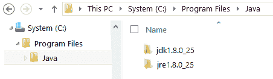
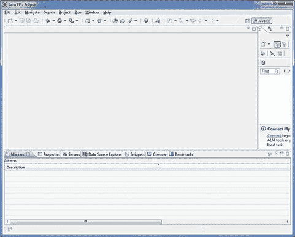
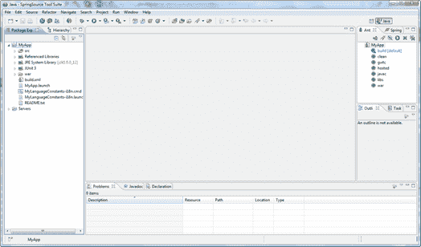
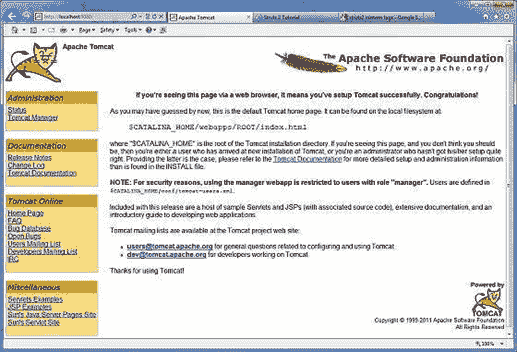

# GWT 装置

> 原文：<https://www.javatpoint.com/gwt-installation>

**系统需求:** GWT 是基于 Java 的，所以我们要安装 JDK。JDK 应该是 1.6 或更高版本的系统。

| java 开发工具包 | 1.6 或以上 |
| 记忆 | 没有最低要求。 |
| 磁盘空间 | 没有最低要求。 |
| 操作系统 | 没有最低要求。 |

* * *

## 安装 JDK

### 第一步:下载 JDK

1.  从[下载 JDK](http://www.oracle.com/technetwork/java/javase/downloads/index.html.)
2.  在“Java 平台，标准版”下，点击最新版本的“JDK 下载”按钮。
3.  选中“接受许可协议”。
4.  为您的操作系统选择 JDK，例如，“Windows x64”(适用于 64 位 Windows 操作系统)或“Windows x86”

### 步骤 2:安装 JDK 和 JRE

运行安装程序，安装 JDK 和 JRE。默认情况下，JDK 将安装在目录“C:\程序文件\Java\jdk1.8.0_xx”和“C:\程序文件\Java\jre1.8.0_xx”中的 JRE 中。

使用文件资源管理器检查 JDK 安装的目录，并记下下一步需要的版本。



### 步骤 3:设置路径

1.  启动“控制面板”系统单击左侧窗格中的“高级系统设置”。
2.  转到“高级”选项卡按下“环境变量”按钮。
3.  在“系统变量”(底部窗格)下，向下滚动选择“路径”单击“编辑…”

**(注意:非常小心地做下一步，因为没有撤销 don？不要按“应用”或“确定”，直到你 101%确定。)**

在变量值中，在所有现有目录前插入您的 JDK 路径，它看起来像“C:\程序文件\Java\jdk1.8.0_xx\bin”(用您的安装号替换 xx)

变量名:**路径**

变量值:C:**\程序文件\ Java \ JDK 1 . 8 . 0 _ xx \ bin；[** 退出条目...**】**

### 步骤 4:验证 JDK 安装

在 CMD 外壳上写下以下过程

编写以下命令进行验证:

```

// Display the PATH entries
prompt>path
PATH=c:\Program Files\Java\jdk1.8.0_xx\bin;[other entries...]

```

编写以下命令来验证 JDK/JRE:

```

// Display the JRE version
prompt>java -version
java version "1.8.0_xx"
Java(TM) SE Runtime Environment (build 1.8.0_xx-b13)
Java HotSpot(TM) 64-Bit Server VM (build 25.5-b02, mixed mode)
 // Display the JDK version

```

* * *

## 安装 Eclipse

1)从 https://www.eclipse.org/downloads/下载 Eclipse IDE

2)安装 Eclipse，将二进制分发解包到方便的文件夹中。



* * *

## 为 Eclipse 安装 GWT 软件开发工具包和插件

1)从[http://www.gwtproject.org/download.html](http://www.gwtproject.org/download.html)下载 GWT SDK 并解压。

2)从 https://dl.google.com/eclipse/plugin/4.5 下载 Eclipse(火星)的谷歌插件并安装。

**安装成功后**应该是这样的:



### 安装 Apache

从 https://tomcat.apache.org/下载最新版本的 Apache，并运行默认情况下在端口 8080 上运行的 Apache

