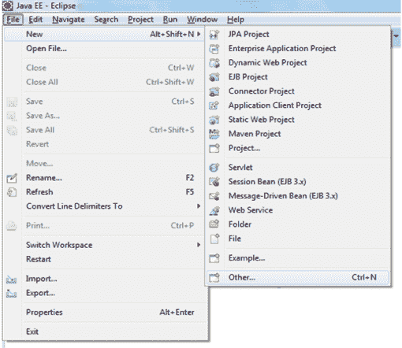
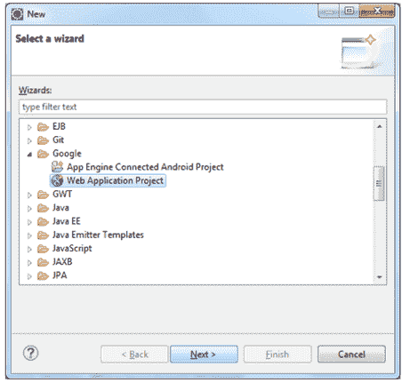
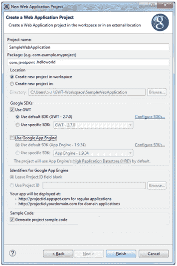
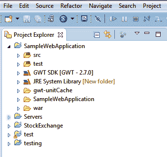
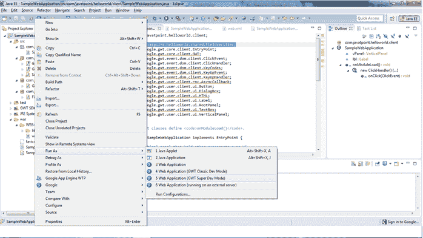
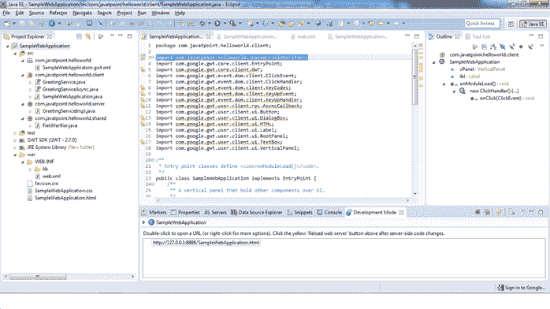
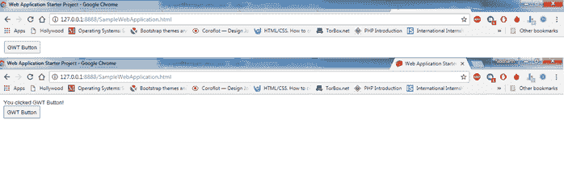

# 第一次 GWT 申请

> 原文：<https://www.javatpoint.com/first-gwt-application>

要构建一个 GWT 应用程序，我们有四个部分，最后一部分是可选的。

**1)模块描述符:**本节有助于 GWT 应用程序的配置。为了进行配置，我们将配置文件写入 XML

**语法:name.gwt.xml**

这里，“**名称**”是应用的名称。所有配置文件都在项目根目录中。

**2) UI 设计:**由用来设计 GWT 应用的 HTML、CSS 或 Images 组成。我们可以通过使用 **<公共路径=“位置地址”/ >** 标签来配置其位置。我们可以在模块配置中找到配置文件。

**3)客户端代码:**在本节中，应用程序的所有代码和业务逻辑的转换都使用 GWT 编译器转换为 JavaScript。我们可以使用 **<源路径=【路径】/ >** 标签找到资源的位置。该代码由入口点代码组成，无需参数即可编写。加载 GWT 应用模块后，每次都会调用**entrypoint . onmoduleload()**方法。

**4)服务器端代码:**在本节中，我们可以执行服务器端代码。如果我们的应用程序没有任何后端(服务器端脚本或数据库)，那么这个部分是可选的。

* * *

## 创建应用程序:

使用 GWT 网络开发工具包创建简单的网络开发项目。要创建应用程序，请执行以下步骤:

文件→新建→其他



现在，将打开一个弹出窗口，从中选择一个向导选项。

选择谷歌网络应用向导，并点击“下一步”按钮。



单击“下一步”按钮后，将打开一个新向导。

现在，提供项目名和包名。选择谷歌软件开发工具包选项下的**使用 GWT** ，取消选中**使用谷歌应用引擎**，因为我们只是在构建一个基础应用。

单击完成按钮。



单击完成按钮后，将生成以下目录



* * *

## 入口点类别:

在这个例子中，类样本网络应用程序被称为 GWT 应用程序的入口点。该文件包含许多对服务器端代码的引用。这个文件需要清理，因为它有很多引用。

有一个预定义的方法 **onModuleLoad()** ，它是运行 GWT 网络应用程序时执行的程序的入口点。

这非常类似于普通 java 程序中的**公共静态 void main (String args[])** 方法。

## 入口点类别代码

**SampleWebApplication.java**

```

package com.javatpoint.helloworld.client;
 import com.google.gwt.core.client.EntryPoint;
 /** * Entry point classes define onModuleLoad() */ 
public class SampleWebApplication implements EntryPoint {
 	/ * This is the entry point method. */ 
public void onModuleLoad() {
 // TODO
 } 
}

```

* * *

## 部署描述符

它类似于 J2EE 编程中的 web.xml，是基于 Servlet 的 Java Web 应用程序的部署描述符。

现在在 web.xml 中，GWT 创建了在部署描述符下定义的 servlets。因为我们正在创建一个基本的 web-app，所以删除 web.xml 中的所有服务器端代码和条目，也称为规范标签。

我们创建了一个欢迎文件**SampleWebApplication.html**，并将其包含在 web.xml 中。

## 部署描述符代码

**web.xml**

```

<?xml version="1.0" encoding="UTF-8"?>
<web-app xmlns:xsi="https://www.w3.org/2001/XMLSchema-instance"
xsi:schemaLocation="https://java.sun.com/xml/ns/javaee
https://java.sun.com/xml/ns/javaee/web-app_2_5.xsd"
version="2.5"
>
<!-- Servlets -->
<!-- Default page to serve -->
<welcome-file-list>
<welcome-file>SampleWebApplication.html</welcome-file>
</welcome-file-list>
</web-app>

```

* * *

## 模块描述符

在这一部分，我们打开一个文件**samplewebapplication . gwt . XML**，可以在 package**com . javatpoint . hello world**下找到，这是一个特定的配置文件。

它由来自核心 GWT 库组成，该库包含在继承标签中。我们还可以使用 inherit 标记添加第三方库。继承标记引用 GWT 控件的默认样式。

## 模块描述符代码

**samplewebapplication . gwt . XML**

```

<?xml version="1.0" encoding="UTF-8"?>
<!--
When updating your version of GWT, you should also update this DTD reference,
so that your app can take advantage of the latest GWT module capabilities.
-->
<!DOCTYPE module PUBLIC "-//Google Inc.//DTD Google Web Toolkit 2.7.0//EN"
"http://gwtproject.org/doctype/2.7.0/gwt-module.dtd">
<module rename-to='samplewebapplication'>
<!-- Inherit the core Web Toolkit stuff.-->
<inherits name='com.google.gwt.user.User'/>

<!-- Inherit the default GWT style sheet.  You can change-->
<!-- the theme of your GWT application by uncommenting-->
<!-- any one of the following lines.-->
<inherits name='com.google.gwt.user.theme.clean.Clean'/>
<!-- <inherits name='com.google.gwt.user.theme.standard.Standard'/>-->
<!-- <inherits name='com.google.gwt.user.theme.chrome.Chrome'/>-->
<!-- <inherits name='com.google.gwt.user.theme.dark.Dark'/>-->

<!-- Other module inherits-->

<!-- Specify the app entry point class.-->
<entry-point class='com.javatpoint.helloworld.client.SampleWebApplication'/>

<!-- Specify the paths for translatable code-->
<source path='client'/>
<source path='shared'/>

<!-- allow Super Dev Mode -->
<add-linker name="xsiframe"/>
</module>

```

* * *

## 欢迎文件

欢迎文件描述了项目的外观和感觉。它是根据我们的需要设计的。

```

<!doctype html>
<!-- The DOCTYPE declaration above will set the-->
<!-- browser's rendering engine into-->
<!-- "Standards Mode". Replacing this declaration -->
<!-- with a "Quirks Mode" doctype is not supported.-->
<html>
<head>
<meta http-equiv="content-type" content="text/html; charset=UTF-8">
<!--  -->
<!-- Consider inlining CSS to reduce the number of requested files -->
<!--  -->
<link type="text/css" rel="stylesheet" href="SampleWebApplication.css">
<!-- -->
<!-- Any title is fine-->
<!--  -->
<title>Web Application Starter Project</title>
<!--  -->
<!-- This script loads your compiled module. -->
<!-- If you add any GWT meta tags, they must -->
<!-- be added before this line. -->
<!--  -->
<script type="text/javascript" language="javascript"
src="samplewebapplication/samplewebapplication.nocache.js"> </script>
</head>
<!-- The body can have arbitrary html, or  -->
<!-- you can leave the body empty if you want  -->
<!-- to create a completely dynamic UI.  -->
<!-- -->
<body>
<!-- RECOMMENDED if your web app will not function without JavaScript enabled -->
<noscript>
<div style="width: 22em; position: absolute; left: 50%;
margin-left: -11em; color: red; background-color: white; border: 1px solid red;
padding: 4px; font-family: sans-serif">
Your web browser must have JavaScript enabled  in order for this application to display correctly.
</div>
</noscript>
</body>
</html>

```

用户界面组件在入口点类下更改。我们编写几行代码来添加 UI 组件。在这个例子中，我们将添加按钮，垂直面板，事件处理。

```

package com.javatpoint.helloworld.client;

import com.google.gwt.core.client.EntryPoint;
import com.google.gwt.event.dom.client.ClickEvent;
import com.google.gwt.event.dom.client.ClickHandler;
import com.google.gwt.user.client.ui.Button;
import com.google.gwt.user.client.ui.Label;
import com.google.gwt.user.client.ui.RootPanel;
import com.google.gwt.user.client.ui.VerticalPanel;

/**
 * Entry point classes define <code>onModuleLoad()</code>.
 */
public class SampleWebApplication implements EntryPoint {
	/** A vertical panel that hold other components over UI.*/
	VerticalPanel vPanel;
	/*
	* A label that gets updated on click of button.
	*/
	Label lbl;	
	/**
	 * This is the entry point method.
	 */
	public void onModuleLoad() {
		vPanel= new VerticalPanel ();
		lbl= new Label ();

		/*
		* Button and its click handlar.
		*/
		Button btn = new Button("GWT Button");
		btn.addClickHandler(new ClickHandler() {

			@Override
		public void onClick(ClickEvent event) {
		lbl.setText("You clicked GWT Button!");
		}
		});		
		/*
		* adding label and button into Vertical Panel.
		*/
		vPanel.add(lbl);
		vPanel.add(btn);		
		/*
		* Adding vertical panel into HTML page.
		*/
		RootPanel.get().add(vPanel);
		}
	}

```

* * *

## 运行 GWT 网络应用程序

GWT 网络应用程序以两种模式运行:

*   **开发模式:**在这种模式下，Java 代码运行到 JVM 中
*   **生产模式:**在这种模式下，GWT 编译器编译 Java 代码并创建在浏览器上运行的 JavaScript。

在本教程中，我们将 GWT 网络应用程序运行到“GWT 超级开发模式”，该模式在运行时编译 Java 代码，并在浏览器上运行 JavaScript。



**现在复制网址:**



输出:

