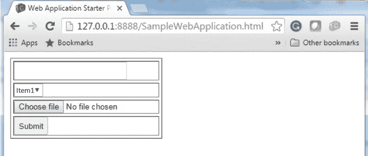

# GWT FormPanel

> 原文：<https://www.javatpoint.com/gwt-form-panel>

该面板处理 **HTML 表单**的元素。在这个面板中，我们可以添加任何包装在 HTML 表单元素中的小部件。

### GWT 表单面板类声明

来看看**com . Google . gwt . user . client . ui . form panel**的申报吧

```
public class FormPanel extends SimplePanel

```

### GWT 表单面板嵌套类

| 班级 | 描述 |
| 模具环。亚纯文本处理程序 | 它处理表单面板。提交完成事件。 |
| 模具环。亚纯风 | 当表单提交成功时，它将被激发。 |
| 模具环。提交人 | 提交表单时，它将被激发 |
| 形环.亚微米级 | 它处理表单面板。提交事件。 |

### GWT 表单面板构造函数

| 构造器 | 描述 |
| FormPanel（） | 它会创建一个新的 FormPanel。 |
| 表单面板(元素元素) | 子类使用它来显式使用现有元素。 |
| 表单面板(元素元素，布尔 createIFrame) | 子类使用它来显式使用现有元素。 |
| FormPanel（NamedFrame frameTarget） | 它创建了一个以命名框架为目标的表单面板。 |
| FormPanel（NamedFrame frameTarget） | 它创建了一个以命名框架为目标的表单面板。 |
| FormPanel(java.lang.String 目标) | 它创建了一个新的表单面板，将字符串作为输入。 |

### GWT 表单面板方法

| 修饰符和类型 | 方法 | 描述 |
| 空的 | addFormHandler(FormHandler) | 它向面板添加一个表单小部件。 |
| java.lang.String | getAction() | 它获取与此表单关联的“操作”。 |
| java.lang.String | getEncoding() | 它获取用于提交此表单的编码。 |
| java.lang.String | getMethod() | 它获取用于提交此表单的 HTTP 方法。 |
| java.lang.String | gettarget() | 它获取表单的“目标”。 |
| 受保护的空隙 | onattach() | 当小部件附加到浏览器的文档时，会调用此方法。 |
| 受保护的空隙 | 底部() | 当小部件从浏览器的文档中分离出来时，会调用此方法。 |
| 空的 | onFrameLoad() | 当目标框架完成加载时调用它。 |
| 空的 | setaction(安全 url) | 它设置与此表单关联的“操作”。 |
| 空的 | setction(Java . lang . string URL) | 它设置与此表单关联的“操作”。 |
| 空的 | setEncoding（java.lang.String encodingType） | 它设置用于提交此表单的编码。 |
| 空的 | 提交() | 它提交表单。 |
| 静态表单面板 | 包装(元素元素) | 它创建了一个包装现有

<form>元素的表单面板。</form>

 |
| 静态表单面板 | 包装(元素元素，布尔 createIFrame) | 它创建了一个包装现有

<form>元素的表单面板。</form>

 |

### GWT 表单面板示例

**//sampleformring . Java:**

```

import com.google.gwt.core.client.EntryPoint;
import com.google.gwt.event.dom.client.ClickEvent;
import com.google.gwt.event.dom.client.ClickHandler;
import com.google.gwt.user.client.Window;
import com.google.gwt.user.client.ui.Button;
import com.google.gwt.user.client.ui.DecoratorPanel;
import com.google.gwt.user.client.ui.FileUpload;
import com.google.gwt.user.client.ui.FormPanel;
import com.google.gwt.user.client.ui.FormPanel.SubmitCompleteEvent;
import com.google.gwt.user.client.ui.FormPanel.SubmitEvent;
import com.google.gwt.user.client.ui.ListBox;
import com.google.gwt.user.client.ui.RootPanel;
import com.google.gwt.user.client.ui.TextBox;
import com.google.gwt.user.client.ui.VerticalPanel;

public class FormPanelExample implements EntryPoint {

  public void onModuleLoad() {
    // Create a FormPanel and point it at a service.
    final FormPanel form = new FormPanel();
    form.setAction("/myFormHandler");

    form.setEncoding(FormPanel.ENCODING_MULTIPART);
    form.setMethod(FormPanel.METHOD_POST);

    // Create a panel to hold all of the form widgets.
    VerticalPanel panel = new VerticalPanel();
    form.setWidget(panel);

    // Create a TextBox, giving it a name so that it will be submitted.
    final TextBox tb = new TextBox();
    tb.setName("textBoxFormElement");
    panel.add(tb);

    // Create a ListBox, giving it a name and some values to be associated with its options.
    ListBox lb = new ListBox();
    lb.setName("listBoxFormElement");
    lb.addItem("Item1", "Item1Value");
    lb.addItem("Item2", "Item2Value");
    lb.addItem("Item3", "Item3Value");
    panel.add(lb);

    // Create a FileUpload widget.
    FileUpload upload = new FileUpload();
    upload.setName("uploadFormElement");
    panel.add(upload);

    // Add a 'submit' button.
    panel.add(new Button("Submit", new ClickHandler() {
      public void onClick(ClickEvent event) {
        form.submit();
      }
    }));

```

```
  // Add an event handler to the form.
    form.addSubmitHandler(new FormPanel.SubmitHandler() {
      public void onSubmit(SubmitEvent event) {

        if (tb.getText().length() == 0) {
          Window.alert("The text box must not be empty");
          event.cancel();
        }
      }
    });
    form.addSubmitCompleteHandler(new FormPanel.SubmitCompleteHandler() {
      public void onSubmitComplete(SubmitCompleteEvent event) {

        Window.alert(event.getResults());
      }
    });

    RootPanel.get().add(form);
  }
}

```

**//sampleformring . CSS:**

```
body {
   text-align: center;
   font-family: verdana, sans-serif;
}

h1 {
   font-size: 2em;
   font-weight: bold;
   color: #777777;
   margin: 40px 0px 70px;
   text-align: center;
}

```

输出:

