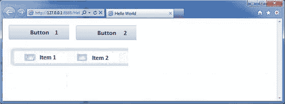
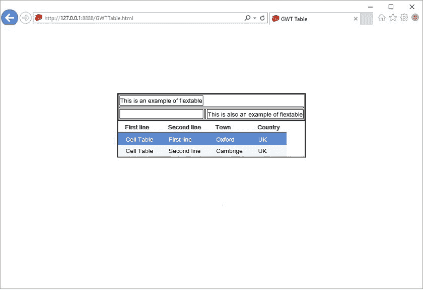

# GWT 弹性表

> 原文：<https://www.javatpoint.com/gwt-flextable>

GWT 灵活表格是一种灵活的表格，可以按需创建单元格。它可以是锯齿状的(也就是说，每行可以包含不同数量的单元格)，并且单个单元格可以设置为跨越多行或多列。它类似于 GWT 网格，因为它也创建表格。表中的单个单元格可以设置为基于索引跨越多行或多列。

### GWT 弹性表类声明

来看看**com . Google . gwt . user . client . ui . flextable**的声明

```
public class FlexTable extends HTMLTable

```

### GWT 弹性表嵌套类

| 班级 | 描述 |
| FlexTable。FlexCellFormatter | 它是 HTMLTable.CellFormatter 的特定实现。 |

### GWT 弹性表构造器

| 修饰符和类型 | 构造器 | 描述 |
| 公众的 | FlexTable() | 它是空弹性表的构造函数。 |

### GWT 弹性表方法

| 修饰符和类型 | 方法 | 描述 |
| 空的 | add 储存格(int 列) | 它将一个单元格追加到指定的行。 |
| （同 Internationalorganizations）国际组织 | getCellCount(int row) | 它获取给定行上的单元格数。 |
| FlexTable。FlexCellFormatter | getFlexCellFormatter() | 它获取弹性表。 |
| （同 Internationalorganizations）国际组织 | getRowCount() | 它获取行数 |
| 空的 | 插入单元格(行前整数，列前整数) | 它将一个单元格插入到 FlexTable 中。 |
| （同 Internationalorganizations）国际组织 | insertRow(int beforeRow) | 它在 FlexTable 中插入一行。 |
| 受保护的空隙 | prepareCell(整数行，整数列) | 它确保了细胞的存在。 |
| 受保护的空隙 | 预备列(int row) | 它确保行存在。 |
| 空的 | 移除所有行() | 它会删除表中的所有行。 |
| 空的 | removeCell(int row，int col) | 它从表格中移除指定的单元格。 |
| 空的 | removeCells(int row，int col，int num) | 它从表中的一行中删除一些单元格。 |
| 空的 | removeRow(int row) | 它从表中删除指定的行。 |

### GWT 弹性表示例 1

**//SampleFlexTable1.java**

```
public class FlexTableExample implements EntryPoint {

  public void onModuleLoad() {
    // Tables have no explicit size -- they resize automatically on demand.
    FlexTable t = new FlexTable();

    // Put some text at the table's extremes.  This forces the table to be
    // 3 by 3.
    t.setText(0, 0, "upper-left corner");
    t.setText(2, 2, "bottom-right corner");

    // Let's put a button in the middle...
    t.setWidget(1, 0, new Button("Button 00"));
    t.setWidget(1, 0, new Button("Button 01"));

	t.setWidget(2, 0, new Checkbox("Chechbox 10"));
	t.setWidget(2, 0, new Checkbox("Chechbox 11"));
    // ...and set it's column span so that it takes up the whole row.
    t.getFlexCellFormatter().setColSpan(1, 0, 3);

    RootPanel.get().add(t);
  }
}

```

**//SampleFlexTable1.css**

```
.flexTable {
  width: 150px;
  height: 150px;
  position: absolute; 
  left: 15px; 
  top: 350px;  
}

.panel {
  background-color: #C3D9FF;
  border: 1px solid #000000;
  padding: 3px;
  margin: 3px;
  font-weight: normal;  
}

```

输出:



### GWT 弹性表示例 2

**//SampleFlexTable2.java**

```
package com.javatpoint.gwt.client;

import com.google.gwt.core.client.EntryPoint;
import com.google.gwt.user.client.ui.CheckBox;
import com.google.gwt.user.client.ui.Composite;
import com.google.gwt.user.client.ui.Label;
import com.google.gwt.user.client.ui.ScrollListener;
import com.google.gwt.user.client.ui.ScrollPanel;
import com.google.gwt.user.client.ui.FlexTable;
import com.google.gwt.user.client.ui.Widget;
import com.google.gwt.user.client.ui.RootPanel;

public class GWTClient implements EntryPoint{
  public void onModuleLoad() {
    FlexTable flexTable = new FlexTable();
    flexTable.setWidget(0, 0, new Label("0,0"));
    flexTable.setWidget(0, 1, new Label("FlexTable"));
    flexTable.setWidget(0, 2, new Label("0,2"));
    flexTable.setWidget(1, 0, new Label("1,0"));
    flexTable.setWidget(1, 1, new Label("1,1"));
    flexTable.setWidget(1, 2, new Label("1,2"));
    flexTable.setWidget(2, 0, new Label("2,0"));
    flexTable.setWidget(2, 1, new Label("2,1"));
    flexTable.setWidget(2, 2, new Label("2,2"));
    flexTable.setWidget(3, 0, new Label("3,0 - span columns"));
    flexTable.setStyleName("panel flexTable");
    flexTable.getFlexCellFormatter().setColSpan(3, 0, 3);
    for (int i = 0; i < flexTable.getRowCount(); i++) {
        for (int j = 0; j < flexTable.getCellCount(i); j++) {
            if ((j % 2) == 0) {
                flexTable.getFlexCellFormatter()
                         .setStyleName(i, j, "tableCell-even");
            } else {
                flexTable.getFlexCellFormatter()
                         .setStyleName(i, j, "tableCell-odd");
            }
        }
    }
    RootPanel.get().add(flexTable);
  }
}

```

**//SampleFlexTable2.css**

```
.FlexTable {
  border-top: thin solid #444444;
  border-left: thin solid #444444;
  border-right: thin solid #111111;
  border-bottom: thin solid #111111;
  background-color:  #505050;
}

.FlexTable-OddRow {
  background-color: #cccccc;
}

.FlexTable-EvenRow {
  background-color:  #505050;
}

.FlexTable-ColumnLabel {
  color: white;
  padding: 3px;
}

.FlexTable-ColumnLabelCell {
  border-width: 0 0 1px 0;
  border-style: solid;
  border-color: white;
  margin: 0;
  padding: 0;
  text-align: center;
}

.FlexTable-Cell {
  border-width: 0px 0px 0px 1px;
  border-style: solid;
  border-color: white;
  padding: 5px;
}

```

输出:

