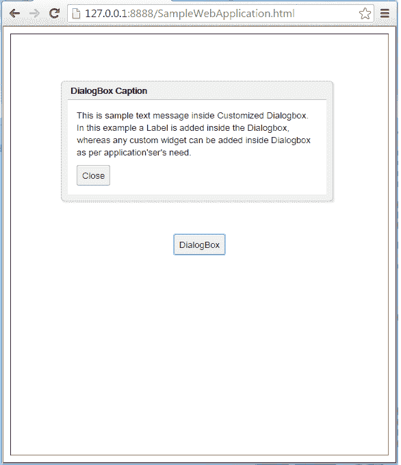
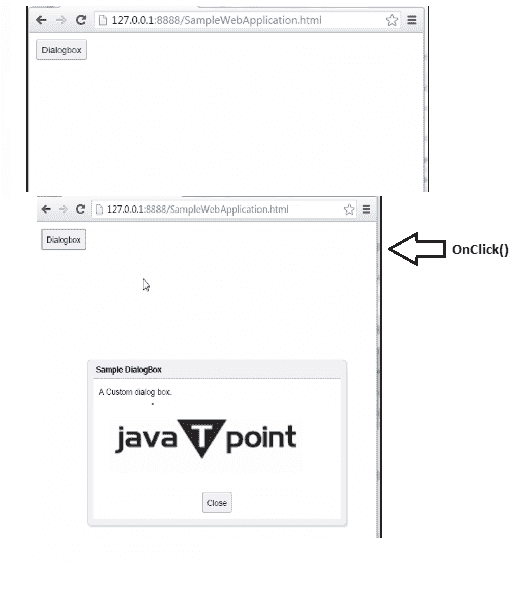

# GWT 对话盒

> 哎哎哎:# t0]https://www . javatppoint . com/gwt-dialog box

GWT 对话盒在顶部有一个标题区，用户可以拖动它。GWT 对话框，调用弹出面板。设置宽度(字符串)和弹出面板。设置高度(字符串)将设置对话框的宽度和高度。

### GWT 对话盒类声明

让我们看看 com . Google . gwt . user . client . ui . dialogbox 的声明

```
public class DialogBox extends DecoratedPopupPanel

```

### GWT 对话框盒嵌套类

| 班级 | 描述 |
| 对话方块。字幕信息 | 它是 DialogBox 标题支持的一组特征接口。 |
| 对话方块。CaptionImpl(字幕) | 这是标题的默认实现。 |

### GWT 对话盒构造函数

| 构造器 | 描述 |
| 对话框() | 它会创建一个空对话框。 |
| 对话方块(boolean autoHide) | 它会创建一个空对话框，指定其“自动隐藏”属性。 |
| 对话框框(布尔 autoHide、布尔模态) | 它创建一个空对话框，指定其“自动隐藏”和“模态”属性。 |
| 对话方块(boolean autoHide、boolean 模态、对话方块)。captionWidget) | 它创建一个空的对话框，指定它的“自动隐藏”、“模态”属性和一个自定义对话框的实现 |

### GWT 对话盒常用方法

| 修饰符和类型 | 方法 | 描述 |
| 受保护的空隙 | 开始抓取(MouseDownEvent 事件) | 它在标题区按下鼠标时被调用，通过打开事件捕获开始拖动循环。 |
| 受保护的空隙 | doAttachChildren() | 如果一个小部件包含一个或多个不在逻辑小部件层次结构中的子小部件(子小部件仅在 DOM 级别上物理连接)，它必须重写此方法，并为其每个子小部件调用 Widget.onAttach()。 |
| 受保护的空隙 | doDetachChildren() | 如果一个小部件包含一个或多个不在逻辑小部件层次结构中的子小部件(子小部件仅在 DOM 级别上物理连接)，它必须重写此方法，并为其每个子小部件调用 Widget.onDetach()。 |
| 空的 | 隐藏(布尔自动关闭) | 它隐藏弹出窗口并将其从页面上分离。 |
| 空的 | onbrowseverent _ event 事件) | 每当收到浏览器事件时都会调用它。 |
| 受保护的空隙 | onPreviewNativeEvent(事件。NativePreviewEvent 事件) | 它会创建预览。 |
| 空的 | setHTML(SafeHtml) | 它通过调用其 setHTML(SafeHtml)方法来设置标题中的 html 字符串。 |
| 空的 | setHTML(java.lang.String html) | 它通过调用其 setHTML(SafeHtml)方法来设置标题中的 html 字符串。 |
| 空的 | setText(java.lang.String text) | 它通过调用其 setText(字符串)方法来设置标题中的文本。 |
| 空的 | 显示() | 它显示弹出窗口并将其附加到页面上。 |

### GWT 对话框示例 1

**//SampleDialogBox1.java**

```
import com.extjs.gxt.ui.client.event.ButtonEvent;
import com.extjs.gxt.ui.client.event.SelectionListener;
import com.extjs.gxt.ui.client.widget.Window;
import com.extjs.gxt.ui.client.widget.button.Button;
import com.extjs.gxt.ui.client.widget.form.FormPanel;
import com.extjs.gxt.ui.client.widget.form.HtmlEditor;
import com.extjs.gxt.ui.client.widget.form.TextField;
import com.extjs.gxt.ui.client.widget.layout.FitLayout;
import com.extjs.gxt.ui.client.widget.layout.FormData;
import com.google.gwt.core.client.EntryPoint;
import com.google.gwt.user.client.ui.RootPanel;

/** 
 * This is the entry point method.
 */
public void onModuleLoad() {
	VerticalPanel verticalPanel = new VerticalPanel();
	verticalPanel.setSpacing(10);
	verticalPanel.setBorderWidth(1);
	verticalPanel.setSize("100%", "100%");
	verticalPanel.setHorizontalAlignment(HasHorizontalAlignment.ALIGN_CENTER);
	verticalPanel.setVerticalAlignment(HasVerticalAlignment.ALIGN_MIDDLE);
	// The log in button
	Button submit = new Button("DialogBox");
	verticalPanel.add(submit);
	submit.addClickHandler(new ClickHandler() {
		@Override
		public void onClick(ClickEvent event) {
			// Add validation
			showCustomDialog();
		}
	});

	// Add our panel to the page
	RootLayoutPanel.get().add(verticalPanel);
}
/**
 * Draws Custom Dialog box.
 * @return DialogBox
 */
private DialogBox showCustomDialog() {

       final DialogBox dialog = new DialogBox(false, true);
       // final DialogBox dialog = new DialogBox(true, true);
       // Set caption
       dialog.setText("DialogBox Caption");
       // Setcontent
	Label content = new Label("This is sample text message inside "
		+ "Customized Dialogbox. In this example a Label is "
		+ "added inside the Dialogbox, whereas any custom widget "
		+ "can be added inside Dialogbox as per application'ser's need. ");
       if (dialog.isAutoHideEnabled())  {
	   dialog.setWidget(content);
        } else {
	VerticalPanel vPanel = new VerticalPanel();vPanel.setSpacing(2);
	vPanel.add(content);vPanel.add(new Label("\n"));
	vPanel.add(new Button("Close", new ClickHandler() {
	public void onClick(ClickEvent event) {
         	dialog.hide();
		}
	}));
	dialog.setWidget(vPanel);
	}
	dialog.setPopupPosition(100, 150);
	dialog.show();
	return dialog;
}

```

输出:



### GWT 对话框示例 2

**//SampleDialogBox2.java**

```

/**
 * This is the entry point method.
 */
public void onModuleLoad() {

	Button btn= new Button("Dialogbox", new ClickHandler() {

		@Override
		public void onClick(ClickEvent event) {
			DialogBox dlg = new CustomDialog();
			dlg.center();
		}
	});
	RootPanel.get().add(btn);
}
/**
 * CustomDialog adds DockPanel as its child widget.
 */
class CustomDialog extends DialogBox implements ClickHandler {
	public CustomDialog() {
		super(true);
		setText("Sample DialogBox");

		Button closeButton = new Button("Close", this);
		HTML msg = new HTML("A Custom dialog box.",true);

		DockPanel dock = new DockPanel();
		dock.setSpacing(6);
		Image image = new Image();
		image.setUrl("/images/gwt-dialogbox1");
		dock.add(image, DockPanel.CENTER);
		dock.add(closeButton, DockPanel.SOUTH);
		dock.add(msg, DockPanel.NORTH);

		dock.setCellHorizontalAlignment(closeButton, DockPanel.ALIGN_CENTER);
		dock.setWidth("100%");
		setWidget(dock);
	}

	@Override
	public void onClick(ClickEvent event) {
		hide();
	}
}

```

输出:

