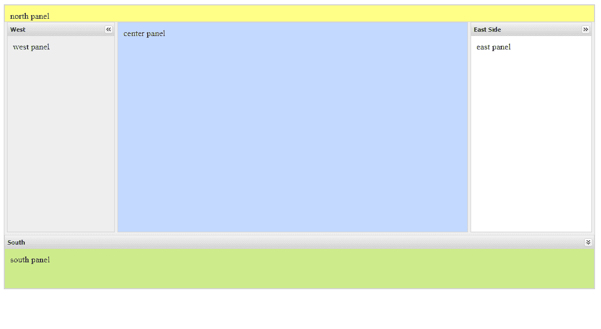

# GWT 坞站布局环

> 原文：<https://www.javatpoint.com/gwt-dock-layout-panel>

在这个布局面板中，它的所有子部件都位于角落或边缘。最后一个小部件占据了中心空间。它也可以在标准模式下工作，在标准模式下，网页是有！DOCTYPE DECLARATION。

### GWT 码头布局面板类声明

来看看**com . Google . gwt . user . client . ui . DockLayoutPanel**的声明

```
 public class DockLayoutPanel extends ComplexPanel

```

### 嵌套类

| 班级 | 描述 |
| DockLayoutPanel。方向 | 它在 addEast(Widget，double)等中用于指定添加子小部件的方向。 |
| DockLayoutPanel.LayoutData | 它的布局数据与每个小部件相关联。 |

### GWT 码头布局构造器

| 构造器 | 描述 |
| DockLayoutPanel(样式。单位单位) | 它会创建一个空的停靠面板。 |

## 公共方法

| 修饰符和类型 | 方法 | 描述 |
| 空的 | 添加(小部件小部件) | 它在 dock 的中心添加了一个小部件。 |
| 空的 | addEast(IsWidget 小部件，双倍大小) | 它是 IsWidget 的重载版本。 |
| 空的 | addEast(小部件，双倍大小) | 它在码头的东边缘添加了一个小部件。 |
| 空的 | 添加线端(小部件，双倍大小) | 它在行尾添加一个小部件。 |
| 空的 | 添加北(小部件，双倍大小) | 它在码头的北边缘添加了一个小部件。 |
| 空的 | 添加南方(小部件，双倍大小) | 它在码头的南边缘添加了一个小部件。 |
| 元素 | getwidgetcontainerelement(子构件) | 它获取包装给定子小部件的容器元素。 |
| 受保护的 DockLayoutPanel。方向 | getresolved direction(DockLayoutPanel。方向(方向) | 它根据当前区域设置解析指定的方向。 |
| 受保护的空隙 | 插入(Widget 小部件，DockLayoutPanel。方向方向，双倍大小，小部件在前) | 它将一个小部件添加到 dock 的指定边缘。 |
| 受保护的空隙 | onattach() | 当一个小部件附加到浏览器的文档时，就会调用它。 |
| 受保护的空隙 | 底部() | 当小部件从浏览器的文档中分离出来时，就会调用它。 |
| 空的 | setwidgetthidden(Widget 小部件，布尔隐藏) | 它设置给定的小部件是否应该隐藏。 |
| 空的 | setWidgetSize 小部件(double size) | 它更新传入的小部件的大小，只要它不是中心小部件，并更新 dock 的布局。 |

* * *

## GWT 码头布局示例 1

//SampleDockLayoutPanel.java

```
import com.google.gwt.event.logical.shared.ResizeEvent;
import com.google.gwt.event.logical.shared.ResizeHandler;
import com.google.gwt.user.client.Window;

/*This is the entry point method. */

public void onModuleLoad() { 

// Attach five widgets to a DockLayoutPanel, one in each direction. Lay // them out in ?em? units. 

DockLayoutPanel p = new DockLayoutPanel(Unit.EM); 
p.addNorth(new HTML("north"), 8); 
p.addSouth(new HTML("south"), 8); 
p.addEast(new HTML("east"),8);
 	p.addWest(new HTML("west"), 8);
 p.add(new HTML("center")); 

// Attach the DockLayoutPanel to the RootLayoutPanel. 

RootLayoutPanel rp = RootLayoutPanel.get(); rp.add(p); 

}

```

//SampleDockLayoutPanel.css

```
body {
   text-align: center;
   font-family: verdana, sans-serif;
}

h1 {
   font-size: 2em;
   font-weight: bold;
   color: #777777;
   margin: 40px 0px 70px;
   text-align: center;
}
.dockpanel td {
   border: 1px solid #BBBBBB;
   padding: 3px;
}

```

输出:


## GWT 码头布局示例 2

//SampleDockLayoutPanel.java

```

import com.google.gwt.core.client.EntryPoint;  
import com.gwtext.client.core.Margins;  
import com.gwtext.client.core.RegionPosition;  
import com.gwtext.client.widgets.Panel;  
import com.gwtext.client.widgets.Viewport;  
import com.gwtext.client.widgets.layout.BorderLayout;  
import com.gwtext.client.widgets.layout.BorderLayoutData;  
import com.gwtext.client.widgets.layout.FitLayout;  

public class Test implements EntryPoint {  

    public void onModuleLoad() {  
        Panel panel = new Panel();  
        panel.setBorder(false);  
        panel.setPaddings(15);  
        panel.setLayout(new FitLayout());  

        Panel borderPanel = new Panel();  
        borderPanel.setLayout(new BorderLayout());  

        //add north panel  
        Panel northPanel = new Panel();  
        northPanel.setHtml("北面板");  
        northPanel.setHeight(32);  
        northPanel.setBodyStyle("background-color:#FFFF88");  
        borderPanel.add(northPanel, new BorderLayoutData(RegionPosition.NORTH));  

        //add south panel  
        Panel southPanel = new Panel();  
        southPanel.setHtml("南面板");  
        southPanel.setHeight(100);  
        southPanel.setBodyStyle("background-color:#CDEB8B");  
        southPanel.setCollapsible(true);  
        southPanel.setTitle("South");  

        BorderLayoutData southData = new BorderLayoutData(RegionPosition.SOUTH);  
        southData.setMinSize(100);  
        southData.setMaxSize(200);  
        southData.setMargins(new Margins(0, 0, 0, 0));  
        southData.setSplit(true);  
        borderPanel.add(southPanel, southData);  

        //add east panel  
        Panel eastPanel = new Panel();  
        eastPanel.setHtml("东面板");  
        eastPanel.setTitle("East Side");  
        eastPanel.setCollapsible(true);  
        eastPanel.setWidth(225);  

        BorderLayoutData eastData = new BorderLayoutData(RegionPosition.EAST);  
        eastData.setSplit(true);  
        eastData.setMinSize(175);  
        eastData.setMaxSize(400);  
        eastData.setMargins(new Margins(0, 0, 5, 0));  

        borderPanel.add(eastPanel, eastData);  

        Panel westPanel = new Panel();  
        westPanel.setHtml("西部面板");  
        westPanel.setTitle("West");  
        westPanel.setBodyStyle("background-color:#EEEEEE");  
        westPanel.setCollapsible(true);  
        westPanel.setWidth(200);  

        BorderLayoutData westData = new BorderLayoutData(RegionPosition.WEST);  
        westData.setSplit(true);  
        westData.setMinSize(175);  
        westData.setMaxSize(400);  
        westData.setMargins(new Margins(0, 5, 0, 0));  

        borderPanel.add(westPanel, westData);  

        Panel centerPanel = new Panel();  
        centerPanel.setHtml("中央面板");  
        centerPanel.setBodyStyle("background-color:#C3D9FF");  

        borderPanel.add(centerPanel, new BorderLayoutData(RegionPosition.CENTER));  

        panel.add(borderPanel);  

        Viewport viewport = new Viewport(panel);  
    }  
}  

```

输出:

