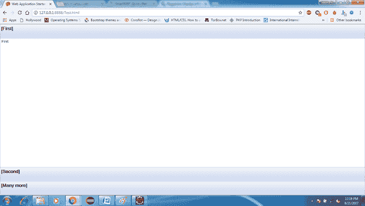
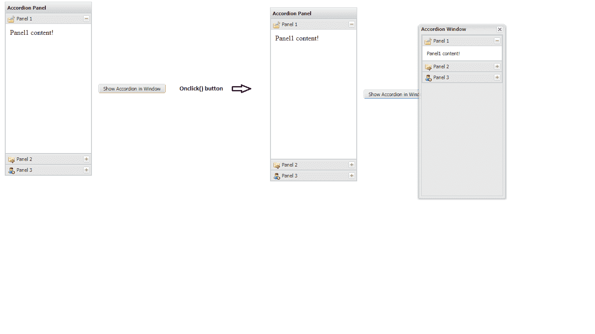

# GWT StackLayoutPanel

> 原文：<https://www.javatpoint.com/gwt-stack-layout-panel>

在 GWT StackLayoutPanel 中，一次只能垂直显示一个孩子。所有其他子小部件创建它们的标题，并将它们自己排列在面板的底部。我们可以通过点击子小部件的标题来查看它们。

### GWT StackLayoutPanel 类声明

来看看**com . Google . gwt . user . client . ui . stacklayoutpanel**的申报吧

```
 public class StackLayoutPanel extends ResizeComposite

```

### GWT StackLayoutPanel 构造器

| 构造器 | 描述 |
| StackLayoutPanel(样式。单位单位) | 它会创建一个空的栈面板。 |

## StackLayoutPanel 常用方法

| 修饰符和类型 | 方法 | 描述 |
| 空的 | 添加(IsWidget 小部件，IsWidget 头，双头大小) | 这是 IsWidget 的重载版本。 |
| 空的 | 添加(小部件小部件，安全 Html 标题，双标题大小) | 它向这个栈添加一个子小部件，以及一个表示栈头的小部件。 |
| 空的 | 添加(Widget widget，java.lang.String 头，boolean asHtml，double headerSize) | 它向这个栈添加一个子小部件，以及一个表示栈头的小部件。 |
| HandlerRegistration | addBeforeSelectionHandler(预选择处理程序<java.lang.integer>处理程序)</java.lang.integer> | 它添加了一个 BeforeSelectionEvent 处理程序。 |
| HandlerRegistration | addSelectionHandler(选择处理程序<java.lang.integer>处理程序)</java.lang.integer> | 它添加了一个 SelectionEvent 处理程序。 |
| 空的 | 动画(整数持续时间) | 它的布局子对象，在指定的时间段内制作动画。 |
| 空的 | 清除() | 它会移除所有子部件。 |
| 空的 | forceLayout() | 它马上布局孩子。 |
| 小部件 | getHeaderWidget（int index） | 它获取栈头中给定索引处的小部件。 |
| 小部件 | getHeaderWidget（Widget child） | 它获取与给定子小部件相关联的栈头中的小部件。 |
| 空的 | 插入(Widget 子代，SafeHtml html，双头，int beforeIndex) | 它会在面板中插入一个小部件。 |
| 空的 | 插入(Widget 子级，java.lang.String 文本，布尔 asHtml，双头大小，int beforeIndex) | 它会在面板中插入一个小部件。 |
| 空的 | setHeaderHTML(int index，java.lang.String html) | 它设置栈头的 HTML 内容。 |
| 空的 | setHeaderText(int index，java.lang.String text) | 它设置栈标题的文本内容。 |
| 空的 | 显示窗口小部件(窗口小部件子部件) | 它显示指定的小部件并触发事件。 |
| 空的 | 显示窗口小部件(窗口小部件子部件，布尔火灾事件) | 它显示指定的小部件。 |

### GWT StackLayoutPanel 示例 1

**//SampleStackLayoutPanel . Java**

```
import com.google.gwt.core.client.EntryPoint;  
import com.google.gwt.user.client.ui.RootPanel;  
import com.gwtext.client.core.EventObject;  
import com.gwtext.client.widgets.Button;  
import com.gwtext.client.widgets.Panel;  
import com.gwtext.client.widgets.Window;  
import com.gwtext.client.widgets.event.ButtonListenerAdapter;  
import com.gwtext.client.widgets.layout.AccordionLayout;  
import com.gwtext.client.widgets.layout.HorizontalLayout;  

/*This is the entry point method. */

 public void onModuleLoad() {

 // Create a three-item stack, with headers sized in EMs.

 StackLayoutPanel p = new StackLayoutPanel(Unit.EM); 
p.add(new HTML("First"), new HTML("[this]"), 4); 
p.add(new HTML("Second"), new HTML("[that]"), 4);
 p.add(new HTML("Many more"), new HTML("[Many more]"), 4); 

// Attach the StackLayoutPanelto the RootLayoutPanel.

 RootLayoutPanel rp = RootLayoutPanel.get(); 
rp.add(p); 

}

```

输出:



### GWT StackLayoutPanel 示例 2

//SampleStackLayoutPanel.java

```

import com.google.gwt.core.client.EntryPoint;  
import com.google.gwt.user.client.ui.RootPanel;  
import com.gwtext.client.core.EventObject;  
import com.gwtext.client.widgets.Button;  
import com.gwtext.client.widgets.Panel;  
import com.gwtext.client.widgets.Window;  
import com.gwtext.client.widgets.event.ButtonListenerAdapter;  
import com.gwtext.client.widgets.layout.AccordionLayout;  
import com.gwtext.client.widgets.layout.HorizontalLayout;  

public class StackLayoutSample implements EntryPoint {  

    public void onModuleLoad() {  
        Panel panel = new Panel();  
        panel.setBorder(false);  
        panel.setPaddings(15);  

        panel.setLayout(new HorizontalLayout(15));  

        Panel accordionPanel = createAccordionPanel();  
        accordionPanel.setTitle("Accordion Panel");  
        accordionPanel.setHeight(400);  
        accordionPanel.setWidth(200);  

        Button button = new Button("Show Accordion in Window", new ButtonListenerAdapter() {  
            public void onClick(Button button, EventObject e) {  
                Panel accordionPanel = createAccordionPanel();  
                Window window = new Window();  
                window.setTitle("Accordion Window");  
                window.setWidth(200);  
                window.setHeight(400);  
                window.add(accordionPanel);  
                window.show(button.getId());  
            }  
        });  

        panel.add(accordionPanel);  
        panel.add(button);  

        RootPanel.get().add(panel);  
    }  

    private Panel createAccordionPanel() {  
        Panel accordionPanel = new Panel();  
        accordionPanel.setLayout(new AccordionLayout(true));  

        Panel panelOne = new Panel("Panel 1", "Panel1 内容！");  
        panelOne.setIconCls("settings-icon");  
        accordionPanel.add(panelOne);  

        Panel panelTwo = new Panel("Panel 2", "Panel2 内容！");  
        panelTwo.setIconCls("folder-icon");  
        accordionPanel.add(panelTwo);  

        Panel panelThree = new Panel("Panel 3", "Panel3 内容！");  
        panelThree.setIconCls("user-add-icon");  
        accordionPanel.add(panelThree);  

        return accordionPanel;  
    }  
}  

```

//SampleStackLayoutPanel.css

```

import com.google.gwt.core.client.EntryPoint;  
import com.google.gwt.user.client.ui.RootPanel;  
import com.gwtext.client.core.EventObject;  
import com.gwtext.client.widgets.Button;  
import com.gwtext.client.widgets.Panel;  
import com.gwtext.client.widgets.Window;  
import com.gwtext.client.widgets.event.ButtonListenerAdapter;  
import com.gwtext.client.widgets.layout.AccordionLayout;  
import com.gwtext.client.widgets.layout.HorizontalLayout;  

public class StackLayoutSample implements EntryPoint {  

    public void onModuleLoad() {  
        Panel panel = new Panel();  
        panel.setBorder(false);  
        panel.setPaddings(15);  

        panel.setLayout(new HorizontalLayout(15));  

        Panel accordionPanel = createAccordionPanel();  
        accordionPanel.setTitle("Accordion Panel");  
        accordionPanel.setHeight(400);  
        accordionPanel.setWidth(200);  

        Button button = new Button("Show Accordion in Window", new ButtonListenerAdapter() {  
            public void onClick(Button button, EventObject e) {  
                Panel accordionPanel = createAccordionPanel();  
                Window window = new Window();  
                window.setTitle("Accordion Window");  
                window.setWidth(200);  
                window.setHeight(400);  
                window.add(accordionPanel);  
                window.show(button.getId());  
            }  
        });  

        panel.add(accordionPanel);  
        panel.add(button);  

        RootPanel.get().add(panel);  
    }  

    private Panel createAccordionPanel() {  
        Panel accordionPanel = new Panel();  
        accordionPanel.setLayout(new AccordionLayout(true));  

        Panel panelOne = new Panel("Panel 1", "Panel1 内容！");  
        panelOne.setIconCls("settings-icon");  
        accordionPanel.add(panelOne);  

        Panel panelTwo = new Panel("Panel 2", "Panel2 内容！");  
        panelTwo.setIconCls("folder-icon");  
        accordionPanel.add(panelTwo);  

        Panel panelThree = new Panel("Panel 3", "Panel3 内容！");  
        panelThree.setIconCls("user-add-icon");  
        accordionPanel.add(panelThree);  

        return accordionPanel;  
    }  
}  

```

输出:

