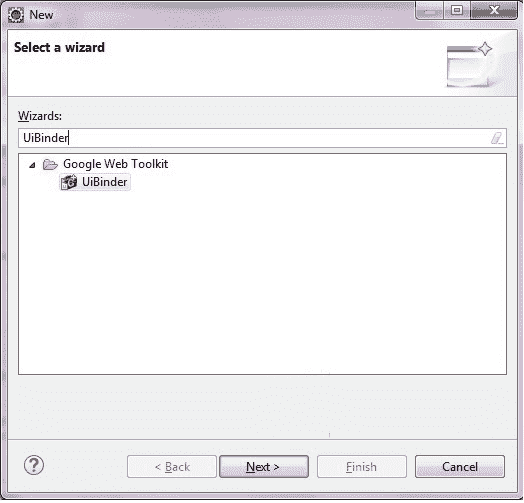
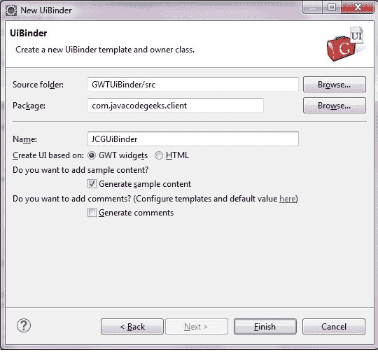
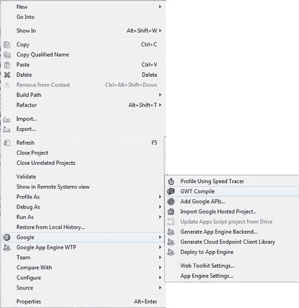
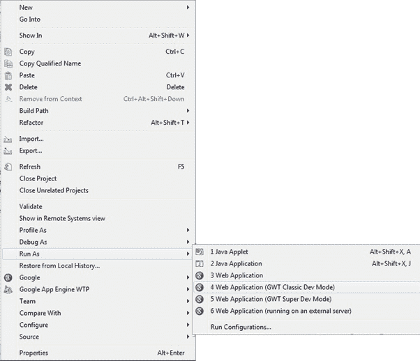

# GWT 用户界面绑定器

> 原文：<https://www.javatpoint.com/gwt-ui-binder>

GWT 用户界面绑定器用于以声明的方式定义用户界面，即它将编程逻辑与使用 GWT(谷歌网络工具包)构建的网络应用程序的用户界面分开。

GWT 用户界面绑定是一个框架，允许用户建立 GWT 应用程序作为网页。 **HTML** 是设计一个 UI 最好的方式。

由于 GWT 是基于 Java 的，如果开发人员熟悉 XHTML、HTML、XML 和 CSS，那么在 GWT 可以很容易地设计用户界面。这类似于 JSP 对 Servlets 的作用。

## 用户界面绑定路线图

**步骤 1:** 在 XML 文件中创建用户界面声明

**步骤 2:** 使用 ui:字段进行后期绑定

**步骤 3:** 创建 UI XML 的 Java 对应物

**第 4 步:**用 UiField 标注绑定 Java UI 字段

**第五步:**用 UI XML 绑定 Java UI，用 UiTemplate 标注

**第 6 步:**创建 CSS 文件

**步骤 7:** 为 CSS 文件创建基于 Java 的资源文件

**第八步:**在 Java UI Code 文件中附加 CSS 资源。

按顺序的所有上述步骤允许开发人员创建一个分离了编程逻辑和前端或用户界面的 GWT 应用程序。

* * *

## 用户界面绑定示例

**步骤 1:** 要创建 UiBinder，请选择客户端包，然后单击文件→新建→其他。在向导中，键入 UiBinder。



**第 2 步:**选择 UiBinder，点击下一步。在下一个屏幕中，给出 UiBinder 类的名称。将其他值保留为默认值。



**步骤 3:** 这是 GWT 配置文件。入口点和来源。源代码指定了可翻译代码的路径。

**gwtuibender . gwt . XML**

```

<?xml version="1.0" encoding="UTF-8"?>
<!DOCTYPE module PUBLIC "-//Google Inc.//DTD Google Web Toolkit 2.6.0//EN"
"http://google-web-toolkit.googlecode.com/svn/tags/2.6.0/distro-source/core/src/gwt-module.dtd">
<module rename-to='gwtuibinder'>
<inherits name='com.google.gwt.user.User'/>
<inherits name='com.google.gwt.user.theme.clean.Clean'/>
<!-- Specify the app entry point class. -->
<entry-point class='com.javatpoint.client.GWTUiBinder'/>
<!-- Specify the paths for translatable code -->
<source path='client'/>
<source path='shared'/>
<add-linker name="xsiframe"/>
</module>

```

**第四步:编译即**要编译应用程序右键点击项目，谷歌→ GWT 编译。



这将从客户端类创建 java 脚本代码。下面是将在 Eclipse 上显示的输出。

```

Compiling module com.javatpoint.GWTUiBinder
Compiling 5 permutations
Compiling permutation 0...
Compiling permutation 1...
Compiling permutation 2...
Compiling permutation 3...
Compiling permutation 4...
Compile of permutations succeeded
Linking into E:\siddharth\study\eclipse-workspace\GWTUiBinder\war\gwtuibinder
Link succeeded
Compilation succeeded -- 28.010s

```

**步骤 5:运行应用程序**

要运行应用程序，右键单击项目，选择运行方式→网络应用程序(GWT 经典开发模式)。



```

Initializing App Engine server
August 22, 2017 11:56:49 PM com.google.apphosting.utils.config.AppEngineWebXmlReaderreadAppEngineWebXml
INFO: Successfully processed E:\siddharth\study\eclipse-workspace\GWTUiBinder\war\WEB-INF/appengine-web.xml
August 22, 2017 11:56:49 PM com.google.apphosting.utils.config.AbstractConfigXmlReaderreadConfigXml
INFO: Successfully processed E:\siddharth\study\eclipse-workspace\GWTUiBinder\war\WEB-INF/web.xml
August 22, 2017 11:56:49 PM com.google.appengine.tools.development.SystemPropertiesManagersetSystemProperties
INFO: Overwriting system property key 'java.util.logging.config.file', 
value 'E:\siddharth\study\eclipse\plugins\com.google.appengine.eclipse.sdkbundle_1.9.19\
appengine-java-sdk-1.9.19\config\sdk\logging.properties' with value 'WEB-INF/
logging.properties' from 'E:\siddharth\study\eclipse-workspace\GWTUiBinder\war\WEB-INF\appengine-web.xml'
August 22, 2017 11:56:49 PM com.google.apphosting.utils.jetty.JettyLogger info
INFO: Logging to JettyLogger(null) via com.google.apphosting.utils.jetty.JettyLogger
August 22, 2017 11:56:50 PM com.google.appengine.tools.development.DevAppServerImplsetServerTimeZone
WARNING: Unable to set the TimeZone to UTC (this is expected if running on JDK 8)
August 22, 2017 11:56:50 PM com.google.apphosting.utils.jetty.JettyLogger info
INFO: jetty-6.1.x
August 22, 2017 11:56:56 PM com.google.apphosting.utils.jetty.JettyLogger info
INFO: Started SelectChannelConnector@0.0.0.0:8888
August 22, 2017 11:56:56 PM com.google.appengine.tools.development.AbstractModulestartup
INFO: Module instance default is running at http://localhost:8888/
August 22, 2017 11:56:56 PM com.google.appengine.tools.development.AbstractModulestartup
INFO: The admin console is running at http://localhost:8888/_ah/admin
August 22, 2017 11:56:56 PM com.google.appengine.tools.development.DevAppServerImpldoStart
INFO: Dev App Server is now running

```

应用程序将输出一些日志，如下所示:

然后，应用程序将在“开发模式”窗口中显示一个网址，如下所示:

http://127 . 0 . 0 . 1:8888/gwtuibender . html 复制 url 并在浏览器上运行。

输出:

