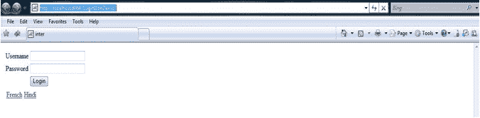
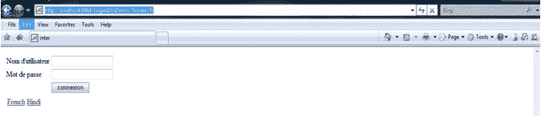
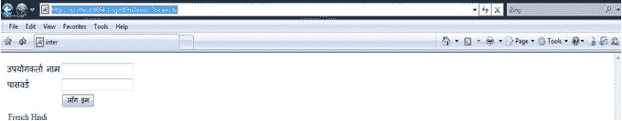

# GWT 国际化

> 原文：<https://www.javatpoint.com/gwt-internationalization>

**简介:**

*   这是一种设计应用程序的技术，它可以与不同地区或国家的语言兼容。
*   国际化需要将待国际化的使用数据**分离到属性文件中。**
***   它类似于 Java 编程语言，通过资源包的方式实现国际化。其中**。属性**文件是为每个需要支持的区域设置创建的。**

 ****国际化技术的类型**

1.  静态字符串国际化
2.  动态字符串国际化
3.  可本地化的界面

* * *

## 静态字符串国际化

*   这是翻译常量和参数化字符串的好技术。
*   这是实现起来最简单的技术，因为它只需要很少的开销。
*   它使用标准的 Java 属性文件来存储翻译后的字符串和参数化消息。

## 动态字符串国际化

*   动态字符串国际化比静态字符串国际化慢，但更灵活。
*   使用这种技术的应用程序看起来像模块主页中的本地化字符串。由于这种技术，当您添加新的区域设置时，不需要重新编译它们。

## 可本地化的界面

*   这是实现接口最强大的技术。
*   这是一种很少使用的高级国际化技术。
*   我们要求高级实现可本地化接口**用于**简单字符串替换。它还创建自定义类型的本地化版本。

* * *

## GWT 国际化的实施

**步骤 1:实现 I18N:** 通过扩展模块中的区域设置值，提到应用程序想要支持的每个区域设置值？XML 文件，如下所示。

```

<module>
<inherits name="com.google.gwt.user.User"/>
<inherits name="com.google.gwt.i18n.I18N"/>
<entry-point/>
<extend-property name="locale" values="fr"/>
<extend-property name="locale" values="hi"/>
</module>

```

**第二步:创建。每个区域设置的属性文件:**所有资源包必须具有相同的基本名称，并且指示区域设置的后缀应该不同。消息查找算法考虑消息的基本名称、当前区域设置和关键字。把所有的。src 包中的属性文件。

**AppConstants.properties** 是默认区域设置，即英语，具有如下键/值对。

```

username: Username
password: Password
login: Login

```

**AppConstants _ fr . properties**支持法语区域设置。键/值对如下。

```

username: Nom d'utilisateur
password: Mot de passe
login: connexion

```

**第三步:创建属性文件对应的接口:**

*   创建一个扩展 GWTs 常量接口的接口。
*   可以通过将资源包绑定到这个接口来使用它们。
*   属性文件的基本名称和接口名称必须相同。
*   接口中的每个方法都对应于属性文件中的键。

```

public interface AppConstants extends Constants {

String username();
String password();
String login();

}

```

**第 4 步:设置入口点类别**

```

public void onModuleLoad() {
// Getting the values from resource bundle through interface methods
		Label username=new Label(constants.username());
		Label passsword=new Label(constants.password());
		TextBox ubox=new TextBox();
		PasswordTextBox pbox=new PasswordTextBox();
		Button button = new Button(constants.login());
	}

```

**代码:**

```

public class LoginI18nDemo implements EntryPoint {
public LoginI18nDemo () {}
AppConstants constants=(AppConstants)GWT.create(AppConstants.class);
public void onModuleLoad() {
Label username=new Label(constants.username());
Label passsword=new Label(constants.password());
TextBox ubox=new TextBox();
PasswordTextBox pbox=new PasswordTextBox();
Button button = new Button(constants.login());
Grid g=new Grid(3,2);
g.setWidget(0,0,username);
g.setWidget(0,1,ubox);
g.setWidget(1, 0, passsword);
g.setWidget(1,1,pbox);
g.setWidget(2, 1, button);
HorizontalPanel links=new HorizontalPanel();
Anchor french=new Anchor("French",GWT.getHostPageBaseURL()+"?locale=fr");
Anchor hindi=new Anchor("Hindi",GWT.getHostPageBaseURL()+"?locale=hi");
links.add(french);
links.add(hindi);
links.setSpacing(5);
RootPanel.get().add(g);
RootPanel.get().add(links);
	}
}

```

输出:



**