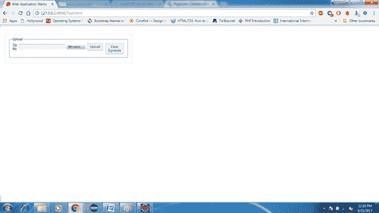

# GWT XML

> 原文：<https://www.javatpoint.com/gwt-xml>

GWT XML(可扩展标记语言)使用自定义标签来描述数据，并将数据编码为纯文本。它更灵活，更容易工作。

## 模块 XML 格式

模块是在扩展名应为 **.gwt.xml** 的 XML 文件中定义的。它位于项目包的根目录中。以下是使用标准项目结构的代码:

```
<module>
    <inherits name="com.google.gwt.user.User"/>
    <entry-point class="com.example.cal.client.CalendarApp"/>
 </module>

```

* * *

## 解析 XML

要解析 XML 文本，我们必须首先将原始 XML 文本解析为 XMl DOM 结构。DOM 结构有助于数据的导航。XML 解析器位于 **XMLParser 类**下。XMLParser 类由 parse(String)静态方法组成，调用该方法来解析 XML 并返回一个 Document 对象。

为了处理解析过程中出现的错误(例如，如果 XML 格式不正确)，XMLParser 将抛出一个 DOMException。如果解析成功，我们收到的 Document 对象代表内存中的 XML 文档。

它将在成功解析时创建以下节点:

*   **元素-** 代表 DOM 元素，由
    **XML 中的标签指定:**<some Element></some Element>。
*   **Text -** 代表一个
    **元素的开始和结束标记之间的文本:** < someElement >下面是一些文本。< /someElement >。
*   **Comment -** 代表一个 XML 注释:<！-关于该数据的注释- >。
*   **Attr -** 表示元素的属性:<somelement myAttribute = " 123 "/>。

**实施**

下面是包含电子邮件的 XML 代码:

```
<?xml version="1.0" ?>
<message>
  <header>
    <to displayName="javatpoint" address="hr@javatpoint.com" />
    <from displayName="sssit" address=?hr@sssit.org" />
    <sent>2017-03-10T12:03:55Z</sent>
    <subject>Re: GWT tutorial</subject>
  </header>	
  <body>gwt tutorial is being developed.</body>
</message> 

```

下面的代码用于从 xml 中提取信息:

```
private void parseMessage(String messageXml) {
  try {
    // parse the XML document into a DOM
    Document messageDom = XMLParser.parse(messageXml);

    // find the sender's display name in an attribute of the <from> tag
    Node fromNode = messageDom.getElementsByTagName("from").item(0);
    String from = ((Element)fromNode).getAttribute("displayName");
    fromLabel.setText(from);

    // get the subject using Node's getNodeValue() function
    String subject = messageDom.getElementsByTagName("subject").item(0).getFirstChild().getNodeValue();
    subjectLabel.setText(subject);

    // get the message body by explicitly casting to a Text node
    Text bodyNode = (Text)messageDom.getElementsByTagName("body").item(0).getFirstChild();
    String body = bodyNode.getData();
    bodyLabel.setText(body);

  } catch (DOMException e) {
    Window.alert("Could not parse XML document.");
  }
}

```

### GWT XML 构造器

| 构造器 | 描述 |
| XMLTools() | 它构造了不同的工具选项。 |

### GWT XML 通用方法

| 方法 | 描述 |
| disableIEXMLHackaround() | 它禁用了针对 MSXML 错误的特定于 Internet Explorer 的工作，即不能显式声明“XML”命名空间前缀。 |
| loadWSDL(字符串 wsdlURL，WSDlLoad 回调) | 它加载一个 WSDL 文件，并创建一个允许调用操作并将数据源绑定到网络服务操作的网络服务实例。 |
| loadWSDL(字符串 wsdlURL、WSDLLoadCallback 回调、RPCRequest requestProperties) | 它加载一个 WSDL 文件，并创建一个允许调用操作并将数据源绑定到网络服务操作的网络服务实例。 |
| loadWSDL(字符串 wsdlURL、WSDLLoadCallback 回调、RPCRequest requestProperties、布尔自动加载导入) | 它加载一个 WSDL 文件，并创建一个允许调用操作并将数据源绑定到网络服务操作的网络服务实例。 |
| loadXMLSchema(字符串 schemaURL，XSDLoadCallback 回调) | 它加载一个包含 XML 模式定义的 XML 文件，并创建数据源和简单类型对象来表示模式。 |
| loadXMLSchema(String schemaURL、xsdloadcallback、RPCRequest requestProperties) | 它加载一个包含 XML 模式定义的 XML 文件，并创建数据源和简单类型对象来表示模式。 |
| nativeXMLAvailable() | 如果当前浏览器公开了一个可用于智能 GWT XML 操作(如 web 服务绑定和 XML 处理)的 XML 解析器，则返回 true。 |
| 选择节点(对象元素，字符串表达式) | 它基于 XPath 表达式从 XML 元素或文档中检索一组节点。 |
| 选择节点(对象元素、字符串表达式、映射命名空间) | 它基于 XPath 表达式从 XML 元素或文档中检索一组节点。 |
| 对象元素 | 它将一个 XML 片段翻译成 JavaScript 集合。 |

* * *

## GWT XML 上传

在这一节中，我们将创建一个带有 GWT 文件上传和表单面板小部件的上传面板。它允许用户上传压缩文件到服务器。

### 前端设计

为了通过 xml 存储信息，我们设计了两个面板的前端，分别是 UploadPanel 和 DataStorePanel。

**DataStorePanel.ui.xml**

```
<!DOCTYPE ui:UiBinder SYSTEM "http://dl.google.com/gwt/DTD/xhtml.ent">
<ui:UiBinder xmlns:ui="urn:ui:com.google.gwt.uibinder"
        xmlns:g="urn:import:com.google.gwt.user.client.ui" xmlns:f="urn:import:in.fins.client.widget">
        <g:LayoutPanel>
                <g:layer left='10%' width='60%' top='10%' height='60%'>
                        <g:VerticalPanel spacing="40">
                                <f:UploadPanel />
                        </g:VerticalPanel>
                </g:layer>
        </g:LayoutPanel>
</ui:UiBinder>

```

### 上传面板

在这个小部件中，我们创建了上传文件的表单和清除符号列表的按钮。

**UploadPanel.ui.xml**

```
<g:CaptionPanel captionText="Upload">
        <g:HorizontalPanel>
                <g:VerticalPanel>
                        <g:FormPanel ui:field="uploadForm" action="/upload">
                               <g:Grid>
                <g:row> 
                        <g:customCell>
                                <g:Label text="Zip file" />
                        </g:customCell>
                        <g:customCell>
                                <g:FileUpload name="uploadFormElement" />
                        </g:customCell>
                        <g:customCell>
                                <g:Button text="Upload" ui:field="uploadButton" />
                        </g:customCell>
                        <g:customCell>
                                <g:Hidden name="action" value="uploadAndParse" />
                        </g:customCell> 
                </g:row>
        </g:Grid>

                        </g:FormPanel>
                </g:VerticalPanel>
                <g:VerticalPanel>
                        <g:FormPanel ui:field="clearListForm" action="/upload">
                                     ....

                        </g:FormPanel>
                </g:VerticalPanel>
        </g:HorizontalPanel>
</g:CaptionPanel>

```

**Upload.java**

```
public UploadPanel() {

                initWidget(uiBinder.createAndBindUi(this));
                uploadForm.setMethod(FormPanel.METHOD_POST);
                uploadForm.setEncoding(FormPanel.ENCODING_MULTIPART);

        }

        @UiHandler("uploadButton")
        void onUploadClick(ClickEvent event) {
                uploadForm.submit();
        }

        @UiHandler("uploadForm")
        void onUploadFormSubmitComplete(SubmitCompleteEvent event) {
                StatusEvent se = new StatusEvent(event.getResults());
                EventBus.get().fireEvent(se);
        }

```

输出:

