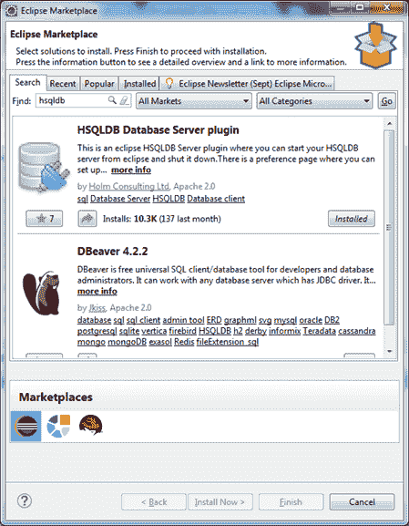
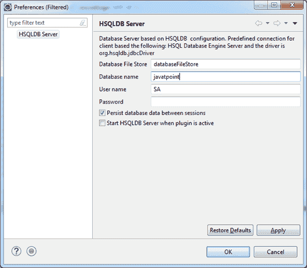
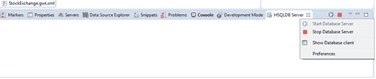
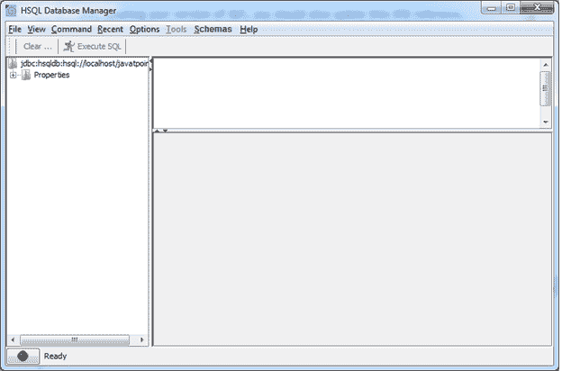
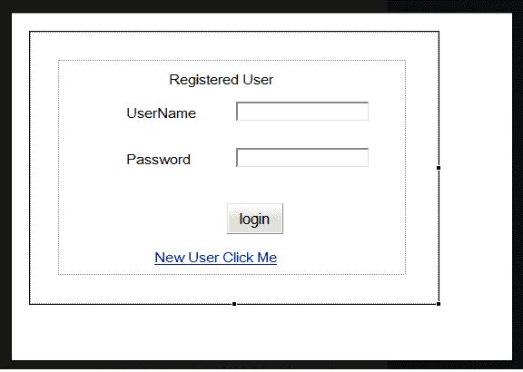

# GWT 数据库

> 原文：<https://www.javatpoint.com/gwt-database>

在本教程中，我们将使用 GWT 设置数据库连接。我们可以使用 Eclipse 来配置数据库。

Eclipse 由 **HSQLDB** 插件组成，可以安装。插件使安装易于设置。插件提供了许多功能，如启动/停止数据库，调用数据库管理器图形用户界面。下面是配置步骤。

1.  选择**帮助→Eclipse market**搜索关键词 **HSQLDB** 点击安装按钮。


3.  现在，选择**窗口→显示视图→其他**，在显示视图对话框中，展开 HSQL 数据库服务器，选择 HSQLDB 服务器，打开 HSQLDB 视图。
4.  点击**查看菜单，从下拉菜单中选择首选项**。输入如图所示的值。


6.  从下拉菜单中选择**显示数据库客户端**，启动数据库并打开数据库管理器。




* * *

## 加载数据库

我们使用 **RStore** 来加载数据，它有以下特点:

1.  它增强了 java 类的持久性。
2.  它创建数据库模式。
3.  它删除数据库模式。
4.  它保存并从数据库中检索对象。

### 属国

RStore 需要 HSQLDB、Data Nucleus JDO、MyBatis 和 Hibernate 库。下表列出了依赖项。

| 普通 | 北茹阿泽鲁机场 | 冬眠 | 我的巴提斯 |
| hsqldb-2.2.9.jar | jdo API-3 . 0 . 1 . jar | hibernate-commons-注释-4.0.1.Final.jar | mybatis-3.2.0.jar .我的巴提斯-3.2.0.jar |
| commons-lang-2.6.jar | datanucleus-api-jdo-3.1.3.jar | 休眠核心 4.1.10.Final.jar |  |
| log4j-1.2.16.jar | datanucleus-core-3.1.4.jar | hibernate-JPA-2.0-API-1 . 0 . 1 . final . jar |  |
|  | datanucleus-rdbms-3.1.4.jar | JBoss-日志记录-3.1.0.GA.jar |  |
|  | data nucleus-增强器-3.1.1.jar | JBoss-transaction-API _ 1.1 _ spec-1 . 0 . 0 . final . jar |  |
|  | asm-4.0.jar | 安特卢瓦 2.7.7.jar |  |
|  |  | dom4j-1.6.1.jar |  |
|  |  | javassist-3.15.0-GA.jar |  |

**下载:**下载以上文件，链接如下:

**Common:**T2【HSQLDB】T3、 [Common-lang](https://commons.apache.org/proper/commons-lang//download_lang.cgi) 、 [log4j](https://logging.apache.org/log4j/1.2/download.html) 。

**jdo:**[【data nucleus】](https://sourceforge.net/projects/datanucleus/files/datanucleus-accessplatform/)、[【show files】](http://forge.ow2.org/project/showfiles.php?group_id=23)、[【jdo】](https://db.apache.org/jdo/downloads.html)。

**冬眠:** [冬眠](https://sourceforge.net/projects/hibernate/files/hibernate4/)。

**my atis:**[my atis](https://code.google.com/p/mybatis/)。

### 履行

将 Mysql 配置添加到 GWT

**LoginScreen.gwt.xml**

```
<module>
 <!-- Inherit the core Web Toolkit stuff. -->
 <inherits name='com.google.gwt.user.User'/>
 <!-- Specify the app entry point class. -->
 <entry-point class='com.yourdomain.projectname.client.LoginScreen'/>
 <!-- servlet context - path is arbritray, but must match up with the rpc init
inside java class -->
 <!-- Tomcat will listen for this from the server and waits for rpc request in
this context -->
 <servlet class="com.yourdomain.projectname.server.MySQLConnection"path="/MySQLConnection" />
 <inherits name="com.google.gwt.user.theme.standard.Standard"/>
 <inherits name="com.google.gwt.user.theme.chrome.Chrome"/>
 <inherits name="com.google.gwt.user.theme.dark.Dark"/>
</module>

```

**数据库连接**

**数据库连接.java**

```
public interface DBConnection extends RemoteService
 {
 public User authenticateUser(String user, String pass);
 }

```

**dbconnection sync . Java**的缩写形式

```
public interface DBConnectionAsync {
 public void authenticateUser(String user, String pass, AsyncCallback callback);
} 
```

**User.java(前端设计)**

```
import com.google.gwt.user.client.rpc.IsSerializable;
public class User implements IsSerializable {
 private String username;
 private String password;
 @SuppressWarnings("unused")
 private User() {
 //just here because GWT wants it.
 }
 public User(String username, String password) {
 this.username = username;
 this.password = password;
 }
}

```

**MySQLConnection.java(创建 Servlet)**

```
import java.sql.Connection;
import java.sql.DriverManager;
import java.sql.PreparedStatement;
import java.sql.ResultSet;
import java.sql.SQLException;
import java.util.Vector;
import com.google.gwt.user.server.rpc.RemoteServiceServlet;
import com.yourdomain.projectname.client.User;
public class MySQLConnection extends RemoteServiceServlet implements DBConnection {
 private Connection conn = null;
 private String status;
 private String url = "jdbc:mysql://yourDBserver/yourDBname";
 private String user = "DBuser";
 private String pass = "DBpass";
 public MySQLConnection() {
 try {
 Class.forName("com.mysql.jdbc.Driver").newInstance();
 conn = DriverManager.getConnection(url, user, pass);
 } catch (Exception e) {
 //NEVER catch exceptions like this
 }

 }
 public int authenticateUser(String user, String pass) {
 User user;
 try {
 PreparedStatement ps = conn.prepareStatement(
 "select readonly * from users where
username = \"" + user + "\" AND " +
 "password = \"" + pass + "\""
 );
 ResultSet result = ps.executeQuery();
 while (result.next()) {
 user = new User(result.getString(1),
result.getString(2));
 }
 result.close();
 ps.close();
 } catch (SQLException sqle) {
 //do stuff on fail
 }
 return user;
 }
}

```

输出

