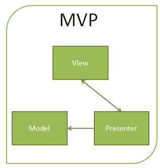
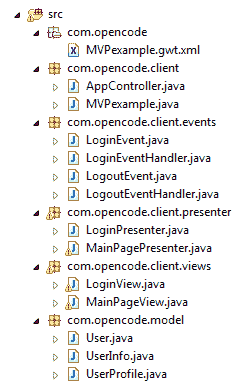
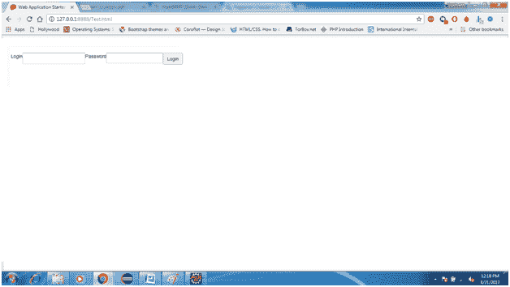

# GWT 最有价值球员

> 原文：<https://www.javatpoint.com/gwt-mvp>

**MVP (Model View Presenter)** 是一种允许在 gwt 中开发的应用遵循 MVP 架构的设计模式。MVP 为开发应用程序提供了复杂性问题的解决方案。应用程序开发是复杂的，因为许多开发人员都在使用相同的代码，因此都遵循相同的设计模式。

以下是每个组件的描述:



1.  **模型:**在本节中，模型仅由数据组成。它保存在业务对象中，业务对象将根据应用程序的需要进行操作和计算。
2.  **视图:**仅由视图组成，即显示演示者给出的数据。它提供了视图代码的可重用性，因为我们可以非常容易地交换新视图。它只处理 HTML 和 CSS，这也有助于分开测试。
3.  **Presenter:** 包含应用开发中需要实现的所有逻辑。它与模型和视图进行通信。它在操作上是完全不同的，提供独立的 JUnit 测试。

## 履行

下面是基于 MVP 设计的登录应用程序的代码。

### 登录视图.java

```
public class LoginView implements HasWidgets{
 HorizontalPanel container;
 Label loginLabel;
 Label passwordLabel;
 TextBox loginField;
 PasswordTextBox passwordField;
 Button loginButton;

 public LoginView(){
  container = new HorizontalPanel();
  loginField = new TextBox();
  loginButton = new Button("Login");
  passwordField = new PasswordTextBox();
  loginLabel = new Label("Login");
  passwordLabel = new Label("Password");

  container.add(loginLabel);
  container.add(loginField);
  container.add(passwordLabel);
  container.add(passwordField);
  container.add(loginButton);
 }

 @Override
 public Widget asWidget() {
  return container;
 }

 @Override
 public void add(Widget w) {
  container.add(w);
 }

 @Override
 public void clear() {
  container.clear();
 }

 @Override
 public Iterator<widget> iterator() {
  return container.iterator();
 }

 @Override
 public boolean remove(Widget w) {
  return container.remove(w);
 }

}

```

### MainPageView.java

```
public class MainPageView implements HasWidgets {

 VerticalPanel container;
 HorizontalPanel leftPanel;
 HorizontalPanel rightPanel;
 Button logout;

 @Override
 public HasClickHandlers getLogoutButton() {
  return logout;
 }

 public MainPageView(){
  leftPanel = new HorizontalPanel();
  rightPanel = new HorizontalPanel();
  container = new VerticalPanel();
  logout = new Button("Logout");
  container.add(logout);
  container.add(leftPanel);
  container.add(rightPanel);
 }

 @Override
 public Widget asWidget() {
  return container;
 }

 @Override
 public void add(Widget w) {
  container.add(w);
 }

 @Override
 public void clear() {
  container.clear();
 }

 @Override
 public Iterator<widget> iterator() {
  return container.iterator();
 }

 @Override
 public boolean remove(Widget w) {
  return container.remove(w);
 }

 @Override
 public Button getButton() {
  return logout;
 }
}

```

现在，我们构建用户界面组件，它跟随演示者控制视图的行为和交互。

### 登录者. java

```
public class MainPagePresenter {
 public interface Display{
  HasClickHandlers getLogoutButton(); 
  Widget asWidget();
  MainPageView getViewInstance();
  Button getButton();
 }

 final Display display;
 final HandlerManager eventBus;

 public MainPagePresenter(Display display, HandlerManager eventBus){
  this.display = display;
  this.eventBus = eventBus;
 }

 public void init(){
  display.getLogoutButton().addClickHandler(new ClickHandler(){
   @Override
   public void onClick(ClickEvent event) {
    // use the event bus to trigger the event
    eventBus.fireEvent(new LogoutEvent());
   }
  });
 }

 public void go(final HasWidgets container){
  init();
  container.clear();
  container.add(display.asWidget());

 }

 public Display getView(){

  return display;
 }

}

```

现在我们设计了视图和演示者之间的接口通信，称为显示。

对于**登录视图**

```
public class LoginView implements HasWidgets, LoginPresenter.Display {
    //...other methods
 @Override
 public HasClickHandlers getLoginButton() {
                //return button to implement its events in the Presenter
  return loginButton;
 }

         @Override
 public LoginView getViewInstance() {
  return this;
 }

         @Override
 public Widget asWidget() {
  return container;
 }

}

```

对于**主页面视图**

```
public class MainPageView implements HasWidgets, MainPagePresenter.Display {
        //...other methods
 @Override
 public  MainPageView getViewInstance(){

  if(instance == null)
   return new MainPageView();
  else
   return instance;
 }

   @Override
 public HasClickHandlers getLogoutButton() {
  return logout;
 }

}

```

最后，我们实现了应用控制器

```
public class AppController {
 HandlerManager eventBus;
 LoginPresenter loginPage;
 HasWidgets container;

 public AppController(HandlerManager manager){
  this.eventBus = manager;
  loginPage = new LoginPresenter(new LoginView(), eventBus);
  bindEvents();
 }
 public void bindEvents(){
  eventBus.addHandler(LoginEvent.TYPE, new LoginEventHandler(){
   @Override
   public void onLogin(LoginEvent event) {
    // TODO Auto-generated method stub
    //if login successful 
    MainPagePresenter mainpage = new MainPagePresenter(new MainPageView(), eventBus);
    container = mainpage.getView().getViewInstance();
    mainpage.go(RootPanel.get());
   }
  });

  eventBus.addHandler(LogoutEvent.TYPE, new LogoutEventHandler(){
   @Override
   public void onLogout(LogoutEvent event) {
    loginPage.go(RootPanel.get());
   }
  });
 }
 public void goTo(HasWidgets page){
  this.container = page;
  loginPage.go(page);
 }

}

```

现在应用程序结构看起来像



输出

