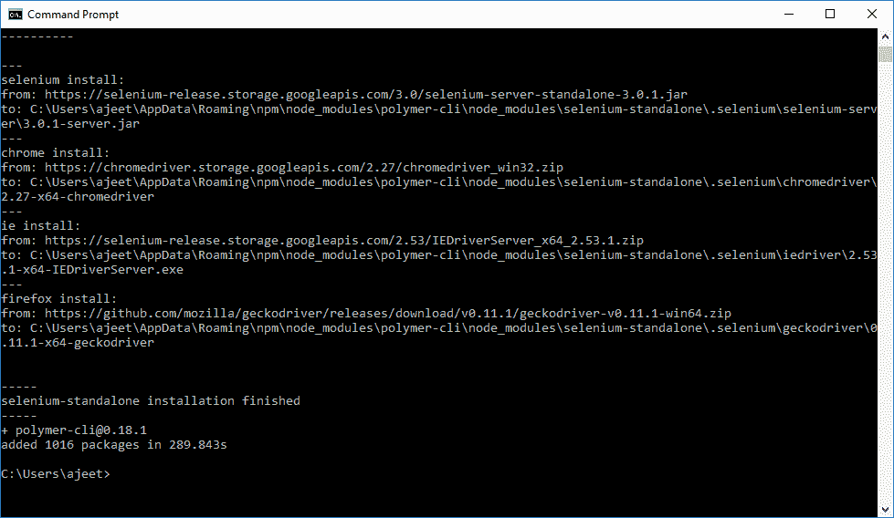

# 聚合物安装

> 原文：<https://www.javatpoint.com/polymer-installation>

在系统中安装和配置聚合物有两种方法:

*   聚合物命令行界面
*   这座塔

### 使用命令行界面安装聚合物

遵循以下步骤:

**步骤 1:** 使用以下命令安装聚合物:

```

npm install -g polymer-cli@next

```

 

**步骤 2:** 您可以使用以下命令检查成功的安装和版本:

```

polymer -version

```


**步骤 3:** 通过给定名称创建一个目录，并切换到该目录。

```

mkdir polymer-js

```

```

cd polymer-js

```


**第 4 步:**运行以下命令，在您的 polymer-jsdirectory 中初始化您的项目。

```

polymer init

```

执行上述命令后，您将看到类似这样的内容:


**步骤 5:** 从上述选项中选择聚合物-2-应用。


现在，使用以下命令启动您的项目。

聚合物发球

示例聚合物

```

http://127.0.0.1:8081/components/polymer-1/#polymer-1:property-prop1

```

## 使用鲍尔安装聚合物

**步骤 1:** 要使用 Bower 方法从头开始，请使用以下命令安装 Bower。

```

npm install -g bower

```


**步骤 2:** 使用以下命令安装聚合物。

```

npm install -g polymer-cli@next

```


**步骤 3:** 使用以下命令检查聚合物的成功安装和版本。

```

polymer --version

```

如果它已经成功安装，那么它将显示版本为-

```

0.18.0-pre.13.

```


**步骤 4:** 要从 bower 安装最新的 Polymer 2.0 RC 版本，请使用以下命令。

```

bower install Polymer/polymer#^2.0.0-rc.3

```

**步骤 5:** 创建一个 index.html 文件，并在<头>标签中添加以下代码。

```

<script src = "/bower_components/webcomponentsjs/webcomponentsloader.js"></script> 
<link rel = "import" href = "/bower_components/polymer/polymer.html"> 

```

**第 6 步:**使用以下命令启动您的项目。

```

polymer serve

```