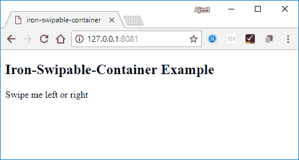

# PolymerIron可翻转容器

> 原文：<https://www.javatpoint.com/polymer-iron-swipeable-container>

铁可交换容器用于交换它的嵌套子元素，即自定义元素或本机元素。默认过渡是水平或曲线，但您可以修改过渡的持续时间和属性。

您可以使用以下类和属性来禁用滑动:

*   **禁用-刷卡类:**可用于禁用单个孩子的刷卡。
*   **禁用-刷卡属性:**可用于禁用整箱刷卡。

### 例子

打开命令提示符并转到项目文件夹，通过使用以下命令实现铁制可交换容器元素:

```

bower install PolymerElements/iron-swipable-container --save

```

上面的命令在 bower_components 文件夹中安装了一个可重复使用的铁容器元素。然后，您必须将其导入到您的 index.html 文件中，如下命令所示。

```

<link rel = "import" href = "iron-swipable-container/iron-swipable-container.html">

```

### 例子

```

<!DOCTYPE html>
<html>
   <head>
      <title>iron-swipable-container</title>
      <base href = https://polygit.org/polymer+1.4.0/components/">
      <script src = webcomponentsjs/webcomponents-lite.min.js"></script>
      <link rel = import" href = polymer/polymer.html">
      <link rel = import" href = iron-swipeable-container/iron-swipeable-container.html">
      <style>
         .content {
            background-color: LightGrey;
            width: 16%;
            padding: 10px 10px 10px 10px; 
         }
      </style>
   </head>
   <body>
      <h2>Iron-Swipable-Container Example</h2>
      <iron-swipeable-container>
         <div class = content">Swipe me left or right</div>
      </iron-swipeable-container>
   </body>
</html>

```

**输出:**

