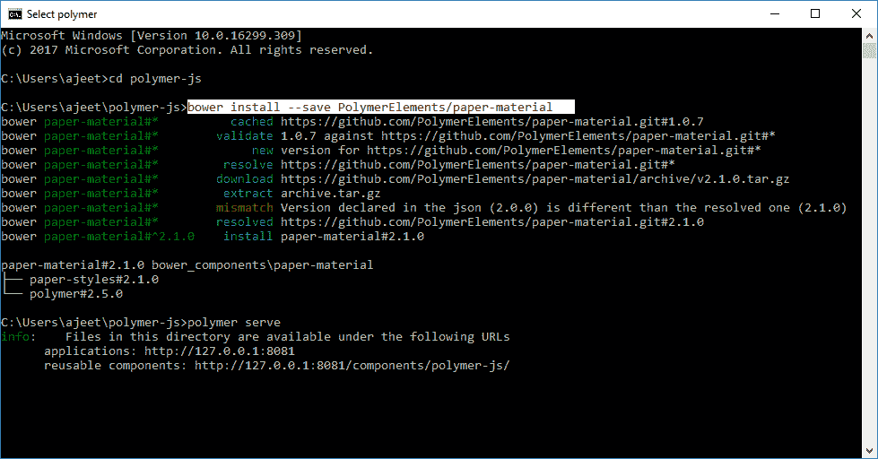
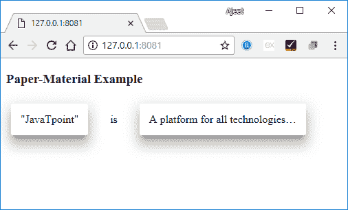

# PolymerPaper材料

> 原文：<https://www.javatpoint.com/polymer-paper-material>

在 Polymer.js 中，纸质材料是一种容器，它显示出一张抬高的纸的效果。在命令提示符下使用以下命令，在工作状态下获取目录中的纸质材料。

```

bower install --save PolymerElements/paper-material

```



### 例子

创建一个 index.html 文件，并在其中添加以下代码，以查看在 Polymer.js 中纸张材料元素的使用

```

<!doctype html>
<html>
   <head>
      <link rel = 'import' href = 'my-app.html'>
   </head>   
   <body>    
      <my-app></my-app>
   </body>
</html>

```

现在，打开 my-app.html 文件，并在其中包含以下代码。

```

<link rel = 'import' href = 'bower_components/polymer/polymer.html'>
<link rel = "import" href = "bower_components/paper-listbox/paper-listbox.html">
<link rel = "import" href = "bower_components/paper-material/paper-material.html">
<dom-module id = 'my-app'>
   <template>
      <style>
         paper-material {
            display: inline-block;
            background: white;
            box-sizing: border-box;
            margin: 7px;
            padding: 14px;
            border-radius: 3px;
         }
      </style>    
      <h3>Paper-Material Example</h3>
      <paper-material elevation = "5">"Tutorialspoint"</paper-material>
      <paper-material elevation = "0">is</paper-material>
      <paper-material elevation = "5">Simply Easy Learning Online Tutorials</paper-material>
   </template>   
   <script>
      Polymer ({
         is: 'my-app',
         ready: function() {
            this.async(function() {         
            });
         }
      });
   </script>
</dom-module>

```

**输出:**

